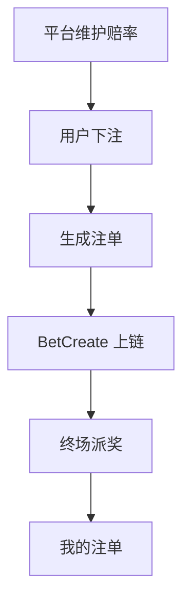
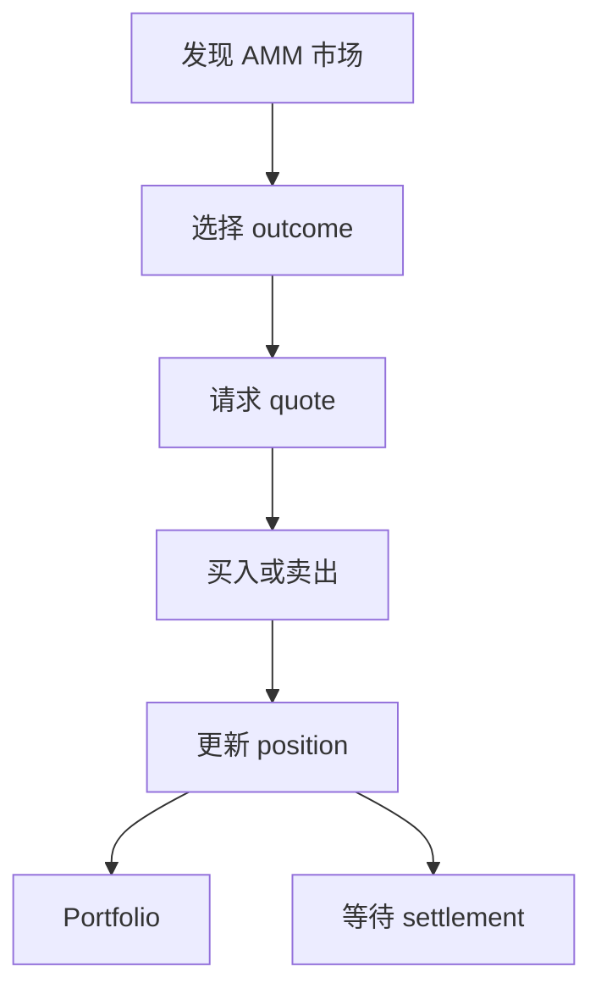
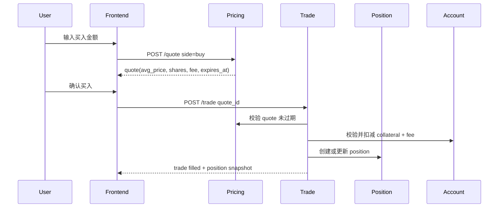
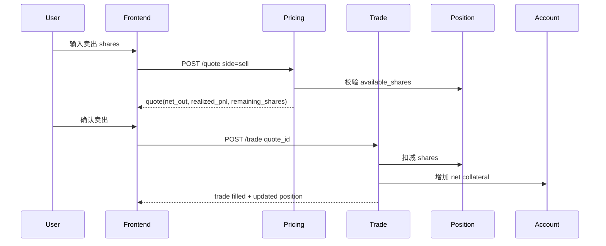
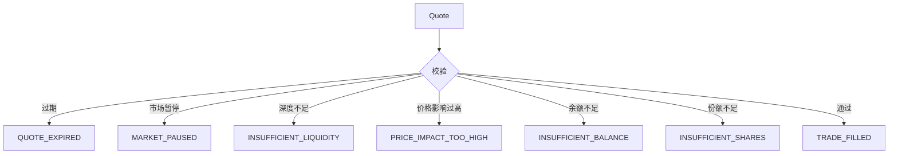
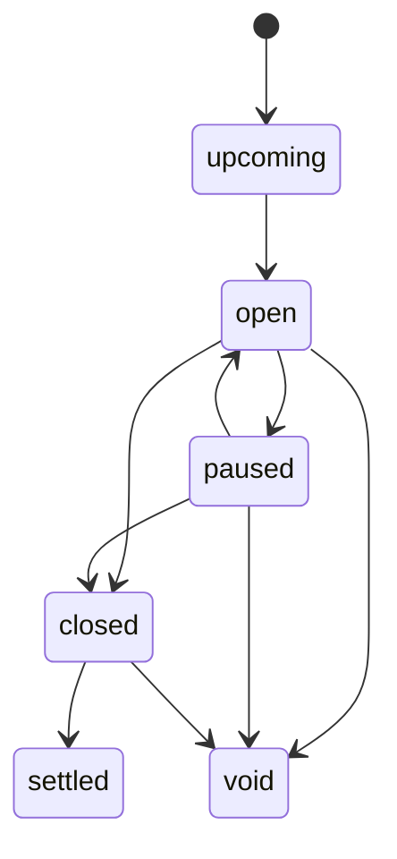

# T-TurboFlow 足球盘口技术方案 v2.0 v6.0 AMM 适配审计报告

审计对象：`T-TurboFlow 足球盘口技术方案 v2.0 设计与实施概述-120526-014442.pdf`

适配目标：`TurboFlow足球AMM预测市场产品需求文档_v6.0.md`

审计视角：产品经理、资深前端开发、资深后端开发

## 1. 总体结论

原《TurboFlow 足球盘口技术方案 v2.0》不建议作为足球 v6.0 AMM 主线技术方案直接实施。该方案的核心是传统盘口链上化：平台维护赔率、用户提交注单、链上 `BetCreate`、撤注 `BetCancel`、终场后 `MarketSettle` 批量派奖。它可以作为 v5 传统盘口技术参考，但不能承载 v6.0 的 AMM outcome 份额交易。

v6.0 技术方案必须围绕以下主线重写：

- Market：市场、outcome、状态、结算规则。
- Pricing：AMM quote、价格影响、手续费、quote TTL。
- Trade：买入、卖出、部分卖出、全部卖出。
- Position：份额、均价、市值、已实现 / 未实现盈亏。
- Portfolio：持仓聚合、成交历史、结算记录。
- Settlement：正确 outcome 兑付 1 USDT，错误 outcome 兑付 0，void 按规则退款。
- Liquidity：池状态、外部流动性、暂停原因。
- Account：余额、流水、对账。
- Chain：如涉及链上，承接交易、兑付或账本事件。
- Event：赛事事件、关键事件暂停。

## 2. 产品经理视角审计

### 2.1 技术方案服务的用户旅程错误

原方案服务的是传统下注旅程：



v6.0 需要服务的是 AMM 持仓旅程：



只要技术方案仍以注单为中心，产品就会回到“下注、撤注、派奖”的旧心智，无法支撑 `/soccer/mybets` 升级为 Portfolio，也无法支撑部分卖出和全部卖出。

### 2.2 范围过宽

原方案覆盖 25 个 template、34 / 35 个盘口、半场、角球、罚牌、球员和 SGM 扩展。v6.0 当前范围必须保持：

- 单场 7/7：胜平负、开球权、让球、让球 0:1、总进球数、大小球、波胆。
- 冠军与晋级 11/11：世界杯 A 组第一、世界杯 A 组出线、进入 8 强、进入决赛、世界杯冠军、欧冠冠军、晋级决赛、皇马 vs 巴萨两回合系列赛赛果、英超冠军、获得欧冠资格、降级球队。

技术方案应先服务这 18 个市场，不把球员、角球、罚牌、分钟盘、同场扩展盘口或 CLOB 带入当前交付。

### 2.3 产品验收口径应重写

原方案验收是“下注 / 撤注 / 结算派奖均经链上确认”。v6.0 验收应改为：

- 用户可以在单场和冠军与晋级中买入 outcome 份额。
- 用户可以部分卖出和全部卖出。
- quote 过期、流动性不足、价格影响过高、市场暂停时整笔失败。
- Portfolio 展示 position、成交历史和结算记录。
- outcome 卡片只展示 `24h Vol.` 和 24h 涨跌幅作为辅助指标。
- 不展示传统投注单、串关、Cash Out、订单簿、挂单、撤单。

## 3. 前端视角审计

### 3.1 前端需要稳定的数据契约

v6.0 前端不是“接收赔率推送 + 提交 PlaceBet”，而是围绕 quote 和 position 构建交互。

| 前端模块 | 需要的后端契约 |
|----------|----------------|
| `SoccerPage` | markets summary、price format、24h Vol. |
| `MatchListCard` | outcome price preview、display price、More count |
| `AmmMarketRenderer` | market/outcome/status、price、24h Vol.、24h change |
| `AmmTradePanel` | quote、trade、balance、selected position、错误码 |
| `AmmPortfolioPanel` | positions、trades、settlements、portfolio summary |
| `SoccerPriceFormatToggle` | price preference read/update |
| `SoccerDesignBoardPage` | 产品签收状态，不依赖技术字段暴露 |

### 3.2 状态推送建议

原方案的 WebSocket 推送是赔率变化。v6.0 应改为市场和持仓相关事件：

| 事件 | 前端动作 |
|------|----------|
| `market.price_updated` | 刷新 outcome price preview |
| `market.paused` | 禁用 outcome 和交易按钮 |
| `market.resumed` | 允许重新 quote，不复用旧 quote |
| `quote.expired` | 提示重新询价 |
| `trade.filled` | 刷新 position 和 Portfolio |
| `trade.failed` | 展示失败原因，保留输入 |
| `position.updated` | 刷新持仓份额、均价、市值 |
| `market.settled` | 刷新结算记录 |
| `market.voided` | 展示退款状态 |

### 3.3 前端刷新策略

建议前端以“乐观 UI + 后端确认”谨慎结合：

- quote 不做乐观更新，以后端返回为准。
- trade 提交后按钮进入 submitting，避免重复点击。
- trade 成功后立即刷新 selected position、portfolio summary 和 recent trades。
- trade 失败不清空用户输入，便于用户调整金额或 shares。
- market paused / resumed 后必须清理当前 quote。
- price format 切换只改变展示，不触发 quote 重新计算。

## 4. 后端视角审计

### 4.1 领域拆分建议

原方案按赛事域、盘口域、注单域、结算域、账户域、链上域划分。v6.0 应调整为：

| 领域 | 职责 |
|------|------|
| Market Domain | market、outcome、状态、结算规则、void 规则 |
| Pricing Domain | AMM quote、价格影响、费用、quote TTL |
| Trade Domain | 买入、卖出、部分卖出、全部卖出、幂等 |
| Position Domain | 持仓、均价、份额、市值、盈亏 |
| Portfolio Domain | 聚合持仓、成交历史、结算记录 |
| Settlement Domain | 结果确认、兑付、void、争议处理 |
| Liquidity Domain | 池状态、外部流动性、暂停原因、风险敞口 |
| Account Domain | 余额、流水、对账、资金冻结或扣划 |
| Chain Domain | 链上交易、链上事件、扫块回流 |
| Event Domain | 赛事事件、关键事件暂停和恢复 |

### 4.2 核心数据模型建议

最低需要以下表或等价存储：

```sql
soccer_amm_market (
  id,
  subject_scope,
  subject_id,
  title,
  group_name,
  question_title,
  status,
  resolution_rule,
  resolution_source,
  expected_resolution_time,
  void_rule,
  delay_or_dispute_policy,
  closes_at,
  created_at,
  updated_at
)
```

```sql
soccer_amm_outcome (
  id,
  market_id,
  label,
  status,
  probability,
  share_price,
  volume_24h,
  price_change_24h,
  sort_order,
  created_at,
  updated_at
)
```

```sql
soccer_amm_quote (
  id,
  account_id,
  market_id,
  outcome_id,
  side,
  collateral_amount,
  shares,
  avg_price,
  end_price,
  price_impact,
  fee,
  max_slippage,
  min_shares_out,
  min_collateral_out,
  expires_at,
  status,
  created_at
)
```

```sql
soccer_amm_trade (
  id,
  account_id,
  quote_id,
  client_trade_id,
  position_id,
  side,
  shares,
  avg_price,
  fee,
  collateral_delta,
  realized_pnl,
  status,
  created_at
)
```

```sql
soccer_amm_position (
  id,
  account_id,
  market_id,
  outcome_id,
  shares,
  available_shares,
  avg_price,
  current_price,
  realized_pnl,
  status,
  updated_at
)
```

```sql
soccer_amm_liquidity_state (
  market_id,
  outcome_id,
  liquidity_mode,
  available_depth,
  max_trade_size,
  max_price_impact,
  provider_quote_status,
  pause_reason,
  updated_at
)
```

```sql
soccer_amm_settlement (
  market_id,
  winning_outcome_id,
  settlement_status,
  settlement_source,
  resolved_at,
  void_reason,
  payload
)
```

### 4.3 旧模型替换建议

| 原模型 / 指令 | v6 替换 |
|---------------|---------|
| `bet_ticket` | `soccer_amm_trade` + `soccer_amm_position` |
| `bet_selection.current_odds` | `soccer_amm_outcome.share_price` / Pricing Domain quote |
| `bet_odds_log` | `soccer_amm_price_snapshot` 或 outcome price history |
| `BetCreate` | `BuyShares` 或链下 trade ledger |
| `BetCancel` | 不进入主流程；由 `SellShares` 替代 |
| `MarketSettle` 遍历注单派奖 | `MarketResolve` + `RedeemSettlement` 或后端 settlement ledger |
| `OutcomeWon/Lost/Refunded` | `settled_won / settled_lost / void_refunded` |
| `frozen stake` | position collateral / reserved accounting，视链上边界确定 |

## 5. v6.0 交易流程示例

### 5.1 买入流程



### 5.2 卖出流程



### 5.3 失败处理



所有失败都是整笔失败，不生成等待订单、部分成交、挂单或撤单。

## 6. 状态机建议

### 6.1 Market 状态



### 6.2 Quote 状态

| 状态 | 说明 |
|------|------|
| `ready` | 可展示并等待用户确认 |
| `expired` | 超过 `expires_at`，不可成交 |
| `invalidated` | 市场暂停、价格更新或流动性状态变化导致失效 |
| `consumed` | 已用于 trade |
| `failed` | 询价失败 |

### 6.3 Trade 状态

| 状态 | 说明 |
|------|------|
| `submitting` | 前端提交中 |
| `filled` | 整笔成交 |
| `failed` | 整笔失败 |

不引入 `resting`、`partially_filled`、`cancelled`、`GTC`、`IOC` 等订单簿状态。

### 6.4 Position 状态

| 状态 | 说明 |
|------|------|
| `active` | 当前持有 shares |
| `reduced` | 已部分卖出 |
| `closed` | 已全部卖出 |
| `settled_won` | 正确 outcome |
| `settled_lost` | 错误 outcome |
| `void_refunded` | 市场 void 后退款 |

## 7. 链上 / 链下边界方案

### 方案 A：链下 AMM + 链上最终结算

quote、trade、position 在后端账本中完成，市场最终结果和兑付可上链确认。

优点：

- 开发速度快。
- 前端体验稳定。
- 便于接外部流动性方。

风险：

- 需要强账本审计和对账。
- 用户对链上透明度的预期需要产品解释。

适合当前 v6.0 mock 和第一版工程落地。

### 方案 B：链上 AMM + 链下镜像

买入、卖出、结算全部上链，后端维护镜像和索引。

优点：

- 链上可验证性强。
- 资金真源清晰。

风险：

- quote 和成交延迟高。
- 成本和失败重试复杂。
- 对 AMM 合约要求高。

适合后续需要强链上证明的阶段。

### 方案 C：外部报价驱动 + 内部 position 账本

外部流动性方提供价格和深度，平台生成 AMM 风格 quote，内部维护 trade 和 position。

优点：

- 更贴近真实体育定价。
- 可以保留 AMM 用户体验。

风险：

- 依赖供应商 SLA。
- provider quote status、异常报价、回滚规则必须明确。

推荐默认：当前 v6.0 技术方案先按方案 A 或 C 设计，保留向方案 B 演进的接口边界。

## 8. 结算与 void 建议

结算域不再输出传统注单 `Won / Lost / Refunded`，而是更新 market 和 position：

| 结算结果 | position 处理 |
|----------|---------------|
| 正确 outcome | 每份兑付 1 USDT |
| 错误 outcome | 每份兑付 0 |
| void | 按规则退款或退回可兑付价值 |
| 官方待确认 | position 保持 pending settlement |
| 争议 / 改判 | 暂停兑付，等待 resolution policy |

让球、大小球等可能产生 push、半赢、半输的市场，必须在技术方案中明确兑付比例。例如：

- push：按 1.0 退回对应份额成本或按规则退款。
- half_win：按明确比例兑付，不沿用传统赔率派奖文案。
- half_loss：按明确比例损失，不展示为注单半输。

## 9. 可复用资产

原方案以下部分可以迁移：

- 赛事数据源接入和 EventNormalizer。
- match_event / match_fact 的事实聚合思想。
- 关键事件暂停机制。
- Redis 锁、限流、Prometheus、日志、任务队列。
- ChainScanner、SlotCheckpoint、补偿回放。
- AccountMirror、Ledger、Reconciler。
- 结算任务队列和失败告警。

但这些资产必须改名或重接到 AMM 领域，不保留“注单域是核心”的架构。

## 10. 实施里程碑建议

| 里程碑 | 交付内容 | 验收 |
|--------|----------|------|
| M1 | 市场与 outcome 模型 | 单场 7/7、赛事级 11/11 可查询 |
| M2 | Pricing / Quote | 买入和卖出 quote 返回均价、价格影响、手续费、过期时间 |
| M3 | Trade / Position | 买入、部分卖出、全部卖出更新 position |
| M4 | Portfolio | 聚合持仓、市值、已实现 / 未实现盈亏、成交历史 |
| M5 | Market 状态与异常 | paused、closed、settled、void、quote 失败可被前端消费 |
| M6 | Settlement | 正确 outcome 兑付 1 USDT，错误兑付 0，void 退款 |
| M7 | 对账与监控 | 资金、trade、position、settlement 可审计 |
| M8 | Design Board 对齐 | 页面 5/5、市场 7/7 + 11/11、状态和移除项全部可验收 |

## 11. 最终建议

建议将原《足球盘口技术方案 v2.0》归档为“传统盘口链上化技术方案”。当前 v6.0 应新增《TurboFlow 足球 AMM 预测市场技术方案 v1.0》，以 AMM 交易域为主线重写。

重写时不应只是把 `BetCreate` 改名为 `TradeCreate`，而要真正把主模型从 `bet_ticket` 改为 `trade + position + settlement`。只有这样，产品文档、Design Board、接口规范和实际前后端实现才会一致。
