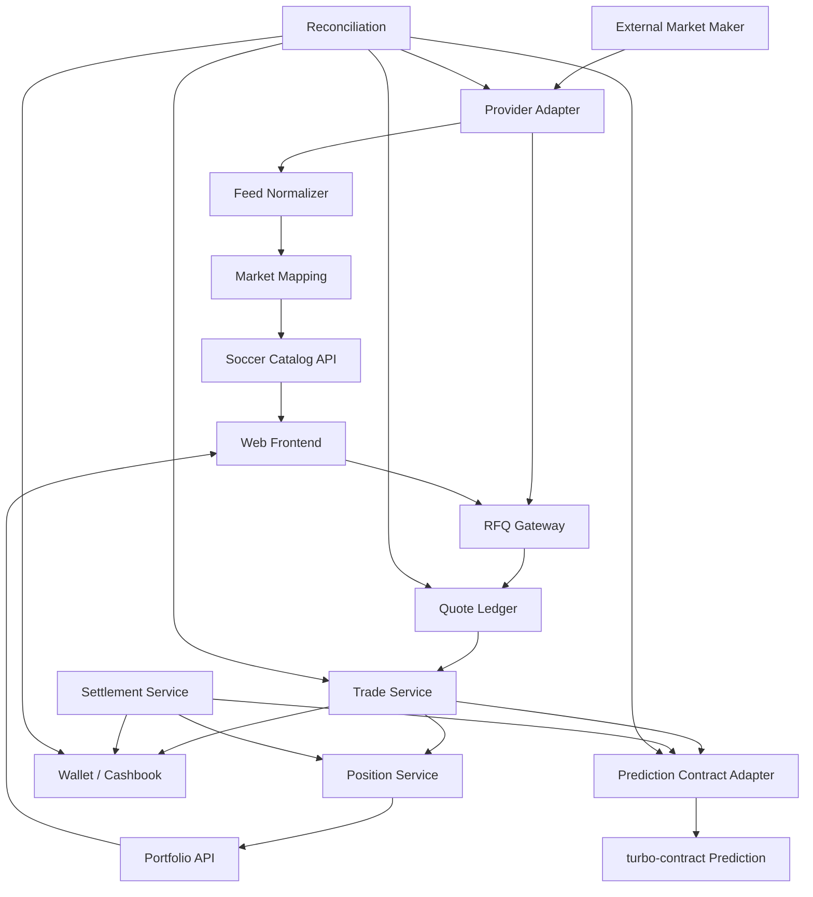
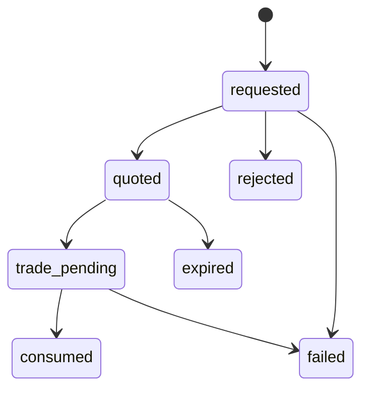
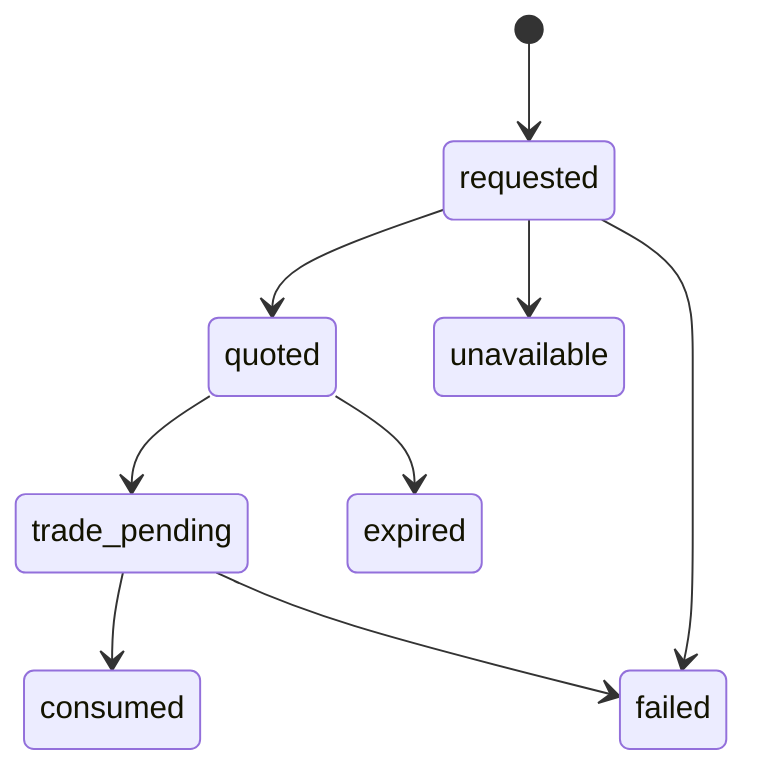
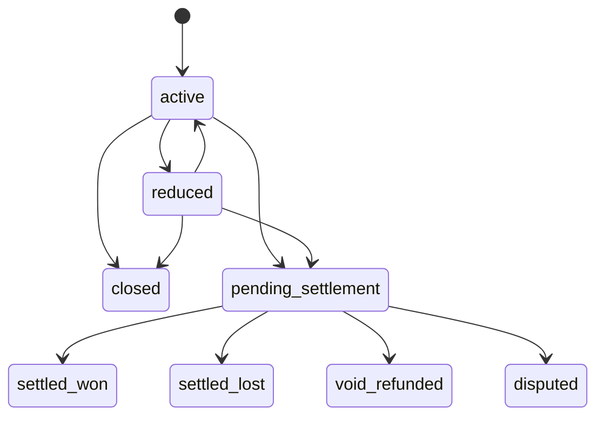
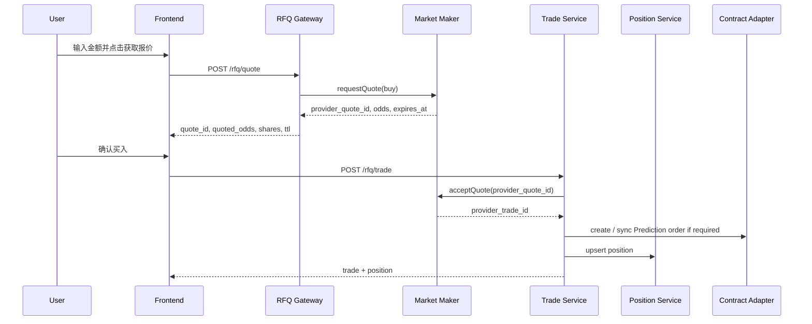
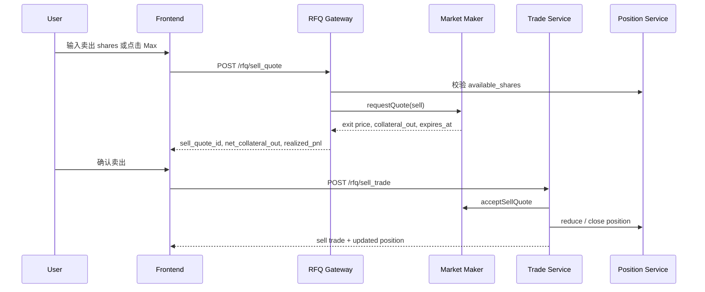

# T-TurboFlow 足球盘口技术方案 v2.0 的 v7.0 RFQ 适配反馈报告

审计对象：`T-TurboFlow 足球盘口技术方案 v2.0 设计与实施概述-120526-014442.pdf`

适配目标：`TurboFlow足球RFQ预测交易市场产品需求文档_v7.0.md`

审计视角：产品架构、后端 / 合约架构、前端 / Design Board

## 1. 总体结论

原技术方案 v2.0 可以保留比赛、盘口、下注、账户、结算和风控的传统工程经验，但不能作为 v7.0 RFQ 的完整技术方案直接执行。v7.0 的核心不是平台静态赔率下注，也不是 v6.0 AMM 池定价，而是：

```text
Provider Feed
  -> Market Mapping
  -> RFQ Gateway
  -> Quote Ledger
  -> Trade Ledger
  -> Position Service
  -> Settlement / Reconciliation
  -> Prediction Contract Adapter
```

技术复杂度从“自建 AMM 定价和流动性管理”转移为“外部做市商接入、quote 生命周期、成交幂等、position 卖出、资金对账和结算一致性”。这会显著降低定价和流动性工程难度，但不会消除交易系统复杂度。

## 2. v7.0 架构定位

### 2.1 不再需要的 AMM 能力

| v6.0 AMM 能力 | v7.0 处理 |
|---------------|-----------|
| AMM pool reserve | 不需要 |
| 曲线定价 | 不需要 |
| liquidity provider | 当前不需要 |
| price impact | 技术侧替换为 provider spread / quote 变化；用户侧展示为报价变化、报价有效期或报价暂不可用 |
| pool imbalance | 替换为 provider limit / suspension |
| AMM sell | 替换为 sell quote / sell trade；用户侧表达为获取退出报价后卖出 |

### 2.2 仍然需要的交易能力

| 能力 | 是否需要 | 原因 |
|------|----------|------|
| 账户资金冻结 / 扣款 | 需要 | 买入成交必须锁定或扣减本金 |
| 交易幂等 | 需要 | quote confirm 可能重试 |
| 状态机 | 需要 | quote、trade、position、settlement 必须可追踪 |
| 风控限额 | 需要 | provider、平台和用户层面都需限制 |
| 结算 | 需要 | 按比赛结果兑付 |
| 对账 | 需要 | provider 成交、内部账、链上订单和资金流水要一致 |
| 反向卖出 | 需要 | 用户买入后可退出部分或全部持仓 |
| 安全与防重放 | 需要 | quote / trade confirm / provider callback 都是资金敏感操作 |

## 3. 推荐系统架构



## 4. 核心服务职责

| 服务 | 职责 | 关键风险 |
|------|------|----------|
| Provider Adapter | 接入 provider 赛事、盘口、赔率、quote、trade、结果 | provider 字段不稳定、超时、拒单 |
| Feed Normalizer | 标准化赛事、盘口、选项和状态 | 映射错误导致交易错位 |
| Market Mapping | 保存 provider ID 到内部 ID 的关系，并受联赛 / 市场白名单约束 | ID 变更、合并、取消、重赛、错误上架 |
| RFQ Gateway | 统一买入和卖出 quote 请求 | quote TTL、重复确认、provider 异常 |
| Quote Ledger | 记录全部 quote 请求和响应 | 缺少审计链路 |
| Trade Service | 确认 quote，生成 trade | 幂等、重复扣款 |
| Position Service | 更新 shares、均价、可卖份额和盈亏 | 部分卖出成本分摊 |
| Settlement Service | 根据结果结算 position | 结果争议和 void |
| Reconciliation | 对账 provider、内部账、链上、资金 | 漏单、错账、重复成交 |
| Contract Adapter | 对接 Prediction 合约或后续扩展指令 | 链上能力与 RFQ 生命周期不完全匹配 |

前端不直接消费 provider ID，也不因为 provider 同步了更多盘口就自动扩张可见范围；所有新比赛和盘口必须经过内部白名单、映射和状态归一化。

## 5. RFQ 状态机

### 5.1 买入 quote



`trade_pending` 表示用户已确认，系统正在执行 provider accept、资金记账和 trade 落库。只有生成 trade 后才写入 `accepted_odds`；quote 阶段只能保存 `quoted_odds`。

### 5.2 卖出 quote



sell quote 在 `trade_pending` 后仍需重新校验 `available_shares` 和 position version，避免并发卖出导致超卖。

### 5.3 position



## 6. 买入流程



关键要求：

- `quote_id`、`client_quote_id` 和 `client_trade_id` 都必须幂等。
- 确认时如果 quote 过期或 provider 返回赔率变化，不得静默成交。
- 成交写入 `accepted_odds`，不可被后续价格刷新覆盖。
- quote 阶段不应命名或展示 `accepted_odds`，避免把“可报价”误读为“已成交锁价”。

## 7. 卖出流程



部分卖出成本分摊建议：

```text
sold_cost = position_avg_price * sold_shares
realized_pnl = net_collateral_out - sold_cost
remaining_cost_basis = old_cost_basis - sold_cost
```

全部卖出时：

```text
if sold_shares == available_shares:
  position.status = closed
  position.available_shares = 0
```

并发卖出建议：

```text
sell_quote 阶段：校验 available_shares，可选择软锁或仅返回预估。
sell_trade 阶段：使用 position.version / CAS 再次校验。
if position_changed:
  reject with POSITION_CHANGED
  require new sell quote
```

如果 provider 不支持 sell quote，产品与后端必须在上线前选择降级策略：不开放卖出入口、由内部风险账户承接退出报价，或接入二级流动性方案。不能在技术方案中默认 provider 一定支持退出报价。

## 7A. 幂等、资金原子性与安全

### 7A.1 幂等与二次确认

| 操作 | 幂等键 | 预期行为 |
|------|--------|----------|
| quote | `account_id + client_quote_id` | 重试返回同一 quote 或最终失败状态 |
| trade | `account_id + client_trade_id` | 重试返回同一 trade，不重复扣款 |
| sell quote | `account_id + client_quote_id` | 重试返回同一 sell quote 或最终失败状态 |
| sell trade | `account_id + client_trade_id` | 重试返回同一 sell trade，不重复扣减 shares |

同一 quote 被消费后再次确认，应返回原 trade 的最终状态；已过期、已失败、账户不匹配或 position 已变化时必须明确拒绝。

### 7A.2 资金原子性

- quote 阶段默认不冻结资金，只做余额和限额预校验。
- trade confirm 必须原子执行余额校验、provider accept、cashbook、trade ledger 和 position update。
- provider accept 成功但内部落账失败，必须进入 Reconciliation 补偿队列。
- 内部扣款成功但 provider 失败，必须回滚资金或写冲正流水。

### 7A.3 安全与防重放

- 用户请求必须通过登录态和账户鉴权，不能只信任请求体 `account_id`。
- provider trade callback、settlement feed 和 webhook 需要签名校验或 mTLS。
- quote / trade confirm 需要保存请求摘要、provider 响应摘要、幂等键和 correlation id。
- 管理后台人工处理必须写审计日志，保留操作者、原因、前后资金和 position 差异。

## 8. Settlement

### 8.1 结果来源

建议优先级：

1. 官方赛事结果源。
2. provider settlement feed。
3. 内部运营确认。
4. 争议仲裁流程。

官方结果应作为最终权威。provider settlement feed 可作为自动化输入，但当 provider 结果与官方结果冲突时，不得自动结算，应进入 `disputed` / `manual_review`。

### 8.2 状态

| 状态 | 说明 |
|------|------|
| `pending_result` | 等待结果 |
| `resolving` | 结果确认中 |
| `settled` | 已结算 |
| `voided` | 市场作废 |
| `disputed` | 结果存在争议 |
| `manual_review` | 需要人工处理 |

### 8.3 void 规则

void 时不得简单删除 trade，应保留完整审计链路：

- 原始 trade 保留。
- position 标记 `void_refunded`。
- cashbook 记录退款。
- Portfolio 展示 void 说明。

## 9. 与 turbo-contract Prediction 模块的关系

### 9.1 可复用点

当前 `turbo-contract` 的 Prediction 模块具备以下可复用价值：

| 合约能力 | v7.0 RFQ 对应 |
|----------|---------------|
| `prediction_place_order` | 买入成交后记录订单和锁定金额 |
| `PredictionOrder.trade_id` | 内部 trade / provider trade 映射锚点 |
| `PredictionOrder.amount` | 用户投入金额 |
| `PredictionOrder.odds_e8` | 成交时锁定赔率 |
| `PredictionOrder.status` | 订单是否已结算 |
| `prediction_settle_v3` | 按 outcome 和 odds 结算 |
| `cashbook` | 资金流水审计 |

### 9.2 缺口

| 缺口 | 影响 |
|------|------|
| 无 provider quote 字段 | 无法链上证明 RFQ 生命周期 |
| 无 sell / exit quote | 不能直接链上表达部分卖出 |
| 无 position 聚合账户 | 多次买入 / 卖出需链下汇总 |
| 无足球赛事结构 | 需通过 pool / coin_code / trade_id 映射 |
| 无 provider 对账状态 | 需链下 Reconciliation |

### 9.3 分阶段建议

#### 第一阶段

- RFQ quote、provider 交互、position 和 sell 全部链下管理。
- 买入成交如需链上记录，应同步为 Prediction order，并保存业务 `trade_id` 与链上 `PredictionOrder.trade_id: u64` 的映射。
- 最终 settlement 可复用 `prediction_settle_v3` 或链下清算后写 cashbook，但必须声明资金与持仓的 source of truth。
- 重点保证用户资产、provider 成交和内部账一致。
- 链上 `PredictionOrder.status` 仅表达 `Pending / Finish`，是业务状态机的子集，不能承载 quote、sell、disputed、failed 等完整状态。

#### 第二阶段

如业务需要更强链上可验证性，再扩展：

- `soccer_rfq_quote` account。
- `soccer_position` account。
- `soccer_sell_quote` / `soccer_sell_trade` instruction。
- provider 签名校验。
- quote TTL 和 accepted odds 的链上校验。

## 10. 风控与限额

| 风控点 | 说明 |
|--------|------|
| 单笔 quote 限额 | provider 和平台双层限制 |
| outcome 暴露限额 | 控制单 outcome 总敞口 |
| 用户频率 | 防止恶意 quote spam |
| provider timeout | 熔断或降级 |
| odds jump | 大幅赔率变化时暂停确认 |
| market suspended | provider 暂停时前端禁用交易 |
| sell liquidity | provider 无法提供退出报价时，用户侧提示“当前暂无法提供退出报价” |
| replay attack | 幂等键、签名和请求摘要防止重复确认 |
| concurrent sell | position version / CAS 防止超卖 |

## 11. Reconciliation

每日和实时对账至少覆盖：

- provider quote 数量、成交数量、拒单数量。
- provider_trade_id 与内部 trade_id。
- 用户 cashbook 与 trade collateral delta。
- position shares 与 trade buy / sell 累计。
- Prediction order 与内部 trade。
- settlement payout 与结果源。
- void / refund / manual adjustment。
- reversed / adjustment 如后续引入，必须单独对齐 provider 事件、cashbook 冲销和 position 回滚。

建议对账结果状态：

| 状态 | 说明 |
|------|------|
| `matched` | 完全一致 |
| `provider_missing` | 内部有成交，provider 缺失 |
| `internal_missing` | provider 有成交，内部缺失 |
| `amount_mismatch` | 金额不一致 |
| `odds_mismatch` | 成交赔率不一致 |
| `settlement_mismatch` | 结算不一致 |
| `manual_resolved` | 人工已处理 |

## 12. 前端与 Design Board 影响

### 12.1 前端最小改动原则

保留：

- 当前页面结构。
- 概率 / 赔率切换。
- 概率与份额价格展示。
- outcome 卡。
- 交易面板。
- Portfolio。
- 部分卖出和全部卖出入口。

调整：

- 用户可见文案从 AMM 池、价格影响、流动性池改为最新报价、报价有效期、退出报价和报价暂不可用。
- 技术字段可以保留 RFQ、provider、quote、provider spread，但不直接展示给用户。
- 买入按钮语义改为获取报价 / 确认买入。
- 卖出语义改为获取退出报价 / 确认卖出。
- 错误提示用产品语言表达：报价已过期、报价已变化、报价暂不可用、报价请求超时、市场暂停。

### 12.2 Design Board 对比重点

| v6.0 AMM | v7.0 报价交易 |
|----------|----------|
| 内部 pool quote | 最新报价 / 报价有效期 |
| price impact | 报价变化 / 报价暂不可用 |
| AMM liquidity | 市场暂停 / 限额 / 退出报价不可用 |
| AMM sell | 获取退出报价后卖出 |
| pool reserve / liquidity state | 技术侧由 Provider Adapter / Quote Ledger / Reconciliation 承接 |

Design Board 必须覆盖当前 17/17 差异项：页面、单场市场、赛事级市场、买入、卖出、Portfolio、异常、结算、术语、首页冠军与晋级入口、全局旧浮动条隔离和实现文件覆盖核对。串关、Cash Out、传统投注单、传统浮动条等历史能力只能写成本版本暂不交付 / 后续待确认，不能写成永久删除。

## 13. 迁移步骤

### P0

1. 确认 provider 协议：赛事、盘口、赔率、quote、sell quote、trade、settlement。
2. 定义内部 match / market / outcome 映射。
3. 新增 RFQ quote / trade / sell quote / sell trade API。
4. 建立 Quote Ledger、Trade Ledger、Position Service。
5. 前端 mock 切换到 v7.0 报价交易文案和字段，用户侧不暴露 RFQ / provider / 做市商术语。
6. 补齐幂等、资金原子性、provider 签名、并发卖出和 position version 规则。

### P1

1. 接入真实 provider sandbox。
2. 接入 Prediction 合约买入记录和结算。
3. 建立 provider / internal / chain 对账。
4. 完善 void、dispute、manual review。
5. 明确 provider 不支持 sell quote 时的产品降级方案。

### P2

1. 评估链上 sell / position 扩展。
2. 评估组合 RFQ / 串关。
3. 多 provider 路由和兜底。

## 14. 最终建议

建议 v7.0 技术方案从原“下注域 + 结算域”演进为“RFQ 交易域 + Position 域 + Provider 对账域”。原 v2.0 中账户、下注记录、限额、结算和风控可复用，但必须补齐 RFQ quote 生命周期、provider 成交确认、反向卖出、position 成本分摊和链上 Prediction 适配边界。
