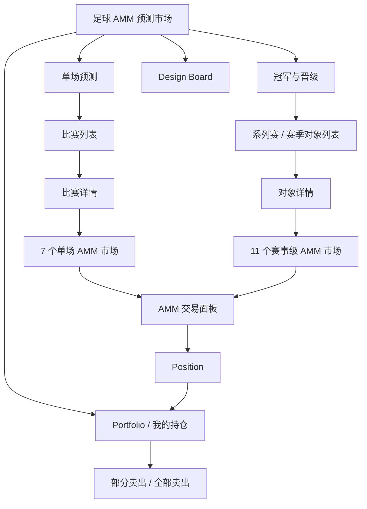
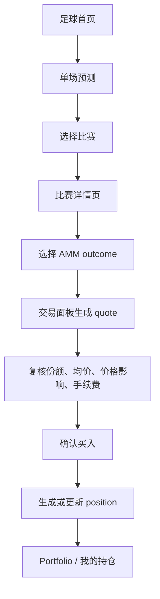
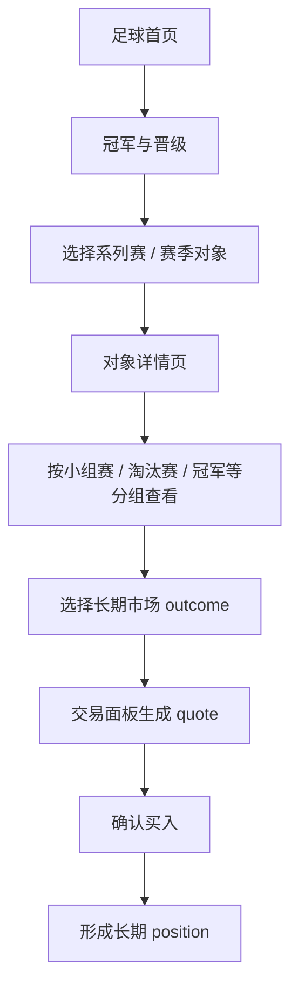
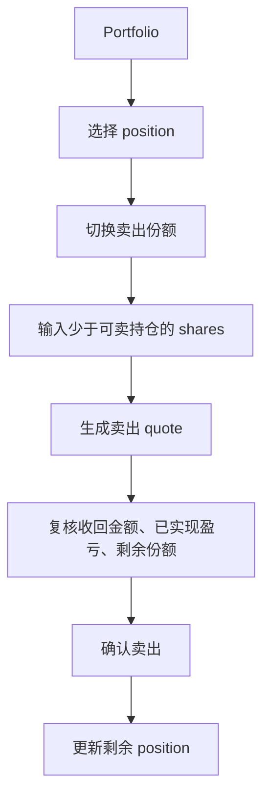
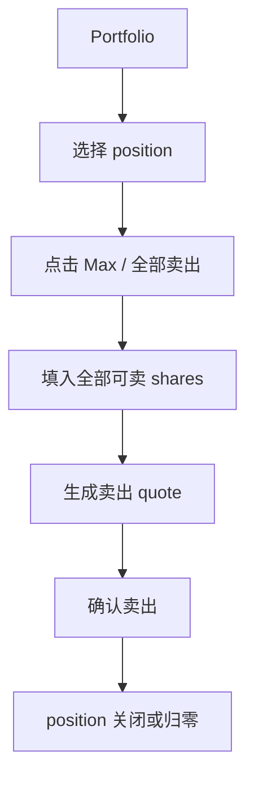
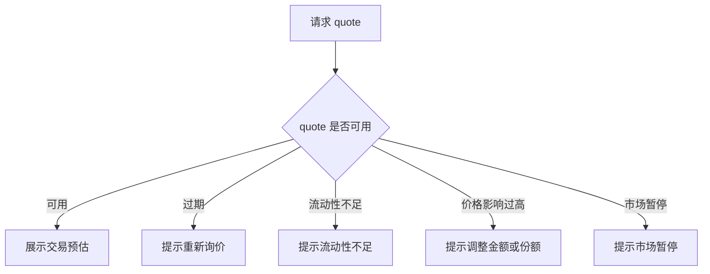
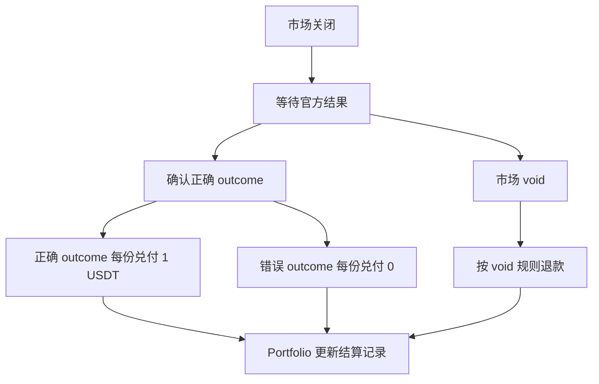
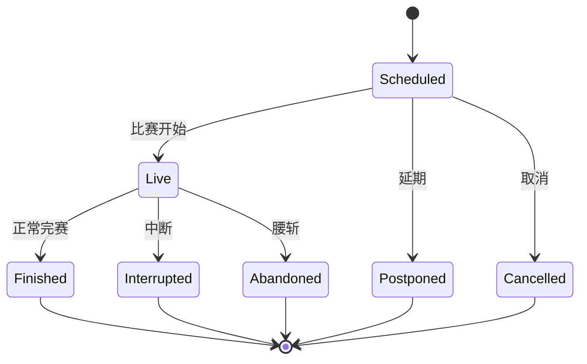
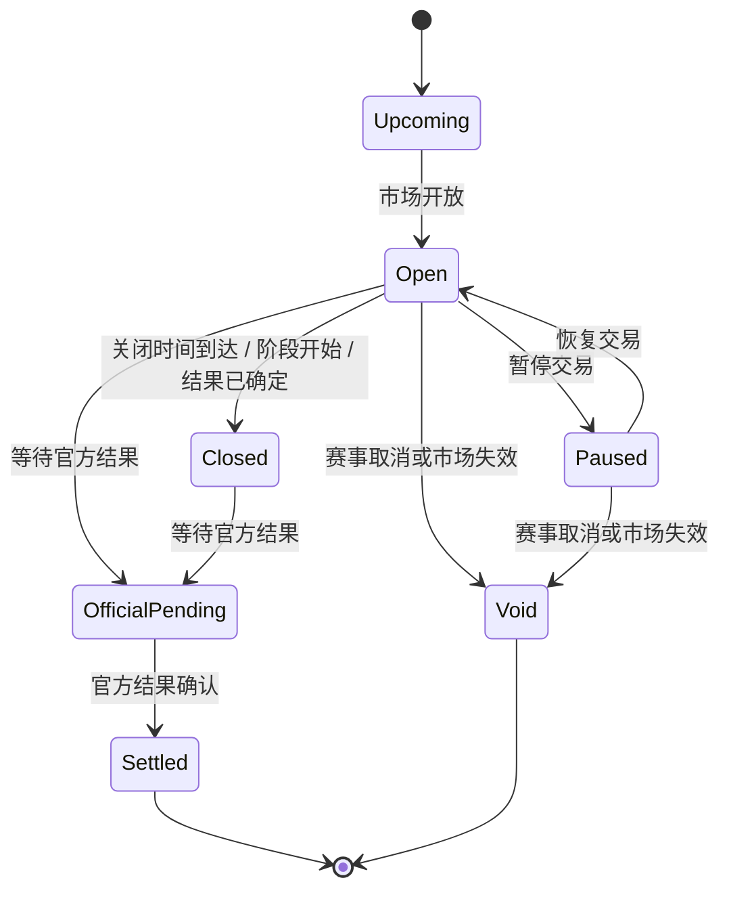

# TurboFlow 足球 AMM 预测市场产品需求文档 v6.0

版本：v6.0
对象：足球 AMM 预测市场，覆盖单场预测与冠军与晋级全量产品定义
状态：当前重写评审稿
文档性质：完整 PRD，不是增量说明

## 0. 文档说明

本文是 TurboFlow 足球 tab v6.0 的完整产品需求文档。v6.0 将 `/soccer` 从 v5.0 的平台报价型传统盘口升级为 AMM 足球预测市场。v5.0 只作为旧 UI、信息架构和历史语义基线，不再作为当前主流程。

本文遵循以下约定：

- 本产品是 AMM 足球预测市场，不是传统投注盘口，不是 CLOB，不是订单簿撮合。
- 用户买入或卖出 outcome 预测份额，形成和管理 position。
- 平台不作为用户交易对手方，不承诺赔率，不用传统注单结算用户输赢。
- 欧洲赔率只作为展示换算；默认价格展示是“概率 + 份额价格”。
- AMM 交易通过 quote 即时执行；不展示订单等待、挂单、撤单或部分成交挂起。
- 文案使用正式产品语言，不使用临时、演示或内部代号表达。
- 不一刀切删除历史代码或底层通用能力。当前 v6.0 主流程不展示，不代表所有历史组件都必须删除。
- v4.5 整届赛事预测大赛已暂缓，当前产品、mock、路由和 Design Board 均不展示该能力。

## 1. 产品背景

TurboFlow 足球产品在 v5.0 中已完成“单场预测 / 冠军与晋级”的信息架构升级，能够承载两类足球判断：

1. 用户想预测近期单场比赛的结果或比赛内容，例如胜平负、让球、大小球、波胆、总进球数。
2. 用户想预测一个系列赛、杯赛或赛季的阶段性结果，例如世界杯小组出线、进入 8 强、欧冠冠军、英超前四、两回合系列赛晋级方。

v5.0 的交易心智仍然是平台报价型传统盘口：用户选择欧洲赔率、加入投注单、确认下注、等待注单结算。这个模型的问题是：

- 平台容易被理解为用户交易对手方。
- 欧洲赔率容易被理解为平台承诺价格。
- 用户提交后只能等待结算，缺少可持续管理 position 的能力。
- “注单 / 串关 / Cash Out”心智与预测市场的 outcome 份额交易不一致。

v6.0 的目标是保留 v5.0 已经验证过的信息架构和市场目录，但把底层交易模型替换为 AMM 预测市场。用户不再“下注”，而是对一个 outcome 买入预测份额；用户可以继续买入、部分卖出、全部卖出或等待结算。

## 2. 产品目标

| 目标类型 | 目标 | 验收口径 |
|----------|------|----------|
| 业务目标 | 将足球 tab 从平台报价型盘口升级为 AMM 预测市场 | `/soccer` 主流程不再出现传统投注单、串关、Cash Out 或平台赔率承诺 |
| 业务目标 | 保留单场预测和冠军与晋级两类判断对象 | `/soccer` 仍有两个一级入口，市场目录不新增不删除 |
| 业务目标 | 支持 outcome 份额交易和 position 生命周期 | 用户可以买入、部分卖出、全部卖出或等待结算 |
| 用户目标 | 用户能理解自己买入的 outcome、份额价格、风险和结算规则 | outcome 卡、交易面板和 Portfolio 展示 question、price、shares、settlement |
| 用户目标 | 用户成交前能看到 quote 风险 | quote 展示成交均价、价格影响、手续费、过期时间、最大亏损或预计收回 |
| 产品目标 | 形成 PRD、mock、Design Board、接口反馈和技术方案反馈的统一口径 | 文档、页面、组件和验收标准对齐 AMM 主线 |
| 设计目标 | 让设计师能按 Design Board 覆盖所有可见状态 | 完整 Design Board 覆盖页面、市场、状态、异常、结算和移除项 |
| 技术协同目标 | 明确旧下单域不能作为 v6 主接口 | 主接口改为 quote / trade / positions / portfolio / settlement |

## 3. 范围定义

### 3.1 当前做什么

| 范围 | 说明 |
|------|------|
| 单场预测 | 近期比赛的 7 个核心市场：胜平负、开球权、让球、让球 0:1、总进球数、大小球、波胆 |
| 冠军与晋级 | 世界杯、欧冠、英超等系列赛 / 赛季对象下的 11 个长期结果预测市场 |
| AMM outcome | 每个市场内原有可选结果转换为可交易 outcome |
| 买入份额 | 用户投入 USDT 买入 outcome 预测份额 |
| 卖出份额 | 用户主动输入 shares 并通过 AMM quote 卖出 |
| 部分卖出 | 用户卖出少于当前可卖持仓的 shares，成交后保留剩余 position |
| 全部卖出 | 用户使用 Max / 全部卖出填入该 position 全部可卖份额 |
| Portfolio | 展示持仓、可卖份额、均价、现价、市值、已实现 / 未实现盈亏、成交历史 |
| 价格格式切换 | 小齿轮弹框切换概率 + 份额价格 / 欧洲赔率 |
| Design Board | 完整 v6.0 展板和 v5.0 → v6.0 UI 变更对比 |

### 3.2 当前不做什么

| 不做项 | 当前处理 |
|--------|----------|
| 足球 CLOB | 独立产品线，未来大版本，不进入 `/soccer` 主流程 |
| 订单簿 / 限价单 / 挂单 / 撤单 | 当前 AMM 即时 quote，整笔成交或整笔失败 |
| 传统投注单主流程 | 不在 v6 正式足球页面作为交易入口 |
| 串关 / 多笔单注作为主流程 | 不进入 v6 AMM 主流程 |
| Cash Out / 平台买断式提前结清 | 被 AMM 卖出份额替代 |
| 传统注单结算中心 | `/soccer/mybets` 升级为 Portfolio / 我的持仓 |
| 球员、角球、罚牌、分钟盘、同场扩展盘口 | 当前不在可见 UI；底层历史资产可保留 |
| v4.5 整届赛事预测大赛 | 已暂缓，不展示入口、路由和 Design Board section |
| 自动接受旧报价 | quote 过期或市场恢复后必须重新询价 |

## 4. 信息架构

### 4.1 总体结构



### 4.2 一级入口

| 入口 | 内容 | 默认 |
|------|------|------|
| 单场预测 | 联赛、比赛、AMM 价格列、单场详情和 7 个 AMM 市场 | 默认入口 |
| 冠军与晋级 | 世界杯、欧冠、英超等系列赛 / 赛季对象 | 用户主动切换 |

“冠军与晋级”首页不全局混排所有 outcome，只展示对象。进入对象后，再展示对象内部的预测分组和具体市场。

### 4.3 为什么继续保留两入口

单场预测围绕具体比赛，用户关注比赛开始时间、比分、事件和单场市场状态。冠军与晋级围绕系列赛、杯赛或赛季对象，用户关注关闭时间、官方来源、阶段结果和长期 position。两者共享 AMM 交易面板和 Portfolio，但市场发现路径、结算时点和用户心智不同，因此仍保留两个一级入口。

## 5. 用户角色与使用场景

| 用户角色 | 典型动机 | 使用路径 |
|----------|----------|----------|
| 新手球迷 | 赛前只想支持某场比赛结果 | 单场预测 → 选择比赛 → 胜平负 outcome → 买入份额 |
| 熟练足球用户 | 想比较多个单场市场价格 | 单场预测 → 比赛详情 → 让球 / 大小球 / 波胆 → 选择 outcome |
| 价格敏感用户 | 关注概率、份额价格和价格影响 | outcome 卡 → quote → 价格影响和手续费 → 确认或放弃 |
| 持仓管理用户 | 想在赛前或长期市场中降低风险 | Portfolio → 选择 position → 部分卖出或全部卖出 |
| 冠军用户 | 认定某队会夺冠 | 冠军与晋级 → 赛事对象 → 冠军市场 → 买入 outcome |
| 晋级用户 | 关心出线、进 8 强、进决赛、获得资格 | 冠军与晋级 → 对象详情 → 小组赛 / 淘汰赛 / 晋级 |
| 赛季结果用户 | 关心前四、降级、赛季名次 | 冠军与晋级 → 英超 → 赛季结果 |
| 系列赛用户 | 关心两回合最终晋级方 | 冠军与晋级 → 欧冠 → 系列赛 |
| 结算查询用户 | 想查看已结算 position 和收益 | Portfolio → 成交历史 / 结算记录 |
| 设计 / 研发 / 测试 | 需要完整状态清单 | Design Board 和 v5→v6 UI 变更对比 |

## 6. 核心用户流程

### 6.1 单场预测买入流程



### 6.2 冠军与晋级买入流程



### 6.3 部分卖出流程



部分卖出是用户主动输入少于当前可卖持仓的 shares 并即时成交，不是部分成交，也不产生等待订单。

### 6.4 全部卖出流程



### 6.5 quote 失败流程



quote 过期、流动性不足、价格影响过高、市场暂停时，整笔交易失败并要求重新询价。系统不生成挂单，不保留部分成交。

### 6.6 结算流程



## 7. 页面定义

### 7.1 `/soccer` 足球首页

足球首页包含左侧联赛导航、进行中 / 即将开赛摘要、主内容区、一级 tab 和价格格式设置。

| 模块 | 展示字段 | 规则 |
|------|----------|------|
| 左侧导航 | 全部赛事、联赛名、国家、比赛数、进行中数量 | 只影响单场预测比赛列表 |
| 进行中列表 | 进行中比赛、球队简称、比分 | 最多展示 3 场 |
| 即将开赛 | 赛前比赛、球队简称、开赛时间 | 最多展示 3 场 |
| 一级 tab | 单场预测、冠军与晋级 | 默认单场预测 |
| 价格设置 | 小齿轮入口 | 切换概率 + 份额价格 / 欧洲赔率 |
| 单场预测内容 | 按联赛分组的比赛列表和 AMM 价格列 | 点击进入比赛详情 |
| 冠军与晋级内容 | 系列赛 / 赛季对象卡片 | 点击进入对象详情 |

比赛列表卡必须展示：

- 比赛时间或比赛状态。
- 主队和客队。
- `24h Vol.`。
- 关键 AMM 价格列。
- `More` 入口。

比赛列表卡的价格默认展示概率 + 份额价格，例如 `55%` 和 `Buy 55¢`。欧洲赔率只在用户通过小齿轮切换后展示。

冠军与晋级对象卡片必须展示：

- 地区和对象类型，例如“国际 · 杯赛系列赛”。
- 对象名称，例如“世界杯 2026”。
- 摘要文案，例如“小组出线、淘汰赛晋级和最终冠军预测”。
- 对象内分组，例如“小组赛 / 淘汰赛 / 冠军”。
- 市场数量。
- 前 1 到 2 个市场摘要。
- 关闭时间摘要。

### 7.2 `/soccer/match/:matchId` 比赛详情页

| 区域 | 展示 | 说明 |
|------|------|------|
| 路径导航 | 足球、联赛、比赛 | 返回上下文 |
| 比赛头部 | 球队、时间、状态、比分、分钟 | 比分只在已产生进程时展示 |
| 市场导航 | 所有市场 | 当前使用聚合入口 |
| AMM 市场列表 | 7 个核心市场 | 使用 `AmmMarketRenderer` |
| outcome 卡片 | outcome 名称、概率、Buy 份额价格、`24h Vol.`、24h 涨跌幅 | 不展示流动性、implied、可交易文本和内部 quote 状态 |
| 右栏信息 | 价格设置、赛事信息、AMM 交易面板、Portfolio 摘要 | 详情页右侧固定 |

比赛详情页不展示传统投注单，不展示串关入口，不展示 Cash Out。用户点击 outcome 后，右栏 AMM 交易面板展示买入或卖出 quote。

### 7.3 `/soccer/futures/:competitionId` 冠军与晋级详情页

路径语义：`足球 › 冠军与晋级 › 系列赛 / 赛季对象`。

| 区域 | 展示 | 说明 |
|------|------|------|
| 路径导航 | 足球、冠军与晋级、对象名称 | 帮助用户返回对象列表 |
| 对象头部 | 名称、地区、对象类型、阶段、说明 | 明确不是单场比赛 |
| 信息卡 | 预测组织、定价方式、交易方式 | 固定展示 AMM 份额价格和买入 / 卖出 |
| 分组筛选 | 全部、小组赛、淘汰赛、冠军、晋级、赛季结果、系列赛等 | 由对象内部 markets 动态生成 |
| 市场卡片 | 市场标题、说明、outcome、关闭时间、结算来源 | 用户选择前必须看到 |
| 右栏交易 | 价格设置、AMM 交易面板、Portfolio 摘要 | 与单场详情共用 |

长期市场同样使用买入、部分卖出、全部卖出和 position 生命周期表达。冠军与晋级不进入串关，也不以传统多笔单注表达。

### 7.4 `/soccer/mybets` Portfolio / 我的持仓页

| 模块 | 展示 | 规则 |
|------|------|------|
| 页面标题 | Portfolio / 我的持仓 | 不再叫传统我的注单中心 |
| 筛选 | 全部、单场预测、冠军与晋级 | 默认全部 |
| 持仓摘要 | 持仓市值、未实现盈亏 | 来自 position 聚合 |
| position 卡片 | 对象、市场、outcome、份额、均价、现价、市值、盈亏 | 支持卖出入口 |
| 成交历史 | 买入、卖出、部分卖出、全部卖出 | 展示成交金额、份额、均价和时间 |
| 结算记录 | settled / void 的 position | 展示兑付或退款结果 |
| 空态 | 暂无持仓 | 引导用户买入 outcome |

Portfolio 中的“卖出”入口打开或选中对应 outcome，并在交易面板中切换到卖出侧。卖出是 AMM trade，不是 Cash Out。

### 7.5 `/soccer/design-board` 完整 Design Board

Design Board 是产品、设计、研发和测试签收页，不是技术审计页，也不是 PRD 正文替代品。

完整 v6.0 tab 必须覆盖：

- `/soccer` 首页。
- `/soccer/match/:matchId`。
- `/soccer/futures/:competitionId`。
- `/soccer/mybets`。
- `/soccer/design-board`。
- 单场 7/7 市场。
- 冠军与晋级 11/11 市场。
- 价格设置齿轮。
- AMM 交易面板快捷金额和 Max。
- 买入、卖出、部分卖出、全部卖出。
- open / paused / closed / settled / void。
- quote 过期、流动性不足、价格影响过高、市场暂停。
- 结算、void、延期、官方待确认。
- 传统投注单、串关、Cash Out、订单簿等移除项。

v5.0 → v6.0 UI 变更对比 tab 只展示用户可见 UI 的旧态 / 新态 / 可见变化点，不展示代码路径、store、PRD 引用、git 命令、scope、技术实现细节或未来 CLOB 边界。

## 8. 单场 AMM 市场体系

当前可见单场核心市场为 7 个：

| 用户可见名称 | 行业口径 | 用户在判断什么 | AMM outcome 形态 |
|--------------|----------|----------------|------------------|
| 胜平负 | 1X2 | 全场主胜、平局或客胜 | 三个互斥 outcome |
| 开球权 | Kickoff | 哪方先开球 | 两个 outcome |
| 让球 | Asian Handicap | 让球后哪方赢盘 | 按线值拆分为对应 outcome |
| 让球 0:1 | European Handicap | 虚拟比分后的胜平负 | 三个 outcome |
| 总进球数 | Exact Total Goals | 准确总进球档位 | 0、1、2、3、4、5+ outcome |
| 大小球 | Over / Under | 围绕线值选择大或小 | 每条线值包含大 / 小 outcome |
| 波胆 | Correct Score | 精确比分 | 主胜比分 / 平局比分 / 客胜比分 / 其他比分分组 |

### 8.1 胜平负

胜平负判断全场赛果。v6.0 中主胜、平局、客胜分别是可交易 outcome。用户买入某个 outcome 的份额后，若官方全场结果与该 outcome 一致，每份兑付 1 USDT；否则兑付 0。

### 8.2 开球权

开球权判断哪一方先开球。开球权与最终比分、胜负方向、总进球数没有直接推导关系。v6.0 中它仍作为独立 AMM 市场展示，但不进入串关，因为 v6.0 不提供串关主流程。

### 8.3 让球

让球是亚洲让球盘口。负数表示让球，正数表示受让。v6.0 中每条让球线下的方向转换为 outcome。

技术方案必须明确整数线、半球线和四分之一球线的份额兑付规则。当前 PRD 先定义用户侧展示和交易口径：

- 用户看到 outcome 名称、概率和 Buy 份额价格。
- 用户通过 AMM quote 买入或卖出份额。
- 若该 outcome 根据官方赛果和让球规则成立，则按结算规则兑付。
- 若规则产生 push、半赢或半输，需在结算专项中映射为明确的兑付比例或 void / refund 规则。

### 8.4 让球 0:1

让球 0:1 是欧洲让球胜平负。系统先加入虚拟比分，再判断调整后的主胜、平局、客胜。它不是亚洲让球，用户仍然在三个 outcome 中选择。

### 8.5 总进球数

总进球数是准确总进球档位，当前为 0、1、2、3、4、5+。它不是大小球，不用“大 / 小”结算。每个档位都是一个 outcome。

### 8.6 大小球

大小球围绕线值选择大或小，例如大 2.5 / 小 2.5。线值展示在 outcome 名称或分组中。总进球数确定后可以推出大小球结果，但 v6.0 不提供串关，因此同场强相关限制不作为用户主流程出现。

### 8.7 波胆

波胆即 Correct Score，选择精确比分。当前按主流投注平台方式分为四组：

- 主胜比分：如 1:0、2:0、2:1、3:0。
- 平局比分：如 0:0、1:1、2:2、3:3。
- 客胜比分：如 0:1、0:2、1:2、0:3。
- 其他比分：其他主胜、其他平局、其他客胜。

波胆 outcome 数量较多，卡片应通过分组控制信息密度。每个 outcome 仍只展示 outcome 名称、概率、Buy 份额价格、`24h Vol.` 和 24h 涨跌幅。

## 9. 冠军与晋级 AMM 市场体系

### 9.1 信息架构

冠军与晋级不是全局市场流，而是按“冠军与晋级 → 系列赛 / 赛季对象 → 对象内部预测分组 → 具体市场”逐层进入。

当前 mock 覆盖 3 个对象、11 个市场：

| 对象 | 类型 | 阶段 | 当前市场 |
|------|------|------|----------|
| 世界杯 2026 | 杯赛系列赛 | 小组赛至决赛 | A组第一、A组出线、进入8强、进入决赛、世界杯冠军 |
| 欧冠 2026 | 俱乐部杯赛 | 淘汰赛 | 欧冠冠军、晋级决赛、两回合系列赛赛果 |
| 英超 2025/26 | 联赛赛季 | 赛季进行中 | 英超冠军、获得欧冠资格、降级球队 |

### 9.2 市场分组

| 分组 | 示例 | outcome 形态 | 结算依据 |
|------|------|--------------|----------|
| 小组赛 | A组第一、A组出线 | 多选一或球队 是 / 否 | 官方小组排名和出线结果 |
| 淘汰赛 | 进入8强、进入决赛 | 球队 是 / 否 | 官方晋级结果，包含加时和点球 |
| 冠军 | 世界杯冠军、欧冠冠军、英超冠军 | 多球队 outcome | 官方冠军或最终积分榜 |
| 晋级 | 晋级决赛、获得欧冠资格 | 球队 是 / 否 | 官方晋级或资格规则 |
| 赛季结果 | 降级球队、前四、前六 | 多球队 outcome 或 是 / 否 | 官方最终积分榜 |
| 系列赛 | 两回合系列赛赛果 | 晋级方 / 特殊结果 | 官方阶段结果 |

### 9.3 当前 11 个赛事级市场

| 编号 | 对象 | 分组 | 市场 | 结算来源 |
|------|------|------|------|----------|
| 1 | 世界杯 2026 | 小组赛 | A组第一 | FIFA 官方小组排名 |
| 2 | 世界杯 2026 | 小组赛 | A组出线 | FIFA 官方小组出线结果 |
| 3 | 世界杯 2026 | 淘汰赛 | 进入8强 | FIFA 官方淘汰赛晋级结果 |
| 4 | 世界杯 2026 | 淘汰赛 | 进入决赛 | FIFA 官方半决赛结果 |
| 5 | 世界杯 2026 | 冠军 | 世界杯冠军 | FIFA 官方冠军结果 |
| 6 | 欧冠 2026 | 冠军 | 欧冠冠军 | UEFA 官方冠军结果 |
| 7 | 欧冠 2026 | 晋级 | 晋级决赛 | UEFA 官方晋级结果 |
| 8 | 欧冠 2026 | 系列赛 | 皇家马德里 vs 巴塞罗那两回合系列赛赛果 | UEFA 官方淘汰赛结果 |
| 9 | 英超 2025/26 | 冠军 | 英超冠军 | Premier League 官方最终积分榜 |
| 10 | 英超 2025/26 | 赛季结果 | 获得欧冠资格 | Premier League 官方名次和资格规则 |
| 11 | 英超 2025/26 | 赛季结果 | 降级球队 | Premier League 官方最终积分榜 |

### 9.4 命名规则

- “冠军与晋级”是用户入口名称，不叫“预测市场”，避免与其他产品线混淆。
- “系列赛对象”可以是世界杯、欧冠、英超赛季等，不等于“两回合系列赛赛果”市场。
- “系列赛”作为市场分组时，特指两回合或阶段性对抗最终赛果。
- “出线”“进入8强”“进入决赛”“晋级决赛”“获得资格”都归为晋级类市场。

### 9.5 长期 position 规则

冠军与晋级 position 可能持有数周或数月。页面必须展示关闭时间、预计结算时点和官方来源。用户可以在市场开放且流动性允许时买入或卖出；市场关闭、暂停、官方待确认、已结算或 void 时，交易面板按状态禁用并给出原因。

## 10. AMM 价格与展示

### 10.1 默认价格格式

系统主价格是概率 + 份额价格的组合展示，例如：

- `55%`
- `Buy Yes 55¢`
- `$0.55 / share`

默认展示为概率 + 份额价格。欧洲赔率是展示换算，公式为 `decimal_odds = 1 / probability`。切换价格格式只影响展示，不改变交易请求、quote 计算和结算字段。

### 10.2 价格格式切换

价格格式入口使用小齿轮按钮。点击后打开弹框，在以下选项之间切换：

| 选项 | 含义 | 影响范围 |
|------|------|----------|
| 概率 + 份额价格 | 默认价格格式 | 首页、市场卡、交易面板、Portfolio |
| 欧洲赔率 | 仅展示换算 | 首页、市场卡、交易面板、Portfolio |

欧洲赔率不是成交承诺。交易确认信息中可以同时展示概率、份额价格和欧洲赔率换算，但必须明确欧洲赔率仅为展示换算。

### 10.3 outcome 卡片信息密度

市场 / outcome 卡片主区域展示：

- outcome 名称。
- 当前概率。
- Buy Yes / Buy No 份额价格。

卡片辅助指标只展示：

- `24h Vol.`：该盘口或 outcome 最近 24 小时交易量。
- `24h 涨跌幅`：概率价格相对 24 小时前的变化。

卡片辅助指标不展示：

- 流动性。
- implied probability。
- “可交易”文本。
- 做市商状态。
- 内部 quote 状态。

open、paused、closed、settled、void 等状态通过卡片可点击 / 禁用、透明度、状态色、暂停提示等视觉状态表达。流动性不足、价格影响和 quote 过期属于交易执行反馈，应放在交易面板和异常提示中。

## 11. AMM 交易模型

### 11.1 基本概念

| 概念 | 定义 |
|------|------|
| outcome | 一个可交易预测结果，例如“主胜”“法国夺冠”“总进球数 3” |
| share | outcome 的预测份额 |
| quote | 交易前询价结果，包含成交均价、价格影响、手续费和过期时间 |
| trade | 用户确认 quote 后执行的买入或卖出成交 |
| position | 用户持有的 outcome 份额及其成本、现价和盈亏 |
| collateral | 用户投入或收回的 USDT |
| settlement | 市场结果确认后的兑付或退款 |

### 11.2 买入份额

买入时，用户输入 USDT 金额。系统返回 quote，展示：

- 当前概率 / 份额价格。
- 预估成交均价。
- 预估获得份额。
- 交易后价格。
- 价格影响。
- 手续费。
- 最大亏损。
- quote 有效期。

用户确认后，系统执行 trade，生成或更新 position。若 quote 过期、余额不足、流动性不足、价格影响过高或市场暂停，整笔交易失败。

### 11.3 卖出份额

卖出时，用户输入 shares。系统返回 quote，展示：

- 当前概率 / 份额价格。
- 预估成交均价。
- 预计收回金额。
- 交易后价格。
- 价格影响。
- 手续费。
- 本次已实现盈亏。
- 卖出后剩余份额。
- 剩余持仓市值。
- quote 有效期。

卖出不是撤单，也不是 Cash Out。卖出是用户通过 AMM quote 主动成交，成交后更新 position。

### 11.4 部分卖出

部分卖出定义为：用户输入小于当前可卖持仓的 shares，系统返回即时卖出 quote，用户确认后完整成交该数量。部分卖出不是部分成交，不产生挂单状态。

### 11.5 全部卖出

卖出侧提供 `Max` / 全部卖出能力。用户点击后，输入框填入该 position 全部可卖份额。确认成交后，该 position 关闭或归零。

### 11.6 快捷金额

交易面板金额输入必须提供快速下单能力：

- 买入金额输入框尾部提供 `Max`，填入当前可用余额或当前产品定义的最大可用金额。
- 买入金额输入框下方提供固定快捷金额按钮：`50`、`100`、`200`、`500`。
- 卖出侧使用 shares 输入，不使用金额快捷按钮，避免误解为份额快捷按钮。

### 11.7 dust threshold

卖出后如果剩余持仓价值低于 `dust_threshold`，前端提示改为全部卖出，或由产品规则归并为全仓卖出。交易面板必须在 quote 阶段展示 dust 提示。

### 11.8 AMM 定价来源

AMM 定价来源仍为技术方案待确认事项。开发前必须在技术方案中选择并写清楚：

1. 纯 AMM 曲线定价。
2. 外部做市商报价驱动。
3. 外部报价作为 AMM 参数输入。

无论采用哪种实现，用户侧都只看到 AMM 即时交易，不看到供应商、不看到 CLOB 订单簿、不看到挂单深度。

外部流动性方契约待技术与供应商确认：

- 报价刷新频率。
- 最小可交易深度。
- 最大价差。
- 最大价格影响。
- 单笔最大交易量。
- 关键事件暂停条件。
- 恢复条件。
- 异常报价处理。
- 回滚规则。
- 流动性撤出限制。
- 手续费与收益分配。
- `market_max_exposure`。
- `outcome_max_exposure`。
- `inventory_balance`。
- `rebalance_threshold`。
- `provider_quote_status`。

## 12. Portfolio 与成交历史

### 12.1 position 字段

position 必须包含：

| 字段 | 说明 |
|------|------|
| `position_id` | 持仓唯一 ID |
| `subject` | match、competition、season 或 tie |
| `market_id` | 市场 ID |
| `outcome_id` | outcome ID |
| `outcome_label` | 用户可读 outcome 名称 |
| `shares` | 当前持有份额 |
| `available_shares` | 当前可卖份额 |
| `avg_price` | 平均成本 |
| `current_price` | 当前份额价格 |
| `market_value` | 当前持仓市值 |
| `realized_pnl` | 已实现盈亏 |
| `unrealized_pnl` | 未实现盈亏 |
| `settlement_status` | open、settled、void 等 |

### 12.2 加仓

用户再次买入同一 outcome 时，系统更新该 position：

- shares 增加。
- 平均成本按成交份额加权更新。
- 当前价格更新。
- 成交历史新增买入记录。

### 12.3 卖出

用户卖出时，系统更新该 position：

- shares 减少。
- 已实现盈亏增加或减少。
- 当前市值重算。
- 成交历史新增卖出记录。
- 若全部卖出，则 position 关闭或归零。

### 12.4 成交历史

成交历史至少展示：

- 买入 / 卖出方向。
- subject。
- market。
- outcome。
- shares。
- avg price。
- collateral amount。
- fee。
- realized pnl。
- created_at。

### 12.5 结算记录

结算记录展示：

- 已结算市场。
- 正确 outcome。
- 用户持有份额。
- 兑付金额。
- 已实现盈亏。
- void 退款金额。
- 官方结算来源。
- 结算时间。

## 13. 状态与生命周期

### 13.1 单场比赛状态



| 状态 | 用户表现 | AMM 交易 |
|------|----------|----------|
| scheduled | 展示开赛时间和开放市场 | 可买入 / 可卖出，取决于 market 状态 |
| live | 展示比分、分钟、事件 | 关键事件可能暂停，是否开放以后端市场状态为准 |
| finished | 展示最终比分和结算状态 | 不允许新增买入；等待或展示结算 |
| interrupted | 展示中断说明 | 暂停交易 |
| abandoned | 展示腰斩说明 | 暂停、void 或等待官方处理 |
| postponed | 展示延期和待定时间 | 暂停或关闭交易 |
| cancelled | 展示取消说明 | 进入 void 或退款流程 |

### 13.2 market 状态

| 状态 | 用户表现 | 交易处理 |
|------|----------|----------|
| open | outcome 可选择 | 可请求 quote 和 trade |
| paused | 卡片禁用或弱化，展示暂停提示 | 买入和卖出均不可执行 |
| closed | 展示关闭状态 | 不接受新增交易 |
| settled | 展示结算结果 | 可查看兑付记录 |
| void | 展示作废或退款 | 按 void 规则退款 |
| hidden | 不展示 | 不进入交易面板 |

### 13.3 quote 状态

| 状态 | 进入条件 | 用户可做 | 系统行为 |
|------|----------|----------|----------|
| empty | 未选择 outcome | 选择 outcome | 不生成 quote |
| ready | 输入合法且市场 open | 确认交易 | 展示预估 |
| expired | quote 超过有效期 | 重新询价 | 阻止成交 |
| insufficient_balance | 买入金额超过余额 | 调整金额或充值 | 阻止成交 |
| insufficient_shares | 卖出 shares 超过可卖份额 | 调整 shares | 阻止成交 |
| insufficient_liquidity | 池或外部流动性不足 | 调整金额或稍后再试 | 整笔失败 |
| high_price_impact | 价格影响超过保护阈值 | 降低金额或提高保护阈值 | 整笔失败 |
| market_paused | 市场暂停 | 等待恢复 | 必须重新 quote |

### 13.4 trade 状态

| 状态 | 说明 |
|------|------|
| pending | 用户确认后短暂提交中 |
| filled | 整笔成交，position 更新 |
| failed | 整笔失败，资金和 position 不变 |

v6.0 不展示 resting、partially_filled、cancelled、order_waiting 等订单簿状态。

### 13.5 position 状态

| 状态 | 说明 |
|------|------|
| active | 当前仍持有 shares |
| reduced | 已部分卖出，仍有剩余 shares |
| closed | 已全部卖出或归零 |
| settled_won | 正确 outcome，按 1 USDT / share 兑付 |
| settled_lost | 错误 outcome，兑付 0 |
| void_refunded | 市场 void，按规则退款 |

### 13.6 冠军与晋级市场生命周期



赛事级市场关闭文案必须使用“市场关闭”“等待官方结果确认”“市场作废”等语义，不能和单场比赛状态混用。

## 14. 接口改造方向

现有传统下单域接口不能作为 v6.0 足球 AMM 主接口。旧接口中的 `order_type`、`decimal_odds`、`legs`、`stake`、`max_payout_dollars`、`payout_dollars`、撤单和串关语义，只能作为历史兼容或非 v6 主流程参考。

v6.0 交易域需要以下能力：

| 能力 | 说明 |
|------|------|
| `quote` | 交易前询价，返回成交均价、价格影响、手续费、交易后价格和过期时间 |
| `trade` | 执行买入、部分卖出和全部卖出 |
| `positions` | 查询持仓、可卖份额、平均成本和盈亏 |
| `trades` | 查询成交历史 |
| `portfolio` | 聚合返回持仓、已实现 / 未实现盈亏、历史成交和已结算记录 |
| `market_liquidity` | 查询池状态、深度、外部流动性状态和暂停原因 |
| `settlement` | 市场结算和持仓兑付 |
| `price_preference` | 读取和更新用户价格显示偏好 |

核心字段必须从传统下注字段改为：

- `side`
- `outcome_id`
- `shares`
- `collateral_amount`
- `avg_price`
- `end_price`
- `price_impact`
- `fee`
- `position_id`
- `sell_mode`
- `max_slippage`
- `min_shares_out`
- `min_collateral_out`
- `quote_expires_at`

### 14.1 询价接口

```http
POST /api/v1/soccer/amm/quote
```

买入请求使用 `collateral_amount`。卖出请求使用 `shares`。接口返回 quote 后，前端展示交易预估和风险。

### 14.2 成交接口

```http
POST /api/v1/soccer/amm/trade
```

成交接口使用 `quote_id` 和 `client_trade_id` 幂等执行。成交成功后返回 `trade_id`、`position_id`、shares、avg price、fee、collateral delta、realized pnl 和 remaining shares。

### 14.3 查询接口

```http
GET /api/v1/soccer/amm/positions
GET /api/v1/soccer/amm/trades
GET /api/v1/soccer/amm/portfolio
GET /api/v1/soccer/amm/markets
GET /api/v1/soccer/amm/settlements
```

## 15. 数据模型

### 15.1 对象 subject

v6.0 不再使用传统“下注对象”文案，但底层仍需要 subject 表达 market 所属对象。

| 字段 | 类型 | 说明 |
|------|------|------|
| `scope` | `match` / `competition` / `season` / `tie` | 市场对象粒度 |
| `subject_id` | string | 对象唯一 ID |
| `subject_label` | string | 用户可读名称 |
| `closes_at` | ISO 时间 | 市场关闭时间；赛事级必填 |
| `resolution_time_label` | string | 用户可读结算时点 |
| `resolution_source` | string | 官方结算来源 |

### 15.2 Market

每个 market 必须包含：

| 字段 | 说明 |
|------|------|
| `market_id` | 市场唯一 ID |
| `subject` | 所属对象 |
| `title` | 用户可见名称 |
| `group` | 分组 |
| `question_title` | 市场问题 |
| `outcomes` | outcome 列表 |
| `status` | open / paused / closed / settled / void |
| `resolution_rule` | 结算规则 |
| `resolution_source` | 官方结算来源 |
| `expected_resolution_time` | 预计结算时间 |
| `void_rule` | void 规则 |
| `delay_or_dispute_policy` | 延期、争议和官方改判处理 |

### 15.3 Outcome

| 字段 | 说明 |
|------|------|
| `outcome_id` | outcome 唯一 ID |
| `market_id` | 所属市场 |
| `label` | 用户可读名称 |
| `probability` | 当前概率 |
| `share_price` | 当前份额价格 |
| `volume_24h` | 24 小时交易量 |
| `price_change_24h` | 24 小时涨跌幅 |
| `status` | open / paused / closed / settled / void |

### 15.4 Quote

| 字段 | 说明 |
|------|------|
| `quote_id` | quote 唯一 ID |
| `side` | buy / sell |
| `outcome_id` | outcome |
| `shares` | 预估份额 |
| `collateral_amount` | 投入或收回金额 |
| `avg_price` | 预估成交均价 |
| `end_price` | 交易后价格 |
| `price_impact` | 价格影响 |
| `fee` | 手续费 |
| `max_slippage` | 最大滑点 |
| `min_shares_out` | 最小获得份额 |
| `min_collateral_out` | 最小收回金额 |
| `quote_expires_at` | 过期时间 |

### 15.5 Trade

| 字段 | 说明 |
|------|------|
| `trade_id` | 成交唯一 ID |
| `quote_id` | 对应 quote |
| `position_id` | 对应 position |
| `side` | buy / sell |
| `shares` | 成交份额 |
| `avg_price` | 成交均价 |
| `fee` | 手续费 |
| `collateral_delta` | 资金变化 |
| `realized_pnl` | 本次已实现盈亏 |
| `created_at` | 成交时间 |

### 15.6 Position

见第 12.1。

### 15.7 PricePreference

| 字段 | 说明 |
|------|------|
| `account_id` | 用户 ID |
| `soccer_price_format` | probability / european |
| `updated_at` | 更新时间 |

## 16. 风控与异常

| 场景 | 触发条件 | 系统行为 | 用户提示 |
|------|----------|----------|----------|
| quote 过期 | 当前时间超过 `quote_expires_at` | 阻止 trade | 报价已过期，请重新询价 |
| 流动性不足 | 可成交深度不足 | 整笔失败 | 当前流动性不足，请调整金额或稍后再试 |
| 价格影响过高 | 超过保护阈值 | 整笔失败 | 价格影响过高，请降低金额或调整保护设置 |
| 市场暂停 | market status = paused | 买入和卖出均不可用 | 市场暂停，恢复后需重新询价 |
| 市场关闭 | market status = closed | 不接受新增交易 | 市场已关闭 |
| 市场已结算 | market status = settled | 不接受交易，仅展示结果 | 市场已结算 |
| 市场 void | market status = void | 按 void 规则退款 | 市场作废，按规则退款 |
| 余额不足 | 买入所需金额超过余额 | 阻止 trade | 余额不足 |
| 可卖份额不足 | 卖出 shares 超过 position available shares | 阻止 trade | 可卖份额不足 |
| dust 剩余 | 卖出后剩余价值低于阈值 | 提示全部卖出 | 剩余持仓价值过低，建议全部卖出 |
| 关键事件 | 进球、红牌、点球、VAR、重大伤停 | 暂停买入和卖出 | 关键事件处理中，市场暂停 |
| 数据源延迟 | 官方数据源延迟或异常 | 暂停或关闭交易 | 数据确认中，请稍后再试 |
| 官方改判 | VAR 或赛后官方改判 | 进入争议或重新结算流程 | 等待官方结果确认 |
| 比赛延期 | match postponed | 暂停或关闭相关市场 | 比赛延期，市场状态以后端为准 |
| 比赛腰斩 | match abandoned | 暂停、void 或等待官方处理 | 比赛异常结束，等待官方确认 |
| 赛事规则变化 | 资格递补、赛制调整 | 暂停、void 或按官方规则结算 | 市场等待官方处理 |

## 17. 埋点

| 事件名 | 触发时机 | 关键属性 |
|--------|----------|----------|
| `soccer_home_view` | 进入足球首页 | 当前 tab、联赛、比赛数量、赛事级对象数量、price_format |
| `soccer_home_tab_click` | 切换单场预测 / 冠军与晋级 | from、to |
| `soccer_match_view` | 进入比赛详情 | match_id、league、status |
| `soccer_futures_view` | 进入冠军与晋级 tab | series_count、market_count |
| `soccer_future_series_view` | 进入系列赛详情 | competition_id、series_type、group_count、market_count |
| `soccer_outcome_select` | 选择 outcome | subject_scope、subject_id、market_id、outcome_id |
| `soccer_quote_request` | 请求 quote | side、outcome_id、collateral_amount、shares |
| `soccer_quote_success` | quote 返回成功 | quote_id、avg_price、price_impact、fee |
| `soccer_quote_fail` | quote 失败 | reason、market_id、outcome_id |
| `soccer_trade_submit` | 用户确认交易 | side、quote_id |
| `soccer_trade_success` | trade 成交 | side、trade_id、position_id、shares、collateral_delta |
| `soccer_trade_fail` | trade 失败 | side、reason |
| `soccer_position_view` | 查看 Portfolio | position_count、portfolio_value、unrealized_pnl |
| `soccer_position_sell_click` | 点击卖出入口 | position_id、outcome_id |
| `soccer_price_format_change` | 切换价格格式 | from、to |
| `soccer_settlement_view` | 查看结算记录 | market_id、settlement_status |

## 18. Design Board 要求

### 18.1 完整 v6.0 Design Board

`/soccer/design-board` 的完整 v6.0 tab 必须覆盖当前用户可见足球 AMM 能力：

- 首页单场预测和冠军与晋级两个 tab。
- 比赛详情。
- 冠军与晋级首页。
- 冠军与晋级系列赛详情。
- Portfolio / 我的持仓。
- 7 个单场核心市场。
- 11 个赛事级市场全量矩阵。
- outcome 卡片默认价格展示。
- 小齿轮价格格式弹框。
- AMM 交易面板。
- 买入、卖出、部分卖出、全部卖出。
- 快捷金额 `50 / 100 / 200 / 500`。
- 买入 Max 和卖出 Max。
- open、paused、closed、settled、void。
- quote 过期、流动性不足、价格影响过高、余额不足、可卖份额不足。
- 结算、void、延期、官方待确认。
- 传统投注单、串关、Cash Out、订单簿、挂单、撤单等移除项。

### 18.2 v5.0 → v6.0 UI 变更对比

v5.0 → v6.0 UI 变更 tab 只展示真实发生变化的用户可见 UI：

- 顶部导航和足球 tab 心智变化。
- 首页比赛列表价格列变化。
- outcome 卡片变化。
- 7/7 单场市场 AMM 化。
- 比赛详情右栏从投注单变交易面板。
- 交易面板状态矩阵。
- 我的注单变 Portfolio。
- 冠军与晋级 11/11 赛事级市场 AMM 化。
- 价格格式切换齿轮。
- 异常反馈从赔率变化 / 拒单变 quote / 风险反馈。
- 移除传统浮动投注条、Cash Out、串关入口等。
- 术语从投注项 / 注单 / 串关切到 outcome / shares / trade / position / sell / settlement。

该 tab 不展示代码路径、store、PRD 引用、git 命令、scope、技术实现细节或未来 CLOB 边界。

## 19. 验收标准

### 19.1 页面覆盖

| 场景 | Given | When | Then |
|------|-------|------|------|
| 足球首页默认入口 | 用户进入 `/soccer` | 页面加载完成 | 默认展示单场预测和 AMM 价格格式 |
| 切换冠军与晋级 | 用户在 `/soccer` | 点击冠军与晋级 | 展示系列赛 / 赛季对象卡片 |
| 进入比赛详情 | 比赛存在 | 用户点击比赛卡 | 进入 `/soccer/match/:matchId` 并展示 7 个 AMM 市场 |
| 进入赛事对象 | 对象存在 | 用户点击世界杯 / 欧冠 / 英超 | 进入 `/soccer/futures/:competitionId` 并展示对象内分组 |
| 查看 Portfolio | 用户点击我的持仓 | 进入 `/soccer/mybets` | 展示 position、成交历史和卖出入口 |
| 查看 Design Board | 用户进入 `/soccer/design-board` | 切换两个 tab | 可见完整 v6 展板和 v5→v6 UI 对比 |

### 19.2 市场覆盖

| 场景 | 验收 |
|------|------|
| 单场 7/7 | 胜平负、开球权、让球、让球 0:1、总进球数、大小球、波胆全部 AMM 化 |
| 冠军与晋级 11/11 | 世界杯 5 个、欧冠 3 个、英超 3 个市场全部 AMM 化 |
| 不新增市场 | 不新增球员、角球、罚牌、分钟盘、组合盘 |
| 不删除市场 | v5.0 当前可见的单场 7 个和赛事级 11 个均保留 |

### 19.3 交易

| 场景 | Given | When | Then |
|------|-------|------|------|
| 买入 outcome | 市场 open 且余额足够 | 用户输入金额并确认买入 | trade 成交，position 增加 |
| 买入快捷金额 | 用户在买入侧 | 点击 50 / 100 / 200 / 500 | 输入金额更新并刷新 quote |
| 买入 Max | 用户在买入侧 | 点击 Max | 填入可用余额或产品定义最大金额 |
| 部分卖出 | 用户有 position | 输入少于可卖 shares 并确认 | trade 成交，position 剩余 shares 更新 |
| 全部卖出 | 用户有 position | 点击 Max / 全部卖出并确认 | position 关闭或归零 |
| quote 过期 | quote 超时 | 用户确认交易 | 阻止成交并提示重新询价 |
| 流动性不足 | quote 返回流动性不足 | 用户确认交易 | 整笔失败，不生成挂单 |
| 价格影响过高 | price impact 超阈值 | 用户确认交易 | 整笔失败，提示调整金额 |
| 市场暂停 | market paused | 用户尝试买入或卖出 | 买入和卖出均不可用 |

### 19.4 Portfolio

| 场景 | Given | When | Then |
|------|-------|------|------|
| 查看持仓 | 用户已有 position | 打开 Portfolio | 展示份额、均价、现价、市值、未实现盈亏 |
| 查看已实现盈亏 | 用户卖出过 position | 打开 Portfolio | 展示已实现盈亏和成交历史 |
| 从持仓卖出 | 用户点击卖出 | 交易面板切到卖出侧 | 填入对应 outcome 和 shares 输入 |
| 查看结算记录 | 市场 settled 或 void | 打开 Portfolio | 展示兑付或退款结果 |

### 19.5 价格展示

| 场景 | Given | When | Then |
|------|-------|------|------|
| 默认价格格式 | 用户首次进入足球页 | 查看价格 | 展示概率 + 份额价格 |
| 切换欧洲赔率 | 用户打开小齿轮 | 选择欧洲赔率 | 首页、市场卡、交易面板、Portfolio 展示换算赔率 |
| 交易字段不变 | 用户切换价格格式 | 请求 quote 或 trade | 请求字段和结算字段不受影响 |

### 19.6 移除项

| 移除项 | 验收 |
|--------|------|
| 传统投注单 | v6 正式足球页面不以投注单作为主交易入口 |
| 串关 | v6 足球 AMM 主流程不展示串关入口 |
| Cash Out | 不展示平台买断式提前结清；用卖出份额替代 |
| 订单簿 | `/soccer` 不展示订单簿、深度、挂单 |
| 撤单 | AMM 成交后不展示撤单；退出通过 sell trade |
| 平台赔率承诺 | 欧洲赔率只作为展示换算 |

## 20. 上线依赖与风险

| 类型 | 依赖 / 风险 | 处理方案 |
|------|-------------|----------|
| AMM 定价来源 | 纯 AMM、外部做市商报价或外部报价参数输入尚未最终确定 | 技术方案必须先冻结定价来源 |
| 外部流动性 | 深度不足会导致 quote 失败或价格影响过高 | 定义最小深度、最大价格影响和暂停规则 |
| 多 outcome 风险 | 胜平负、波胆、冠军等多 outcome 市场存在概率归一化和库存风险 | 技术方案定义总概率、单 outcome 最大负债和再平衡 |
| 让球结算 | 整数线、四分之一球线可能产生 push、半赢、半输 | 结算专项需映射到份额兑付比例或退款规则 |
| 长期市场关闭 | 冠军与晋级关闭时间依赖官方赛程和阶段 | 后端市场状态为准，前端不自行推断 |
| 官方结果延迟 | 冠军、晋级、积分榜、资格递补可能延迟 | 使用官方待确认状态 |
| 用户理解 | 用户可能把欧洲赔率理解为成交承诺 | 所有确认区域说明欧洲赔率仅为展示换算 |
| 技术兼容 | 旧下单域接口仍是 order / bet 模型 | v6 主接口新建 AMM trade 域，旧接口只作兼容 |
| 设计交付 | v6 完整状态多 | Design Board 作为签收页逐项覆盖 |

## 21. 开放问题

| 编号 | 问题 | 当前建议 |
|------|------|----------|
| OPEN-001 | AMM 定价采用纯曲线、外部做市商报价驱动，还是外部报价作为参数输入 | 技术方案先冻结，PRD 保持用户侧 AMM 即时交易口径 |
| OPEN-002 | 外部流动性方 SLA 如何定义 | 至少覆盖刷新频率、最小深度、最大价差、最大价格影响和暂停条件 |
| OPEN-003 | 让球 push、半赢、半输如何映射到份额兑付 | 结算专项定义兑付比例或退款规则 |
| OPEN-004 | 长期市场的资金效率和最大风险敞口如何控制 | 技术方案定义 `market_max_exposure` 和 `outcome_max_exposure` |
| OPEN-005 | 链上 / 链下边界如何划分 | quote 和 position 镜像可链下，最终 settlement 可链上或以后端账本为准，需技术方案明确 |
| OPEN-006 | 是否支持成交历史导出 | 不进入当前主流程，可作为 P1 增强 |
| OPEN-007 | 未来 CLOB 与 AMM 如何共存 | `/clob` 保持独立产品线，不混入 `/soccer` v6 |

## 22. v4.5 预测大赛隐藏结论

v4.5 整届赛事预测大赛包含小组赛填表、淘汰赛 bracket、冠亚季殿军、完整名次表预测等 Battle Pass 式玩法。团队已确认该方向当前无法从外部稳定获得报价与可验证结算口径，因此：

- 足球首页不展示预测大赛 tab。
- App 不注册预测大赛详情、榜单、分享路由。
- Portfolio 不展示预测大赛资产 tab。
- Design Board 不展示报名、填表、榜单、分享、结算、赛后复盘。
- 相关代码和 mock 可作为历史研究资产保留。
- 后续恢复前必须先解决外部报价来源、结算数据源、风险定价、关联性和运营兜底。

## 23. 术语表

| 术语 | 定义 |
|------|------|
| AMM | Automated Market Maker，自动做市交易模型 |
| outcome | 一个可交易预测结果 |
| share | 用户买入或卖出的 outcome 预测份额 |
| quote | 交易前询价结果，包含均价、价格影响、手续费和过期时间 |
| trade | 用户确认 quote 后执行的买入或卖出成交 |
| position | 用户持有的 outcome 份额及成本、现价和盈亏 |
| Portfolio | 用户持仓、成交历史和结算记录中心 |
| collateral | 用户投入或收回的 USDT |
| avg price | 成交均价或持仓平均成本 |
| price impact | 本次交易对成交价格的影响 |
| sell | 用户通过 AMM 卖出持有份额 |
| partial sell | 卖出少于当前可卖持仓的 shares |
| sell all | 卖出该 position 全部可卖 shares |
| settlement | 市场结果确认后的兑付或退款 |
| void | 市场作废，按规则退款或退回可兑付价值 |
| dust threshold | 卖出后剩余持仓价值过低的归并或提示阈值 |
| 概率 + 份额价格 | v6.0 默认价格展示方式 |
| 欧洲赔率 | 只作为展示换算，不作为成交承诺 |
| 单场预测 | 围绕一场具体比赛的结果和内容市场 |
| 冠军与晋级 | 围绕系列赛、杯赛、赛季对象的长期结果预测入口 |
| 系列赛对象 | 世界杯、欧冠、英超赛季等承载长期预测的对象 |
| 系列赛市场 | 两回合或阶段性对抗的最终赛果市场 |
| 传统投注单 | v5.0 下注主流程，v6.0 不作为足球 AMM 主流程 |
| Cash Out | 平台买断式提前结清，v6.0 用 AMM sell 替代 |
| CLOB | 中央限价订单簿，未来独立产品线，不进入当前 `/soccer` 主流程 |
