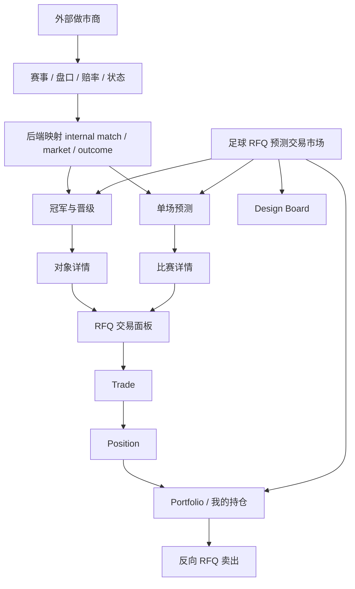
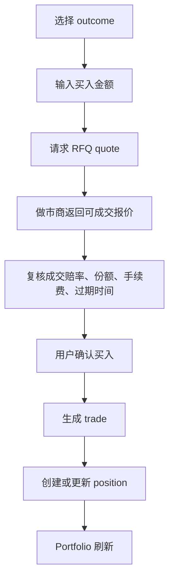
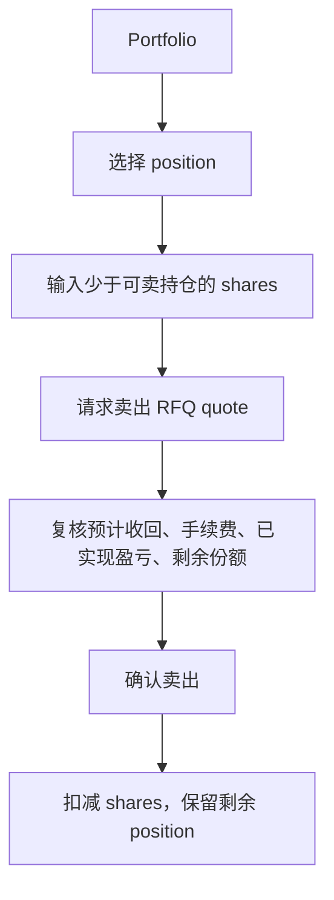
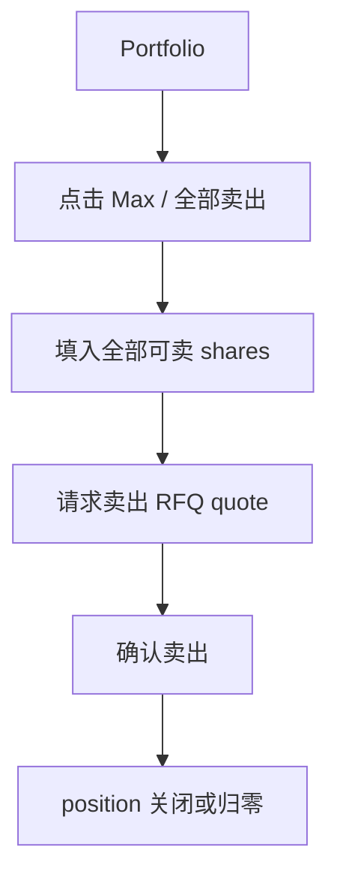
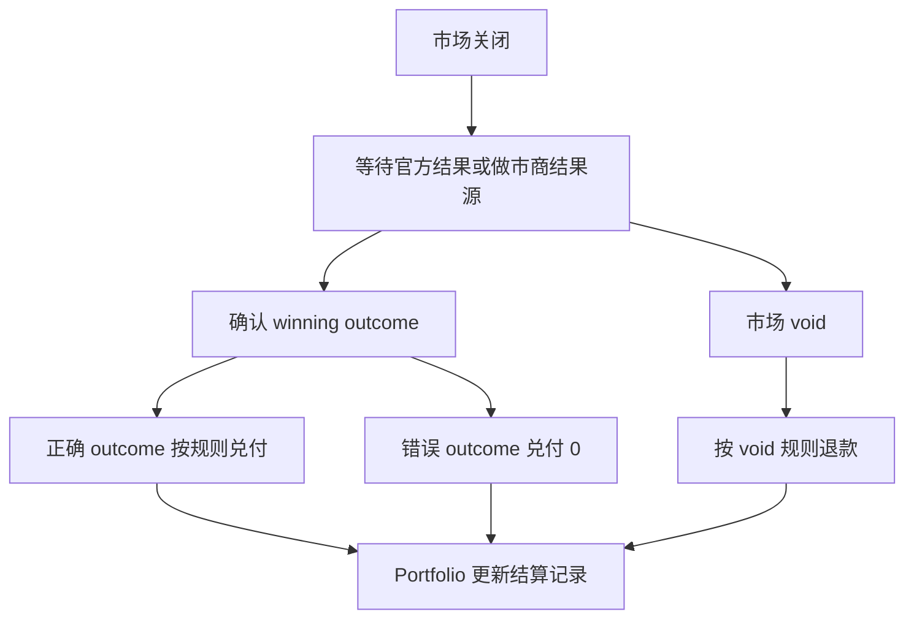
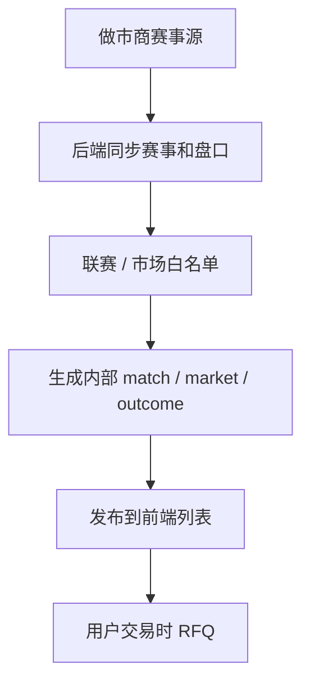

# TurboFlow 足球 RFQ 预测交易市场产品需求文档 v7.0

版本：v7.0
对象：足球 RFQ 预测交易市场，覆盖单场预测与冠军与晋级
状态：当前评审稿
文档性质：完整 PRD，不是 v6.0 增量说明

## 0. 文档说明

本文是 TurboFlow 足球 tab v7.0 的完整产品需求文档。v7.0 将足球交易底层从 v6.0 的纯 AMM 探索稿调整为外部做市商 RFQ 模式：外部做市商提供比赛数据和赔率，用户交易前请求短时有效报价，确认后锁定本次成交赔率并形成 position；买入后可通过反向 RFQ 部分卖出或全部卖出，最终按比赛结果结算。

本文遵循以下约定：

- v7.0 不是 v5.0 传统投注单回滚，也不是 v6.0 AMM 小修，而是新的 RFQ 底层交易模式。
- 用户侧继续使用 outcome、shares、quote、trade、position、Portfolio、sell、settlement 作为主语言。
- 页面继续默认展示“概率 + 份额价格”，并保留小齿轮切换欧洲赔率。
- 页面价格是做市商赔率快照或后端换算后的参考展示；真正成交价以 RFQ 返回为准。
- 买入成交后，本次成交赔率锁定；后续赔率变化只影响新 quote 和卖出 quote，不改变已成交 trade。
- 用户可以继续买入、部分卖出、全部卖出或等待结算。
- 串关、多笔单注、Cash Out、传统投注单、传统浮动投注条、扩展盘口、v4.5 预测大赛等历史能力，本版本不作为 v7.0 RFQ 主交付项；这不等于永久删除或不可回归，后续形态需产品确认。
- 文案使用正式产品语言，不使用临时、演示或内部代号表达。

## 1. 产品背景

### 1.1 v5.0、v6.0 与 v7.0 的关系

| 版本 | 交易模型 | 价格来源 | 用户资产视图 | 当前定位 |
|------|----------|----------|--------------|----------|
| v5.0 | 平台报价型传统盘口 | 平台或后台维护欧洲赔率 | 注单 / 我的注单 | 历史基线，可复用页面组织和部分校验资产 |
| v6.0 | AMM 预测市场探索稿 | 内部 AMM 池或公式 quote | outcome shares / position | 已完成产品探索，但不再作为当前底层实现主线 |
| v7.0 | 外部做市商 RFQ | 做市商赛事源和赔率 quote | RFQ trade + position + Portfolio | 当前目标版本 |

v7.0 的核心变化不是页面大改，而是底层成交方式变化：我们不再自建 AMM 定价引擎，也不把页面赔率理解为长期承诺价格，而是在每次交易前向做市商或后端 RFQ 网关请求可成交报价。

### 1.2 为什么采用 RFQ

足球盘口的真实价格依赖专业赛事、赔率和风险模型。由外部做市商提供赛事数据、市场状态和可成交报价，可以显著降低自建 AMM 定价、流动性池、概率归一化和风险敞口管理的复杂度。

v7.0 后端重点从“计算 AMM 价格”转为：

- 接入外部做市商赛事和赔率。
- 将 provider match / market / selection 映射为内部 match / market / outcome。
- 管理 quote TTL、成交确认、幂等、拒单、超时和赔率变化。
- 维护 trade、position、Portfolio、资金流水和结算对账。
- 对接当前 `turbo-contract` 中 Prediction 模块的下单锁本金、订单 PDA 幂等和结算能力。

## 2. 产品目标

| 目标类型 | 目标 | 验收口径 |
|----------|------|----------|
| 业务目标 | 将足球 tab 从 AMM 探索稿切换为 RFQ 预测交易 | 产品文档、前端 mock、Design Board、接口反馈和技术反馈均以 RFQ 为主线 |
| 业务目标 | 复用外部做市商赛事与赔率能力 | 后端能从 provider 同步比赛、盘口、赔率、状态和限额 |
| 业务目标 | 保留 position 生命周期 | 用户可以买入、继续买入、部分卖出、全部卖出或等待结算 |
| 用户目标 | 用户能理解页面价格与成交报价关系 | 页面展示参考概率 / 份额价格 / 欧洲赔率，交易面板明确“以 RFQ 成交报价为准” |
| 用户目标 | 用户买入后可以退出风险 | Portfolio 中可对 position 发起卖出 RFQ，查看退出报价后确认卖出 |
| 技术目标 | 降低自建 AMM 后端复杂度 | 不要求 AMM pool、曲线定价、内部 liquidity state 和 price impact 引擎 |
| 设计目标 | 最小改动同步前端 | 保留当前页面结构、市场目录、概率/赔率切换和交易面板结构 |

## 3. 范围定义

### 3.1 当前做什么

| 范围 | 说明 |
|------|------|
| 单场预测 | 近期比赛的核心市场：胜平负、开球权、让球、让球 0:1、总进球数、大小球、波胆 |
| 冠军与晋级 | 世界杯、欧冠、英超等系列赛 / 赛季对象下的长期结果预测 |
| 做市商赛事源 | 做市商提供比赛、市场、选项、状态、赔率和限额 |
| 内部映射 | 后端将 provider ID 映射为内部 match / market / outcome |
| RFQ 买入 | 用户输入金额后获取短时有效买入报价，确认后成交 |
| RFQ 卖出 | 用户输入 shares 后获取短时有效退出报价，确认后部分卖出或全部卖出 |
| Position | 成交后形成持仓，记录 shares、买入均价、当前参考价、可卖份额和盈亏 |
| Portfolio | 展示持仓、可卖份额、均价、退出参考价、市值、已实现 / 未实现盈亏、成交历史 |
| 价格格式切换 | 小齿轮切换概率 + 份额价格 / 欧洲赔率 |
| Design Board | 展示 v6.0 AMM 与 v7.0 RFQ 的可见差异 |

### 3.2 当前暂不交付但不永久删除

| 能力 | v7.0 当前处理 |
|------|---------------|
| 串关 / 多笔单注 | 本版本不作为 RFQ 主交付项；未来可设计为组合 RFQ 或独立模块 |
| Cash Out / 平台买断式提前结清 | 不按传统 Cash Out 恢复；当前退出能力通过反向 RFQ 卖出 position 实现 |
| 传统投注单 | 不作为当前主交易面板；历史组件可保留，不默认删除 |
| 传统我的注单 / 历史下注记录 | 当前主视图为 Portfolio；历史记录兼容展示待产品确认 |
| 传统浮动投注条 | 不作为当前 v7 主交易入口；是否保留兼容入口待确认 |
| 球员、角球、罚牌、分钟盘、同场扩展盘口 | 当前前端可见范围不扩张；provider 可同步但需白名单过滤 |
| v4.5 整届赛事预测大赛 | 不进入当前 v7 RFQ 主流程 |
| 足球 CLOB | 独立产品线，不进入当前 RFQ 主流程 |

## 4. 信息架构



## 5. 核心用户流程

### 5.1 买入 RFQ



规则：

- 页面价格只是参考快照。
- 每次交易必须先获取 quote。
- quote 有有效期，过期后必须重新询价。
- 成交后本次 trade 的 `accepted_odds` 锁定。
- 同一个 outcome 可多次买入，position 均价按成交记录更新。

### 5.2 部分卖出 RFQ



部分卖出是用户主动输入少于当前可卖持仓的 shares，并通过做市商退出报价即时成交。它不是 CLOB 部分成交，也不产生挂单。

### 5.3 全部卖出 RFQ



### 5.4 quote 失败

| 场景 | 前端提示 | 用户动作 |
|------|----------|----------|
| quote 过期 | 报价已过期，请重新询价 | 重新获取 quote |
| 做市商拒单 | 做市商暂不接受该交易 | 调整金额或稍后再试 |
| 做市商超时 | 报价请求超时 | 重试 |
| 赔率变化 | 赔率已变化，请按最新报价确认 | 重新询价 |
| 市场暂停 | 市场暂停，恢复后重新询价 | 等待恢复 |
| 卖出报价不可用 | 当前暂无法提供退出报价 | 稍后重试或等待结算 |

### 5.5 结算



## 6. 价格与展示口径

### 6.1 默认展示

v7.0 前端仍默认展示：

- 概率，例如 `55.0%`。
- 份额价格，例如 `Buy 55¢`。

这些值由做市商欧洲赔率换算或后端聚合后的参考报价生成，不再来自内部 AMM pool。

### 6.2 欧洲赔率切换

欧洲赔率仍通过 `SoccerPriceFormatToggle` 小齿轮切换。切换只影响展示，不改变 quote、trade、settlement 字段。

### 6.3 成交价

交易面板必须明确：

- 列表和卡片价格是参考快照。
- 成交以 RFQ quote 返回为准。
- 买入成交后 `accepted_odds` 锁定。
- 卖出时按新的退出 quote 成交，不修改原买入赔率。

## 7. 页面要求

### 7.1 `/soccer`

- 保留“单场预测 / 冠军与晋级”两个入口。
- 保留比赛列表、`24h Vol.`、More 入口。
- 价格列保留概率 + 份额价格 / 欧洲赔率切换。
- 文案从 AMM 价格改为 RFQ 参考报价或做市商参考价。

### 7.2 `/soccer/match/:matchId`

- 保留 7 个核心市场。
- outcome 卡点击后选中交易对象。
- 右栏展示 RFQ 交易面板、赛事信息、Portfolio 摘要。
- 暂停、关闭、结算、void 通过卡片禁用和状态提示表达。

### 7.3 `/soccer/futures/:competitionId`

- 保留 11 个赛事级市场。
- 长期市场也使用 RFQ 买入和卖出。
- 必须展示关闭时间、官方来源、结算规则和 provider 状态。

### 7.4 `/soccer/mybets`

- 主视图仍为 Portfolio / 我的持仓。
- 支持 position 选择、卖出入口、成交历史和结算记录。
- 历史注单兼容展示不在本版本主交付内，后续需产品确认。

### 7.5 `/soccer/design-board`

- 保留完整 v7 展板。
- 差异 tab 改为 v6.0 AMM 与 v7.0 RFQ 对比。
- 不做 v5 / v6 / v7 三代大矩阵。
- 必须覆盖：页面、市场、价格、买入、卖出、Portfolio、异常、结算、术语变化。

## 8. 后端领域模型

| 领域 | 职责 |
|------|------|
| Provider Adapter | 接入做市商赛事、盘口、赔率、状态、限额和结算结果 |
| Market Mapping | provider ID 到内部 match / market / outcome 的稳定映射 |
| RFQ Gateway | 统一买入 quote、卖出 quote、成交确认、拒单映射 |
| Quote Ledger | 保存 quote 请求、响应、TTL、provider_quote_id、状态 |
| Trade Ledger | 保存成交记录、accepted_odds、provider_trade_id、幂等键 |
| Position Service | 维护 position shares、均价、可卖份额、已实现 / 未实现盈亏 |
| Portfolio Service | 聚合持仓、成交历史、结算记录 |
| Settlement Service | 处理比赛结果、winning outcome、void、争议和兑付 |
| Reconciliation | 对账做市商成交、链上 Prediction 订单、资金流水和用户资产 |
| Chain Adapter | 复用 Prediction 合约能力或扩展后续链上指令 |

## 9. 与 Prediction 合约的关系

当前 `turbo-contract` 中的 Prediction 模块可作为 v7.0 RFQ 的链上参考基线：

- `prediction_place_order`：下单时锁定用户本金，写入 `PredictionOrder`。
- `PredictionOrder`：记录 `user`、`trade_id`、`pool_id`、`coin_code`、`amount`、`odds_e8`、`status`。
- `prediction_settle_v3`：按 `outcome` 和 `odds_e8` 结算赢、输、平，并写 cashbook。

缺口：

- 没有 provider quote 生命周期字段。
- 没有 sell quote / exit quote 指令。
- 没有 position 部分卖出和多次卖出状态。
- 没有 football match / market / outcome 链上结构。

建议第一阶段链下管理 RFQ、position 和 sell quote，链上只记录买入和最终结算；第二阶段如需更强链上证明，再扩展 sell / position 指令。

## 10. 接口方向

建议接口资源：

```http
GET  /api/v1/soccer/rfq/matches
GET  /api/v1/soccer/rfq/matches/:matchId/markets
GET  /api/v1/soccer/rfq/futures/:competitionId/markets
POST /api/v1/soccer/rfq/quote
POST /api/v1/soccer/rfq/trade
POST /api/v1/soccer/rfq/sell_quote
POST /api/v1/soccer/rfq/sell_trade
GET  /api/v1/soccer/rfq/portfolio
GET  /api/v1/soccer/rfq/trades
GET  /api/v1/soccer/rfq/settlements
```

核心字段：

- `provider_id`
- `provider_match_id`
- `provider_market_id`
- `provider_selection_id`
- `provider_quote_id`
- `quote_id`
- `quote_expires_at`
- `display_decimal_odds`
- `implied_probability`
- `share_price`
- `accepted_odds`
- `shares`
- `position_id`
- `client_trade_id`
- `provider_trade_id`
- `sell_quote_id`
- `net_collateral_out`

## 11. 上新比赛流程



规则：

- 前端不直接接做市商 API。
- 前端不决定比赛是否上架。
- 后端负责白名单、映射、状态归一化和异常过滤。
- 前端只消费内部 API 返回的比赛、市场和状态。

## 12. Design Board 验收

v7.0 Design Board 必须证明：

- 页面 5/5 仍覆盖。
- 单场市场 7/7 仍覆盖。
- 赛事级市场 11/11 仍覆盖。
- 概率 + 份额价格默认展示仍保留。
- 欧洲赔率切换仍保留。
- 交易面板已从 AMM quote 改为 RFQ quote。
- 卖出已从 AMM sell 改为反向 RFQ sell。
- 异常从 AMM liquidity / price impact 改为 provider reject / timeout / odds changed / quote expired。
- 历史能力没有被写成永久删除。

## 13. 验收标准

| 类别 | 验收标准 |
|------|----------|
| 产品 | 文档、前端 mock、Design Board 均使用 v7.0 RFQ 口径 |
| 价格 | 保留概率 + 份额价格和欧洲赔率切换 |
| 买入 | 用户获取 RFQ quote 后确认成交，形成 position |
| 卖出 | 用户可发起卖出 quote，部分卖出或全部卖出 |
| 上架 | 新比赛由后端 provider feed 自动同步和内部映射 |
| 后端 | quote、trade、position、settlement、reconciliation 边界清晰 |
| 合约 | 明确 Prediction 可复用点和缺口 |
| 前端 | 采用最小改动，不重做页面，不删除现有核心体验 |

## 14. 开放问题

| 问题 | 当前建议 |
|------|----------|
| 做市商是否支持卖出 / 退出报价 | 必须确认；若不支持，卖出能力需由内部风险或二级方案承接 |
| shares 是否完全链上记录 | 第一阶段链下记录，链上记录成交和结算即可 |
| 串关是否进入后续 v7.x | 本版本不交付，后续以组合 RFQ 单独定义 |
| Cash Out 是否恢复 | 不恢复传统 Cash Out，当前以反向 RFQ 卖出表达退出 |
| provider 结果和官方结果冲突 | 进入 dispute 状态，暂停结算，按产品规则处理 |
