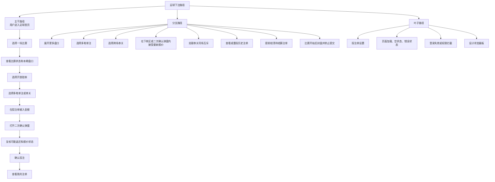
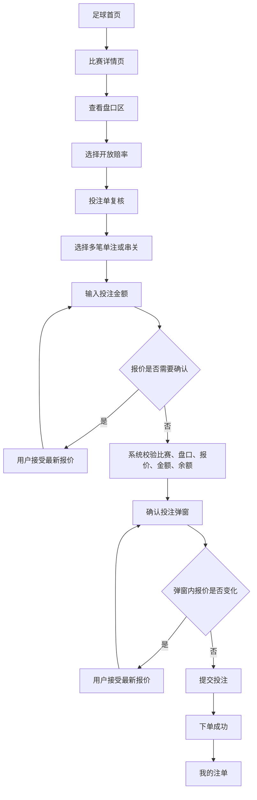
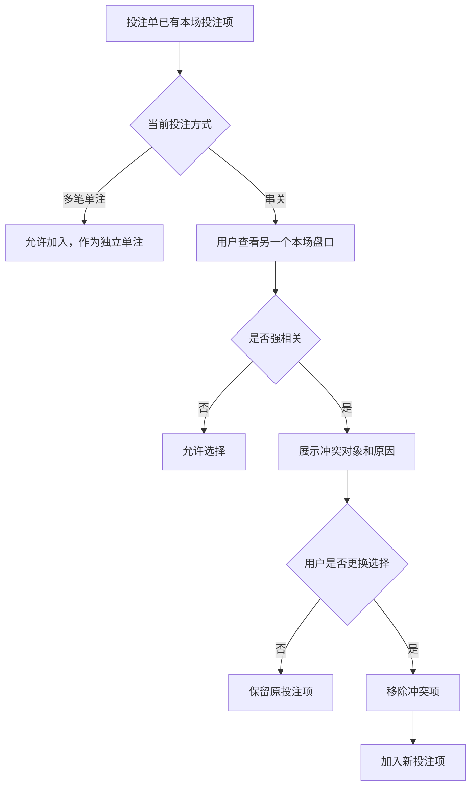
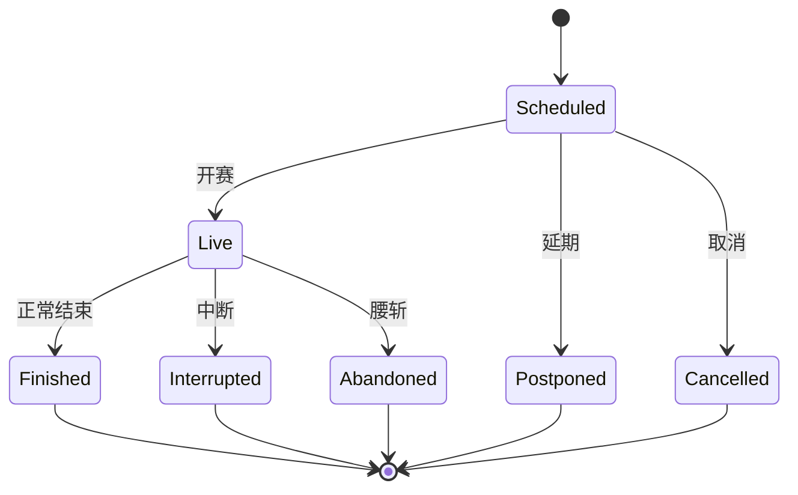
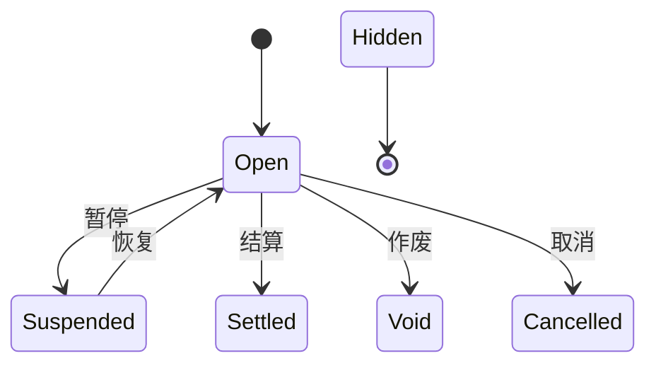
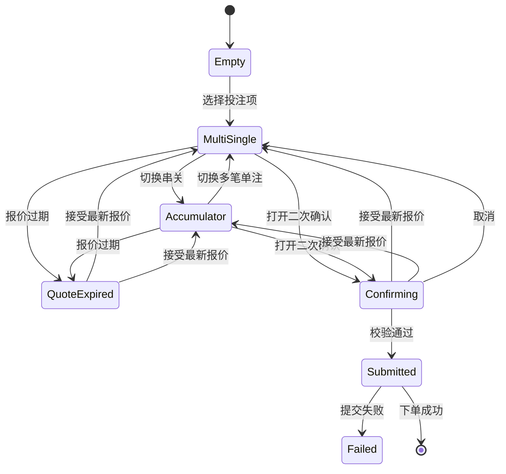
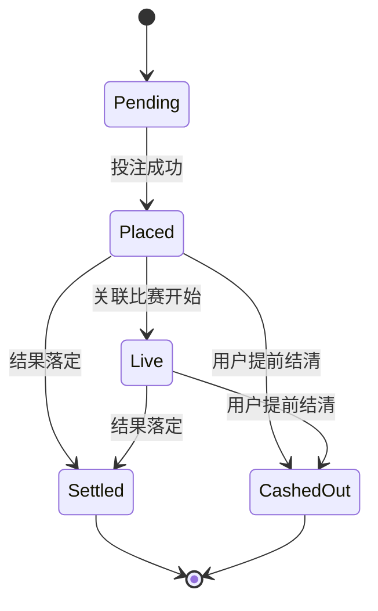

# TurboFlow 足球盘口产品需求文档 v4.3

版本：v4.3  
对象：足球传统盘口  
状态：当前评审稿

## 一、产品背景

TurboFlow 足球传统盘口是足球投注业务线下的平台报价型产品。平台向用户展示比赛、盘口和赔率，用户按平台给出的赔率选择投注项，并在投注单中完成金额、报价和二次确认。

本需求不是足球 CLOB。传统盘口由平台给出赔率，用户选择后提交投注；足球 CLOB 是订单簿撮合，用户挂单、吃单并围绕订单深度交易，两者的页面结构、资金模型和状态机不同，不能混写。

本需求也不是返佣专项。足球注单有效结算后，可以向统一返佣体系提供有效投注额等统计口径。邀请码、推广码、无限级返佣、比例、到账和冲正由返佣专项另行定义。

当前要解决的问题是：足球产品已经具备首页、比赛详情、盘口、投注单、我的注单和设计状态展板，但需要整理成可供产品评审、设计画稿、研发实现、测试验收和运营客服解释的统一 PRD。文档必须把页面结构、盘口含义、多笔单注、串关、报价变化、二次确认、开赛封盘和异常处理说清楚。

## 二、需求目标

| 目标类型 | 目标 | 对应功能 / 验收 |
|----------|------|-----------------|
| 业务目标 | 支持用户完成足球传统盘口下注主路径 | 首页找比赛、详情页看盘口、投注单提交、我的注单查看 |
| 业务目标 | 支持多笔单注和串关两种投注方式 | 投注方式切换、独立注单、串关赔率、二次确认 |
| 用户目标 | 用户能理解比赛是否可下注、盘口在判断什么、为什么某些盘口不能串关 | 盘口说明、串关冲突提示、状态提示、客服解释口径 |
| 用户目标 | 用户能在提交前复核金额、赔率、可能返还和失败原因 | 投注单、二次确认、拒单提示 |
| 产品目标 | 形成可落地的页面、状态、字段、异常和验收口径 | 页面说明、状态机、数据字段、异常表、GWT 验收 |
| 产品目标 | 让设计状态展板覆盖本期全部页面和状态 | 展板清单、设计验收、文案规范 |

### 不做什么

| 不覆盖范围 | 当前处理 |
|------------|----------|
| 足球 CLOB | 单独产品线，不在本文展开 |
| 真实提前结清报价算法 | 本文只定义用户路径、状态和展示要求 |
| 返佣完整规则 | 只保留有效投注额进入统一返佣体系的口径 |
| 更多足球盘口扩展 | 本期按当前 10 个盘口验收 |
| 合规和责任博彩专项 | 标记为上线依赖和开放问题 |
| 登录、KYC、地区限制完整规则 | 标记为【待确认】，本文只说明拦截后的用户表现 |

## 三、用户与使用场景

| 用户角色 | 使用场景 | 用户目标 | 产品必须支持的路径 |
|----------|----------|----------|--------------------|
| 新手球迷 | 赛前只想支持一场比赛结果 | 快速找到比赛，选择主胜 / 平局 / 客胜 | 首页快捷赔率或详情页胜平负单注 |
| 熟练足彩用户 | 想比较多个盘口 | 看懂每类盘口和赔率状态 | 详情页所有盘口、展开更多、串关冲突说明 |
| 临场查看用户 | 比赛开始后查看赛况和盘口结果 | 确认比赛已封盘，不能继续下单或撤单 | 进行中比赛、封盘提示、赔率锁定展示 |
| 多笔单注用户 | 一次提交多笔独立投注 | 减少重复操作，但每笔独立赔率、独立注单、独立结算 | 多项选择、逐项金额、批量提交 |
| 串关用户 | 用多场比赛换更高返还 | 组合多个独立投注项 | 跨场串关、总赔率、全部命中提示 |
| 注单查询用户 | 下单后查看结果和资金变化 | 理解待结算、结算、提前结清 | 我的注单、筛选、展开明细、重投 |
| 运营客服 | 用户询问为什么不能下注或余额变化 | 有统一解释口径 | 状态、拒单原因、结算结果说明 |
| 设计 / 研发 / 测试 | 需要完整状态清单 | 不靠反复操作发现状态 | 设计状态展板、验收标准、字段表 |

典型主干场景是：用户进入足球首页，找到赛前比赛，进入详情页，看懂比赛状态和盘口含义，选择一个或多个开放赔率，在投注单中选择多笔单注或串关，完成二次确认后提交，提交成功后在我的注单看到注单。

重要分支场景包括：多笔单注、跨场串关、串关同场盘口冲突、赔率变化确认、盘口暂停、开赛封盘、提前结清和历史注单重投。

## 四、功能范围

### P0：本期必须做

| 功能 | 用户入口 | 核心流程 | 前置条件 | 后置结果 | 失败情况 | 数据依赖 | 优先级理由 | 验收摘要 |
|------|----------|----------|----------|----------|----------|----------|------------|----------|
| 足球首页 | 主导航足球入口 | 选择联赛或比赛 | 有比赛数据 | 进入比赛详情 | 无比赛、加载失败 | 联赛、比赛、状态、快捷赔率 | 主路径入口 | 用户能找到比赛并区分状态 |
| 比赛详情页 | 首页比赛卡 | 查看比赛头部和盘口 | 比赛存在且未开赛 | 用户可选盘口 | 比赛失效或已开赛 | 比赛、盘口、辅助信息 | 下注核心页 | 页面信息层级完整 |
| 盘口区 | 比赛详情页 | 展示本期 10 个盘口 | 盘口数据存在 | 用户理解并选择赔率 | 盘口关闭、隐藏、串关冲突 | 盘口标题、选项、赔率、状态 | 下注判断核心 | 盘口含义和状态清晰 |
| 串关同场互斥 | 串关模式下选择盘口时 | 判断是否可组合 | 投注单已有本场投注项且用户选择串关 | 可选或显示冲突 | 强相关盘口冲突 | 盘口分类、组合规则 | 防止强相关投注误导 | 冲突有原因和处理动作 |
| 投注单 | 详情页右侧 / 浮动入口 | 选择投注方式、复核投注项、金额、赔率并提交 | 至少 1 个投注项 | 生成多笔单注或串关注单 | 金额、余额、报价、状态不通过 | 余额、报价、投注项、限制 | 资金操作前置校验 | 成功失败都有明确反馈 |
| 二次确认 | 投注单提交 | 展示投注方式、投注项、赔率、金额和返还 | 金额和投注项合法 | 用户确认后提交 | 赔率变化、用户取消 | 报价、投注项状态 | 防止误提交 | 下单区和弹窗内都可处理赔率变化 |
| 我的注单 | 详情页摘要 / 我的注单页 | 查看、筛选、展开、提前结清、重投 | 有注单数据 | 用户理解结果和资金变化 | 无注单、不可重投、不可提前结清 | 注单、结算、资金、报价 | 下单后闭环 | 状态和资金口径可解释 |
| 开赛封盘 | 比赛开始时 | 锁定赔率并禁止新增下注或撤单 | 比赛进入进行中 | 所有盘口不可选 | 投注单含已开赛比赛 | 比赛状态、开赛时间、盘口状态 | 本期关键规则 | 开赛后所有盘口表现一致 |
| 设计状态展板 | 内部评审入口 | 展示页面、元素和状态 | 展板数据准备 | 设计师逐项画稿 | 状态遗漏 | 页面状态、盘口状态、注单状态 | 设计交付依赖 | 本期状态一次性覆盖 |

### P1：可以做，但不阻塞上线

| 功能 | 说明 | 为什么不是 P0 |
|------|------|----------------|
| 更完整的辅助信息 | 阵容、事件、统计、交锋的完整数据覆盖 | 不影响下注主路径 |
| 更多赔率格式说明 | 当前版本仅支持欧洲盘、分数盘、美式盘展示切换 | 赔率变化统一走手动“接受最新报价”，不提供自动报价处理配置 |
| 更多运营客服话术 | 围绕退款、半赢半输补充案例 | 可随上线运营材料补充 |

### P2：后续规划

| 功能 | 说明 |
|------|------|
| 更多足球盘口分类 | 球员、角球、罚牌、分钟盘、组合盘等 |
| 风控与账户限制 | 黑名单、限额、频控、人工审核 |
| 返佣专项 | 邀请码、推广码、无限级返佣、比例和到账 |
| 足球 CLOB | - |

## 五、最短路径树与核心用户流程

### 5.1 最短路径树



### 5.2 正常下注成功流程



### 5.3 失败、取消和异常流程

| 流程 | 触发 | 系统行为 | 用户结果 |
|------|------|----------|----------|
| 用户取消 | 二次确认中点击取消 | 关闭确认弹窗，保留投注单 | 用户可继续调整 |
| 赔率变化 | 下单区或二次确认期间任一投注项赔率变化 | 主按钮变为“接受最新报价” | 用户接受后回到复核状态，需要再次确认投注 |
| 系统失败 | 报价过期、盘口关闭、余额不足、网络异常 | 阻止提交，保留投注单 | 用户按提示修正后重试 |
| 数据加载中 | 进入首页或详情页时数据未就绪 | 展示骨架状态 | 加载完成后展示内容 |
| 网络超时 | 提交或加载超时 | 不清空用户选择 | 提示稍后重试 |
| 登录失效 | 提交前身份不可用【待确认】 | 阻止提交 | 引导重新登录 |
| 权限不足 | 地区、风控限制【待确认】 | 阻止下注 | 展示限制原因和下一步 |

### 5.4 串关同场互斥处理流程



### 5.5 选项替换与投注单保留

同一个比赛、同一个盘口内，用户只能保留一个选项。用户选择同盘口的另一个选项时，系统替换原选项，而不是新增第二个同盘口投注项。

跨盘口选择时按投注方式处理：

| 投注方式 | 同场强相关盘口 | 用户表现 |
|----------|----------------|----------|
| 多笔单注 | 允许 | 作为独立注单加入投注单，不展示冲突遮罩 |
| 串关 | 不允许 | 阻止加入或阻止切换串关，并提示不可同场串关 |

投注单在页面切换和失败后保留。若从本地持久化恢复或通过重投回填，报价需要重新确认，用户接受最新报价后再继续提交。

## 六、页面与模块说明

### 6.1 页面总览

| 页面 / 模块 | 页面目标 | 用户入口 | 主要动作 | 关键状态 |
|-------------|----------|----------|----------|----------|
| 足球首页 | 找到比赛 | 主导航足球入口 | 联赛筛选、进入比赛 | 加载、空列表、赛前、进行中、异常 |
| 比赛详情页 | 完成下注判断 | 首页比赛卡 | 返回、查看盘口、选择赔率 | 比赛状态、盘口状态、右栏信息缺失 |
| 盘口区 | 理解并选择盘口 | 比赛详情页 | 选择赔率、展开更多、处理冲突 | 开放、暂停、作废、结算、隐藏、开赛封盘 |
| 投注单 | 下单前复核和提交 | 详情页右侧 / 浮动入口 | 输入金额、切换投注方式、提交 | 空单、多笔单注、串关、报价过期 |
| 我的注单 | 查看下注后状态 | 右栏摘要 / 我的注单页 | 筛选、展开、提前结清、重投、导出 | 待结算、已结算、提前结清 |
| 设计状态展板 | 设计和评审覆盖状态 | 内部评审入口 | 查看所有页面和状态 | 静态展示，不参与用户下注 |

### 6.2 足球首页

首页先让用户看清“有哪些比赛”，再让用户决定是否进入详情页。快捷赔率只是入口，不承担完整盘口解释。

| 模块 | 展示字段 | 默认规则 | 点击后 |
|------|----------|----------|--------|
| 联赛导航 | 全部赛事、联赛名、国家、比赛数量、进行中数量 | 默认全部赛事 | 刷新主区比赛列表 |
| 进行中列表 | 进行中比赛、双方简称、比分 | 按当前数据顺序 | 进入比赛详情 |
| 即将开赛 | 赛前比赛、双方简称、开赛时间 | 按开赛时间 | 进入比赛详情 |
| 比赛列表 | 时间、状态、球队、快捷赔率、更多盘口数量 | 按联赛分组 | 点击比赛进入详情 |

| 状态 | 页面表现 |
|------|----------|
| 默认 | 展示全部联赛比赛 |
| 加载 | 展示列表骨架 |
| 空状态 | 显示当前筛选下暂无比赛 |
| 错误 | 显示加载失败，并保留返回或重试入口【待确认】 |
| 移动端 | 侧栏改为顶部或折叠筛选，快捷赔率减少但比赛信息优先 |

### 6.3 比赛详情页

详情页先解释比赛，再展示盘口。投注单和我的注单摘要在右侧，帮助用户在同一页面完成下注和复核。

| 区域 | 信息层级 | 模块说明 |
|------|----------|----------|
| 路径导航 | 足球、联赛、本场比赛 | 帮助用户返回首页或联赛 |
| 比赛头部 | 球队、状态、比分或时间、分钟、场地 | 比分只在已产生比赛进程时展示 |
| 盘口导航 | 所有盘口 | 本期为单一聚合入口 |
| 盘口列表 | 本期 10 个盘口 | 超过首屏时可展开其余盘口 |
| 右栏信息 | 倒计时、阵容、交锋、事件、统计 | 数据缺失不影响下注 |
| 投注单 | 投注项、金额、报价、返还 | 提交前复核 |
| 我的注单摘要 | 最近注单、已实现盈亏、未结算本金 | 进入我的注单页 |

### 6.4 投注单

| 状态 | 进入条件 | 用户可做 | 禁用 / 阻塞 |
|------|----------|----------|-------------|
| 空单 | 未选择投注项 | 查看余额、赔率格式和说明 | 不可提交 |
| 多笔单注 | 1 个或以上投注项 | 逐项或统一输入金额、提交 | 金额或报价异常时阻塞 |
| 串关 | 2 个或以上可组合投注项 | 复核总赔率、提交 | 任一投注项异常或不可串关时阻塞 |
| 报价过期 | 报价超过有效期 | 接受最新报价 | 未接受前不可提交 |
| 含不可用项 | 比赛或盘口状态变化 | 移除不可用项 | 不可提交 |
| 提交中 | 用户点击确认投注 | 等待结果 | 防重复提交 |

投注单支持两种投注方式：

| 投注方式 | 进入条件 | 计算方式 | 用户必须理解 |
|----------|----------|----------|--------------|
| 多笔单注 | 1 个或以上投注项 | 每个投注项单独计算赔率、金额和返还 | 提交后按投注项拆成一笔或多笔独立单腿注单 |
| 串关 | 2 个或以上跨场且可组合投注项 | 金额 × 各项赔率连乘 | 全部命中才返还 |

多笔单注允许一次提交多个投注项，但不是串关，也不合并赔率。同一场比赛内的多个盘口可以作为多笔单注提交，因为每笔都独立生成注单、独立结算；串关同场互斥只适用于串关。同一个盘口内选择新选项时替换原选项。

所有投注方式都必须进入二次确认弹窗。若提交前或二次确认期间发生报价变化，主按钮变为“接受最新报价”；用户接受后只更新赔率快照和 30 秒报价有效期，不直接下单，需要再次核对金额、赔率和可能返还，再继续确认投注。

投注单设置当前只保留赔率格式切换，不提供赔率变化自动处理配置。无论用户使用哪种赔率格式，提交和确认弹窗内的报价变化都必须由用户手动接受。

### 6.5 我的注单

| 模块 | 展示字段 | 规则 |
|------|----------|------|
| 状态筛选 | 全部、待结算、已结算、提前结清 | 默认展示近 7 天 |
| 日期筛选 | 今天、7 天、全部 | 切换后重置分页 |
| 注单卡片 | 注单号、状态、比赛、盘口、选择、赔率、金额、返还 | 多笔单注提交后展示为多张单腿注单；串关展示为一张可展开注单 |
| 操作 | 提前结清、重投、复制注单号、导出记录 | 不可用时隐藏或禁用 |
| 空状态 | 当前无符合条件的注单 | 保留筛选入口 |

串关注单展开后展示每个投注项的比赛、盘口、选择、赔率和赛果。若某一投注项作废或退本，串关重算时该项按 1.00 参与计算；最终结算和有效投注额以后端返回为准。

重投按原注单类型回填：单腿注单回填为多笔单注，串关注单回填为串关。回填时需要重新获取最新报价；若最新报价与原注单不一致或报价已过期，投注单标记为需要接受最新报价，接受后用户仍需再次确认。

### 6.6 设计状态展板

展板必须覆盖页面级、比赛状态、盘口、盘口状态、开赛封盘、投注单、浮动投注单、二次确认、我的注单、报价与错误。展板中的文案按正式产品文案处理，不使用临时、演示、占位或内部代号表达。

## 七、盘口体系与组合规则

### 7.1 本期盘口清单

| 盘口 | 分类 | 用户在判断什么 | 选项形态 |
|------|------|----------------|----------|
| 胜平负 | 赛果 | 全场主胜、平局或客胜 | 三项按钮 |
| 开球权 | 趣味盘 | 哪一方先开球 | 两项按钮 |
| 亚洲让分盘 | 亚洲让分 | 指定让分线下哪一方赢盘 | 多行两列 |
| 让分0:1 | 欧洲让分 | 虚拟比分 0:1 后的胜平负 | 多行三列 |
| 让分0:2 | 欧洲让分 | 虚拟比分 0:2 后的胜平负 | 多行三列 |
| 让分1:0 | 欧洲让分 | 虚拟比分 1:0 后的胜平负 | 多行三列 |
| 让分2:0 | 欧洲让分 | 虚拟比分 2:0 后的胜平负 | 多行三列 |
| 总进球数 | 进球档位 | 全场总进球落在哪个档位 | 0、1、2、3、4、5+ |
| 合计 | 大小球 | 总进球高于或低于某条线 | 多行两列 |
| 正确进球 | 精确比分 | 全场具体比分 | 比分矩阵 |

### 7.1.1 本期盘口解释

本节用于统一产品、设计、研发、测试和客服对盘口的解释口径。所有说明均以常规 90 分钟比赛时间为基础，是否包含伤停补时、加时赛或点球大战以后端赛事规则为准；若盘口卡片或详情页另有说明，以该盘口说明优先。

#### 胜平负

胜平负用于判断全场赛果。用户在主队胜、平局、客队胜三个结果中选择一个；比赛结束后，实际全场结果与用户选择一致则该投注项获胜，否则失败。

示例：主队 2:1 客队，选择主队胜获胜，选择平局或客队胜失败。主队 1:1 客队，选择平局获胜。

胜平负是最基础的赛果盘口，会被正确比分、欧洲让分等盘口直接或间接推出，因此在串关中与这些强相关盘口互斥。

#### 开球权

开球权用于判断哪一方先开球。用户只需要选择主队或客队；实际开球方与用户选择一致则该投注项获胜。

开球权与最终比分、胜负方向、总进球数没有直接推导关系，因此在本期串关规则中视为趣味盘，可与任意本期盘口组合。

#### 亚洲让分盘

亚洲让分盘用于判断让球后的赢盘方。盘口会给主队和客队分别展示一组相反的让球线，例如 `-0.5 / 0.5` 表示主队让 0.5 球、客队受让 0.5 球；用户选择某一方后，系统用实际比分加减让球数，判断该方是否赢盘。

让球线中的正负号表示方向：负数表示该方让球，正数表示该方受让。主队 `-1.5` 表示主队必须净胜 2 球或以上才赢盘；客队 `+1.5` 表示客队赢球、打平或只输 1 球都赢盘。

`.5` 是半球线，用来避免正好打平退本。例如主队 `-0.5` 时，主队只要赢球就赢盘，打平或输球都失败；客队 `+0.5` 时，客队赢球或打平都赢盘。因为足球比分是整数，加入 0.5 后不会出现“刚好等于盘口线”的情况，所以半球线没有退本结果。

整数线可能出现退本。例如主队 `-1` 时，主队净胜 2 球或以上赢盘，刚好净胜 1 球退本，打平或输球失败；客队 `+1` 时，客队赢球或打平赢盘，刚好输 1 球退本，输 2 球或以上失败。

`.25` 和 `.75` 是四分之一球线，本质是把一笔投注拆成两个相邻盘口结算，用来让赔率更细。例如主队 `-0.25` 等于一半投注在 `0`，一半投注在 `-0.5`；主队打平时，`0` 这半退本，`-0.5` 这半失败，因此整体为半输。主队 `-0.75` 等于一半投注在 `-0.5`，一半投注在 `-1`；主队刚好赢 1 球时，`-0.5` 这半获胜，`-1` 这半退本，因此整体为半赢。

当前版本中亚洲让分盘以多行两列展示，行是让球线，列是主队和客队。结算时可能出现赢、输、退本、半赢、半输；具体资金拆分和展示以后端结算结果为准。

#### 让分0:1、让分0:2、让分1:0、让分2:0

这类盘口是欧洲让分胜平负，不是亚洲让分盘。系统先给某一方加入一个虚拟比分，再让用户判断调整后的主胜、平局或客胜，因此每一行仍然是三项选择。

`让分0:1` 表示比赛开始前先视为主队 0:1 落后客队。若实际比分为主队 2:0 客队，调整后为 2:1，主胜；若实际比分为 1:0，调整后为 1:1，平局；若实际比分为 0:0，调整后为 0:1，客胜。

`让分0:2` 表示主队先视为 0:2 落后客队。主队需要在真实比赛中净胜 3 球或以上，调整后才是主胜；真实净胜 2 球时调整后为平局；真实净胜不足 2 球或不胜时为客胜。

`让分1:0` 表示主队先视为 1:0 领先客队。若实际比分为 0:0，调整后为 1:0，主胜；若实际比分为 0:1，调整后为 1:1，平局；若实际比分为 0:2，调整后为 1:2，客胜。

`让分2:0` 表示主队先视为 2:0 领先客队。客队需要在真实比赛中净胜 3 球或以上，调整后才是客胜；客队真实净胜 2 球时调整后为平局；其他结果多为主胜。

欧洲让分与亚洲让分的核心区别是：欧洲让分仍然选择主胜、平局、客胜三项结果；亚洲让分只选择主队或客队哪一方赢盘，并可能出现退本或半赢半输。

#### 总进球数

总进球数用于判断全场总进球会落在哪个离散档位。用户选择 `0`、`1`、`2`、`3`、`4` 或 `5+` 中的一项；比赛结束后，主队进球数和客队进球数相加，落入所选档位则获胜。

示例：比分 2:1 时总进球为 3，选择 `3` 获胜；比分 3:2 时总进球为 5，选择 `5+` 获胜；比分 0:0 时总进球为 0，选择 `0` 获胜。

总进球数是离散档位盘口，用户是在猜具体进球数量或数量区间；它不是大小球，不能用“高于 / 低于某条线”来结算。

#### 合计

合计是大小球盘口，用于判断全场总进球是否高于或低于指定盘口线。每一行是一条进球线，例如 `2.5`，两列分别是“高于”和“低于”。

`2.5` 中的 `.5` 是半球线，用来避免总进球刚好等于盘口线。因为总进球只能是整数，所以高于 `2.5` 等于 3 球或以上获胜，低于 `2.5` 等于 0、1、2 球获胜。`.5` 线不会出现退本。

整数线可能出现退本。例如高于 `2` 时，3 球或以上获胜，刚好 2 球退本，0 或 1 球失败；低于 `2` 时，0 或 1 球获胜，刚好 2 球退本，3 球或以上失败。

`.25` 和 `.75` 是四分之一球线，与亚洲让分盘类似，会拆成两个相邻大小球盘口结算。例如高于 `2.25` 等于一半投注在高于 `2`，一半投注在高于 `2.5`；全场刚好 2 球时，高于 `2` 这半退本，高于 `2.5` 这半失败，因此整体为半输。高于 `2.75` 等于一半投注在高于 `2.5`，一半投注在高于 `3`；全场刚好 3 球时，一半获胜、一半退本，因此整体为半赢。

合计和总进球数高度相关，因为总进球数确定后可以直接判断大小球是否高于或低于盘口线，所以两者不能放入同一张串关注单。

#### 正确进球

正确进球用于判断全场具体比分，也就是常见的正确比分盘口。用户在比分矩阵中选择一个精确比分，例如 `1:0`、`1:1`、`2:1`；比赛结束后，实际比分与所选比分完全一致则获胜，否则失败。

示例：实际比分为主队 2:1 客队，只有选择 `2:1` 获胜；选择主队胜方向但比分不完全一致，例如 `1:0` 或 `3:1`，都失败。

正确进球会直接推出胜平负、总进球数、大小球和让分结果，因此它是串关同场互斥中限制最多的盘口之一。多笔单注不受该限制，但同一盘口内仍只能保留一个比分选项。

### 7.2 串关同场互斥矩阵

下表只约束串关。多笔单注中的同场强相关盘口各自独立结算，不触发本矩阵，也不展示串关冲突遮罩。

| 组合 | 是否允许 | 用户解释 |
|------|----------|----------|
| 开球权 × 任意本期盘口 | 允许 | 开球权与最终赛果相对独立 |
| 胜平负 × 亚洲让分盘 | 不允许 | 两者都在判断胜负方向 |
| 胜平负 × 欧洲让分 | 不允许 | 欧洲让分是带条件的胜平负 |
| 胜平负 × 正确进球 | 不允许 | 正确进球会直接推出胜平负 |
| 亚洲让分盘 × 欧洲让分 | 不允许 | 两者都属于让分维度 |
| 亚洲让分盘 × 正确进球 | 不允许 | 正确进球会决定让分结果 |
| 欧洲让分 × 正确进球 | 不允许 | 正确进球会决定让分后的赛果 |
| 总进球数 × 合计 | 不允许 | 总进球档位会决定大小球结果 |
| 总进球数 × 正确进球 | 不允许 | 正确进球会推出总进球数 |
| 合计 × 正确进球 | 不允许 | 正确进球会推出大小球结果 |
| 未分类盘口 × 同场非趣味盘口 | 不允许 | 相关性未明确前暂不可组合 |

### 7.3 开赛后封盘规则

本期所有盘口只允许赛前下注。比赛开始后，所有盘口立即封盘：不允许新增投注项，不允许提交投注单中关联该比赛的未提交项，也不允许撤销已提交注单。开赛瞬间的赔率作为展示快照保留，之后不再随比赛进程变化。

| 比赛状态 | 用户表现 | 投注单表现 |
|----------|----------|------------|
| 赛前 | 所有开放盘口可选择 | 可进入二次确认并提交 |
| 开赛瞬间 | 页面展示封盘提示，赔率停止变化 | 关联该比赛的未提交项不可提交，需要移除 |
| 进行中 | 盘口可查看但不可选择 | 不允许新增或提交该比赛投注项 |
| 已结束 / 取消 / 延期 | 查看结果或说明 | 不允许提交 |

## 八、交互规则

| 规则 | 说明 | 用户反馈 |
|------|------|----------|
| 按钮可点击 | 比赛可下注、盘口开放、报价已确认、金额合法；串关无同场冲突 | 正常提交 |
| 按钮不可点击 | 任一条件不满足 | 按原因展示禁用文案 |
| 金额校验 | 不低于最低额、不高于最高额、不超过余额、不超过返还上限 | 告诉用户调整金额 |
| 投注方式切换 | 支持多笔单注和串关两种方式 | 切换时说明规则 |
| 同盘口替换 | 同一比赛同一盘口选择新选项 | 替换原投注项 |
| 二次确认 | 所有提交都必须触发 | 弹窗展示投注项、金额、赔率和返还 |
| 防重复提交 | 提交中禁用按钮 | 显示提交中 |
| 报价过期 | 报价有效期结束 | 下单区和二次确认弹窗均可接受最新报价；接受后回到复核状态 |
| 赔率变化 | 最新报价与选择时不同 | 主按钮变为“接受最新报价”，接受后再继续确认 |
| 开赛封盘 | 比赛进入进行中 | 所有盘口不可再选，投注单内相关项不可提交 |
| 离开页面 | 投注单保留 | 非详情页展示浮动入口 |
| 清空操作 | 清空当前场或全部投注项 | 立即更新投注单 |

## 九、状态与生命周期

### 9.1 比赛状态



| 状态 | 含义 | 用户可见 | 可下注 | 用户动作 |
|------|------|----------|--------|----------|
| 赛前 | 比赛未开始 | 是 | 是 | 查看盘口、下注 |
| 进行中 | 比赛正在进行 | 是 | 否 | 查看比分和封盘盘口 |
| 已结束 | 比赛正常结束 | 是 | 否 | 查看结果 |
| 中断 | 比赛暂停或中断 | 是 | 否 | 查看说明 |
| 腰斩 | 比赛异常终止 | 是 | 否 | 查看结算说明 |
| 延期 | 比赛推迟 | 是 | 否 | 等待新时间 |
| 取消 | 比赛取消 | 是 | 否 | 查看退款或作废说明 |

### 9.2 盘口状态



| 状态 | 含义 | 用户可执行动作 | 异常处理 |
|------|------|----------------|----------|
| 开放 | 可选择赔率 | 选择或取消选择 | 正常进入投注单 |
| 即将开放 | 盘口存在但尚未开放 | 仅查看 | 不允许选择 |
| 暂停 | 暂时不接受投注 | 仅查看 | 已选项不可提交 |
| 已结算 | 已有结果 | 查看结果 | 不允许选择 |
| 作废 | 盘口无效 | 查看作废说明 | 已下注按规则退款或重算【待确认】 |
| 取消 | 盘口取消 | 查看说明 | 不允许选择 |
| 隐藏 | 前台不展示 | 无 | 不占用户页面位置 |

### 9.3 投注单状态



### 9.4 注单状态



| 状态 | 含义 | 用户动作 | 系统动作 |
|------|------|----------|----------|
| 待确认 | 投注正在处理 | 等待 | 防重复提交 |
| 已下注 | 注单生成，结果未落定 | 查看、提前结清、重投入口视状态展示 | 锁定未结算本金 |
| 进行中 | 关联比赛正在进行 | 查看、提前结清 | 更新赛况和结算状态；下注赔率不再变化 |
| 已结算 | 结果落定 | 查看、重投 | 更新返还和盈亏 |
| 已提前结清 | 用户提前结束注单 | 查看、重投 | 不再普通结算 |

### 9.5 资金状态

| 状态 / 口径 | 含义 | 变化时机 |
|-------------|------|----------|
| 可用余额 | 用户可继续下注的金额 | 下单成功减少，结算或提前结清增加 |
| 未结算本金 | 已下注但结果未落定的本金 | 下单成功增加，结算 / 提前结清 / 退款减少 |
| 可能返还 | 理想结果下最多拿回的金额 | 投注项、赔率或金额变化时更新 |
| 可能净盈利 | 可能返还减去投注金额 | 投注项、赔率或金额变化时更新 |
| 已结盈亏 | 已实际发生的盈利或亏损 | 结算、提前结清后出现 |

## 十、数据字段与接口意图

本文不定义具体接口路径，只描述页面需要的数据意图。

| 数据对象 | 字段 | 类型 | 必填 | 来源 | 展示位置 | 说明 |
|----------|------|------|------|------|----------|------|
| 比赛 | 比赛 ID | 字符串 | 是 | 比赛数据 | 首页、详情、投注单、注单 | 唯一识别比赛 |
| 比赛 | 主队 / 客队 | 文本 | 是 | 比赛数据 | 全部足球页面 | 展示对阵 |
| 比赛 | 状态 | 枚举 | 是 | 比赛数据 | 首页、详情、投注单 | 决定是否可下注 |
| 比赛 | 比分 / 分钟 | 数字 | 条件必填 | 赛况数据 | 首页、详情 | 仅进行中和已产生结果时展示 |
| 盘口 | 盘口名称 | 文本 | 是 | 盘口数据 | 盘口区、投注单、注单 | 用户理解判断对象 |
| 盘口 | 盘口状态 | 枚举 | 是 | 盘口数据 | 盘口区、投注单 | 决定是否可选 |
| 盘口 | 选项和赔率 | 数组 | 是 | 赔率数据 | 盘口区 | 用户选择入口 |
| 报价 | 报价有效期 | 时间 | 是 | 报价数据 | 投注单 | 决定是否需要重新确认 |
| 投注单 | 投注项 | 数组 | 是 | 用户选择 | 投注单 | 比赛、盘口、选择、赔率 |
| 投注单 | 投注方式 | 枚举 | 是 | 用户选择 | 投注单、二次确认、我的注单 | 多笔单注或串关 |
| 投注单 | 赔率格式 | 枚举 | 是 | 用户设置 | 投注单、盘口区、注单 | 欧洲盘、分数盘、美式盘 |
| 注单 | 注单号 | 文本 | 是 | 下单结果 | 我的注单 | 用户和客服查询 |
| 注单 | 注单状态 | 枚举 | 是 | 注单数据 | 我的注单 | 待结算、结算、提前结清 |
| 资金 | 可用余额 | 数字 | 是 | 账户数据 | 投注单 | 金额校验 |
| 资金 | 未结算本金 | 数字 | 是 | 账户数据 | 投注单、我的注单 | 资金解释 |
| 返佣 | 有效投注额 | 数字 | 条件必填 | 结算结果 | 返佣体系 | 只提供统计口径 |

| 数据能力 | 是否需要 | 说明 |
|----------|----------|------|
| 分页 | 是 | 我的注单需要分页或加载更多 |
| 排序 | 是 | 首页按联赛分组，我的注单按下单时间倒序 |
| 筛选 | 是 | 首页按联赛，我的注单按状态和时间 |
| 实时刷新 | 是 | 赛前赔率、报价倒计时需要刷新；开赛后赔率停止变化 |
| 推送 / 轮询 | 【待确认】 | 生产环境建议由后端或数据源推送 |
| 数据一致性 | 【待确认】 | 结算以官方赛果和后端结算为准 |
| 埋点 | 是 | 下注漏斗、失败原因、状态曝光 |

## 十一、权限与风控规则

| 规则 | 当前要求 | 用户提示 |
|------|----------|----------|
| 访问权限 | 足球首页和比赛详情可访问【待确认】 | 无权限时提示登录或不可用原因 |
| 下注意愿 | 用户必须选择投注项并输入合法金额 | 提示选择赔率或调整金额 |
| 登录态 | 提交前需要有效登录态【待确认】 | 登录已失效，请重新登录 |
| 钱包 / 账户 | 余额必须足够 | 余额不足，请调整投注金额 |
| KYC / 地区限制 | 是否影响下注【待确认】 | 当前账户暂不可下注 |
| 频率限制 | 防重复提交和提交频控 | 提交处理中，请稍候再试 |
| 金额限制 | 最低、最高、返还上限 | 告知具体限制和调整方式 |
| 盘口风控 | 盘口关闭、比赛不可用、串关强相关冲突 | 说明原因并引导移除或替换 |
| 黑白名单 | 【待确认】 | 命中限制时展示不可下注原因 |
| 人工审核 | 【待确认】 | 如需审核，展示等待状态 |

## 十二、异常情况与边界条件

| 场景 | 触发条件 | 系统行为 | 用户提示 | 是否阻塞流程 | 备注 |
|------|----------|----------|----------|--------------|------|
| 网络超时 | 加载或提交超时 | 保留当前页面和投注单 | 网络异常，请稍后重试 | 是 | 不清空选择 |
| 数据加载失败 | 比赛或盘口数据不可用 | 展示错误状态 | 数据加载失败，请重试【待确认】 | 是 | 保留返回入口 |
| 数据为空 | 无比赛或无注单 | 展示空状态 | 当前无符合条件的数据 | 否 | 保留筛选入口 |
| 报价过期 | 报价有效期结束 | 主按钮变为“接受最新报价” | 请接受最新报价后继续 | 是 | 下单区和二次确认弹窗均可处理 |
| 赔率变化 | 最新报价与选择时不同 | 主按钮变为“接受最新报价” | 请接受最新报价后继续 | 是 | 接受后需重新核对返还 |
| 重复提交 | 用户连续点击提交 | 禁用按钮 | 提交处理中，请稍候 | 是 | 防重复下注 |
| 登录失效 | 提交前登录态失效 | 阻止提交 | 登录已失效，请重新登录 | 是 | 待接入账户体系 |
| 权限不足 | 地区 / KYC / 风控限制 | 阻止下注 | 当前账户暂不可下注 | 是 | 规则待确认 |
| 余额不足 | 总投注额超过余额 | 阻止提交 | 余额不足，请调整投注金额 | 是 | 可用余额为准 |
| 比赛状态变化 | 比赛开始、结束、延期、取消等 | 投注项不可提交 | 比赛不可用，请移除相关选项 | 是 | 开赛后封盘，投注单保留 |
| 盘口关闭 | 盘口暂停、作废、取消、结算 | 投注项不可提交 | 盘口已关闭，请移除不可用选项 | 是 | 盘口保留说明 |
| 串关同场冲突 | 强相关盘口同场串关 | 阻止切换串关或提交串关 | 说明冲突对象和原因 | 是 | 可改为多笔单注提交 |
| 同盘口重复选择 | 用户在同一盘口选择另一选项 | 替换原投注项 | 投注单展示最新选择 | 否 | 不产生两条同盘口投注项 |
| 重投报价不可用 | 历史注单对应盘口找不到最新报价 | 回填投注项并标记需重新确认或不可提交 | 请接受最新报价或移除不可用选项 | 视情况 | 以后端报价校验为准 |
| 用户中途退出 | 离开详情页 | 保留投注单 | 浮动投注单可返回 | 否 | 防止选择丢失 |
| 页面刷新 | 用户刷新页面 | 尝试恢复投注单【待确认】 | 需要重新确认报价 | 视情况 | 报价不沿用旧状态 |
| 多端同时操作 | 其他端修改资金或注单 | 提交前重新校验 | 状态已变化，请重新确认 | 是 | 以后端为准 |
| 移动端弱网 | 低速或断续网络 | 保留输入和选择 | 网络不稳定，请稍后重试 | 是 | 减少重复提交 |
| 第三方服务不可用 | 赛果或赔率源异常 | 暂停相关盘口 | 相关盘口暂不可用 | 是 | 需运营兜底 |

## 十三、埋点与数据指标

### 13.1 核心漏斗

```text
足球首页曝光
→ 比赛详情曝光
→ 盘口曝光
→ 选择赔率
→ 打开投注单
→ 输入金额
→ 触发二次确认
→ 提交投注
→ 下单成功 / 下单失败
→ 查看我的注单
```

### 13.2 事件设计

| 事件名 | 触发时机 | 属性 | 用途 |
|--------|----------|------|------|
| soccer_home_view | 进入足球首页 | 联赛筛选、比赛数量、进行中数量 | 首页转化分析 |
| soccer_match_view | 进入比赛详情 | 比赛状态、联赛、是否有盘口 | 详情页曝光 |
| soccer_market_view | 盘口进入可视区域 | 盘口名称、盘口状态、比赛状态 | 盘口关注度 |
| soccer_odds_select | 用户选择赔率 | 盘口、选项、赔率、投注方式、串关冲突状态 | 选择行为 |
| soccer_betslip_open | 投注单展示 | 投注项数量、比赛数量、投注方式 | 投注单使用 |
| soccer_stake_input | 输入金额 | 金额、投注方式、余额是否足够 | 金额分布 |
| soccer_confirm_view | 二次确认弹窗展示 | 投注项数量、金额、投注方式 | 风险复核 |
| soccer_quote_accept | 点击接受最新报价 | 投注方式、投注项数量、触发位置、变化项数量 | 观察报价变化对转化的影响 |
| soccer_bet_submit | 点击确认投注 | 投注方式、金额、投注项数量 | 提交流量 |
| soccer_bet_success | 下单成功 | 注单状态、投注方式、金额 | 成交转化 |
| soccer_bet_failed | 下单失败 | 失败原因、投注方式、金额 | 拒单优化 |
| soccer_mybets_view | 查看我的注单 | 筛选状态、时间范围 | 注单查询 |
| soccer_cashout_click | 点击提前结清 | 注单状态、参考结算价 | 提前结清漏斗 |
| soccer_replay_click | 点击重投 | 原投注方式、投注项数量 | 重投转化 |

## 十四、验收标准

| 场景 | Given | When | Then |
|------|-------|------|------|
| 首页查看比赛 | 有多场比赛 | 用户进入足球首页 | 展示联赛、比赛、状态和快捷赔率 |
| 赛前不展示比分 | 比赛为赛前、延期或取消 | 用户查看首页或详情 | 页面不展示比分 |
| 进行中展示比分 | 比赛进行中 | 用户查看首页或详情 | 展示比分和比赛分钟 |
| 多笔单注 | 用户选择 1 个或多个开放赔率 | 选择多笔单注并提交 | 生成一笔或多笔独立注单并更新资金口径 |
| 同盘口替换 | 用户已选择某盘口选项 | 在同一盘口选择另一选项 | 投注单替换为最新选项，不新增第二条同盘口投注项 |
| 串关提示 | 投注单已有 1 项 | 用户选择另一场可组合赔率并切换串关 | 投注单展示串关总赔率并提示需全部命中 |
| 多笔单注同场多盘口 | 用户选择同一场多个盘口 | 选择多笔单注并提交 | 不展示冲突，分别生成独立注单 |
| 串关同场冲突 | 已选择胜平负 | 用户切换串关或在串关中选择正确进球 | 展示冲突原因，不能作为同一串关提交 |
| 二次确认 | 用户点击确认投注 | 弹窗展示投注方式、明细、金额、赔率和返还 | 用户确认后才提交 |
| 报价变化 | 下单区或二次确认期间赔率变化 | 用户查看投注单或弹窗 | 主按钮变为“接受最新报价”；第一次点击只更新赔率快照和 30 秒有效期，不下单；再次点击才进入确认或提交 |
| 开赛封盘 | 比赛进入进行中 | 用户查看盘口或提交投注单 | 所有盘口不可选，相关投注项不可提交 |
| 报价过期 | 报价有效期结束 | 用户提交投注 | 主按钮变为“接受最新报价”；第一次点击只更新赔率快照和 30 秒有效期，不下单；再次点击才进入确认或提交 |
| 盘口关闭 | 投注单含已关闭盘口 | 用户提交投注 | 阻止提交并提示移除不可用选项 |
| 比赛结束 | 投注单含已结束比赛 | 用户提交投注 | 阻止提交并提示比赛不可用 |
| 余额不足 | 投注金额超过可用余额 | 用户提交投注 | 阻止提交并提示调整金额 |
| 重复提交 | 提交处理中 | 用户再次点击 | 按钮禁用，不重复提交 |
| 提前结清 | 注单支持提前结清 | 用户确认提前结清 | 注单进入已提前结清，不再普通结算 |
| 移动端 | 小屏访问详情页 | 用户已有投注项 | 投注单入口可见，不遮挡主内容 |
| 设计展板 | 设计师打开展板 | 查看页面和状态 | 能看到本期页面、盘口、投注单、注单和错误状态 |

## 十五、上线依赖与风险

| 类型 | 依赖 / 风险 | 处理方案 |
|------|-------------|----------|
| 设计依赖 | 首页、详情、投注单、我的注单、展板全部状态稿 | 按设计状态展板逐项验收 |
| 前端依赖 | 状态展示、投注单校验、移动端适配、错误反馈 | 以本文状态和异常表验收 |
| 后端依赖 | 比赛、盘口、赔率、报价、注单、资金、拒单原因 | 先按接口意图对齐字段 |
| 赛果 / 赔率数据 | 数据延迟或不一致 | 以官方赛果和后端结算为准【待确认】 |
| 钱包 / 账户 | 登录、余额、KYC、地区限制 | 上线前确认账户拦截规则 |
| 运营依赖 | 客服解释口径、异常公告、赛事取消处理 | 提前整理客服话术 |
| 法务 / 合规 | 责任博彩、地区限制、风险提示 | 独立补充合规需求 |
| 数据 / BI | 下注漏斗、拒单原因、注单转化 | 按埋点表接入 |
| 主要风险 | 用户误解多笔单注、串关、提前结清、开赛封盘 | 在页面文案和二次确认中解释 |
| 兜底方案 | 赔率或赛果服务异常 | 暂停相关盘口，保留解释 |

## 十六、术语表与文案规范

### 16.1 术语表

| 术语 | 定义 |
|------|------|
| 投注单 | 用户下注前复核投注项、金额、赔率和返还的区域 |
| 投注项 | 一条比赛、盘口、选择和赔率 |
| 多笔单注 | 一次提交一个或多个投注项，每个投注项分别生成注单并独立结算 |
| 串关 | 多个投注项组成一张注单，全部命中方可获胜 |
| 总赔率 | 多个投注项按当前规则计算后的赔率 |
| 可能返还 | 理想结果下最多拿回的金额 |
| 可能净盈利 | 可能返还减去投注金额 |
| 未结算本金 | 已下注但结果尚未落定的本金 |
| 提前结清 | 用户在普通结算前按参考结算价结束注单 |
| 参考结算价 | 当前可提前结清的参考金额，不等于保证盈利 |
| 有效投注额 | 注单有效结算后可进入外部统计的投注金额 |
| 进球类盘口 | 结果由进球、比分、得分或进球时间直接决定的盘口 |
| 串关同场互斥 | 同一比赛中强相关盘口不能放入同一张串关注单；多笔单注不受该限制 |
| 盘口线 | 让球或大小球盘口中的判断基准，例如 `-0.5`、`2.5`、`2.25` |
| 半球线 | 带 `.5` 的盘口线，避免实际整数结果刚好等于盘口线，因此通常没有退本 |
| 四分之一球线 | 带 `.25` 或 `.75` 的盘口线，按两个相邻盘口拆分结算，可能出现半赢或半输 |
| 亚洲让分盘 | 用户选择主队或客队哪一方在让球后赢盘，可能出现赢、输、退本、半赢、半输 |
| 欧洲让分盘 | 先加入虚拟比分，再判断调整后的主胜、平局、客胜 |
| 大小球 | 用户判断总进球是否高于或低于指定盘口线 |
| 正确比分 | 用户判断全场最终精确比分；本文盘口名为“正确进球” |

### 16.2 文案规范

| 规范 | 要求 |
|------|------|
| 用词统一 | 同一概念只使用一种叫法，例如“我的注单”“提前结清”“投注项” |
| 错误可解决 | 提示必须说明原因和下一步动作 |
| 不暴露临时口径 | 用户可见文案不出现非正式、未定稿或内部代号式表达 |
| 不混用语言 | 主流程优先中文，行业词需在术语表中统一 |
| 金额谨慎 | 区分可用余额、未结算本金、可能返还和已结盈亏 |
| 展板正式 | 设计状态展板也按正式文案处理 |

## 十七、开放问题

| 编号 | 问题 | 当前建议 |
|------|------|----------|
| OPEN-001 | 登录态、KYC、地区限制如何影响下注 | 账户和合规专项确认 |
| OPEN-002 | 正式提前结清报价如何生成和失效 | 后端报价专项确认 |
| OPEN-003 | 多端同时操作时投注单如何同步 | 以后端提交校验为准，前端提示状态变化 |
| OPEN-004 | 部分作废的串关如何计算有效投注额 | 结算和返佣专项确认 |
| OPEN-005 | 合规和责任博彩入口放在哪些页面 | 合规专项确认 |
| OPEN-006 | 后续更多盘口何时进入主路径 | 盘口扩展路线图确认 |
