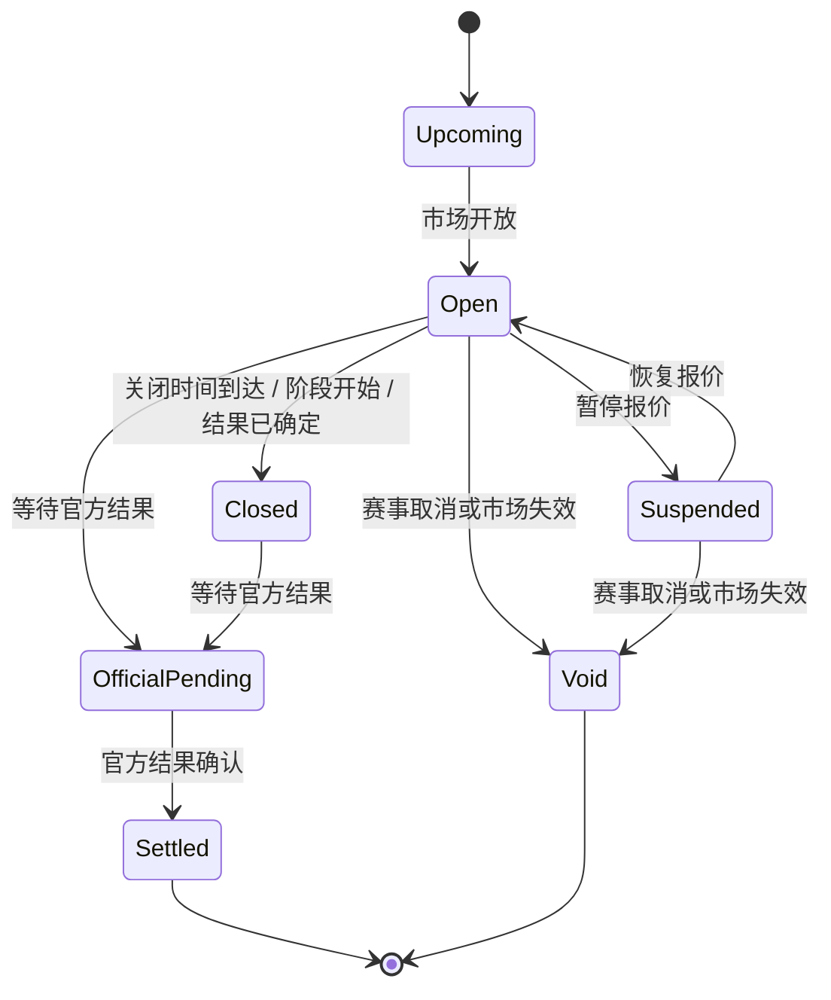

# TurboFlow 足球盘口产品需求文档 v4.4

版本：v4.4  
对象：足球传统盘口 — 赛事级预测增量  
基线：v4.3《TurboFlow 足球盘口产品需求文档》  
状态：当前评审稿

> 本文是 v4.3 的增量。v4.3 已经定稿的内容（足球首页、比赛详情、单场核心盘口、投注单、二次确认、报价变化、串关同场互斥、开赛封盘、我的注单、提前结清、重投、设计状态展板）不在本文重复，只在受影响的位置标注差异。本文着重交代 v4.4 新增的赛事级盘口（冠军、晋级、赛季名次、两回合系列赛赛果）以及它们对现有产品的影响和边界。

## 一、本期要解决的问题

足球用户的下注动机不全部围绕一场具体比赛。在 v4.3 上线之前的真实使用观察和球迷讨论里，可以稳定看到三类长期下注意愿：

- 早就认定某队“今年欧冠是他们的”，希望直接押冠军，而不是逐场比赛押胜平负。
- 关心“我的球队能不能晋级、能不能进决赛、能不能拿到欧冠资格”。
- 关注一组两回合淘汰赛“最后是谁出线”，而不是单回合的具体比分。

v4.3 的产品形态完全围绕 `matchId`：从首页找比赛，从比赛进详情，盘口、投注单、注单都挂在比赛上。结果是上述三类意愿在产品里没有承载位置——用户既找不到这些市场，也没有一个干净的下注对象可以挂注单。v4.4 要补齐这条主路径，并且做到：

- 不破坏 v4.3 的单场下注闭环。
- 不引入足球 CLOB（不是订单簿撮合，不是用户挂单）。
- 不把长期预测做成营销弹窗或独立 H5，而是作为足球产品里平级的下注对象，沿用同一套投注单、二次确认、我的注单、报价变化和资金口径。

## 二、本期范围

### 2.1 本期做什么

| 范围 | 说明 |
|------|------|
| 赛事级盘口 P0 类型 | 冠军、晋级、赛季名次、两回合系列赛赛果 |
| 入口 | 足球首页新增“比赛 / 冠军与晋级”一级切换；新增冠军与晋级列表页和赛事级详情页 |
| 下注对象抽象 | 在投注项、投注单、二次确认、注单中引入 `subject` 字段，覆盖单场、赛事、赛季、淘汰赛阶段四种粒度 |
| 投注方式 | 赛事级盘口支持单注和多笔单注；可与单场盘口在同一投注单中作为多笔单注共存 |
| 市场生命周期 | 新增“即将开放、暂停报价、已封盘、官方结果待确认、已结算、作废退款”这一组市场状态 |
| 我的注单 | 在注单卡片上展示赛事级标签、关闭时间、预计结算时点、官方结算来源 |
| 异常 | 市场关闭、官方待确认、赛事取消、试图把赛事级盘口放进串关 |
| 设计状态展板 | 增加冠军与晋级、赛事级市场状态、赛事级注单几个展板状态 |

### 2.2 本期不做什么

| 不做项 | 原因 |
|--------|------|
| 赛事级盘口串关 | 冠军、晋级、赛季名次、系列赛之间存在明显但尚未量化的相关性；在相关性、限额和组合算法定型前，第一版只支持多笔单注，避免误导用户 |
| 球员个人荣誉（金靴、助攻王、MVP） | 需要单独的球员维度数据、媒体官方来源和奖项规则，与本期“赛事 / 赛季 / 阶段”三种对象不同，留给球员盘口扩展 |
| 复合长期盘（冠军+晋级组合、双重事件） | 价值未验证，且会拉高串关相关性问题的解决难度 |
| 滚球期间的赛事级动态市场 | v4.4 仍然是平台报价、用户接受最新报价；不引入实时撮合、不引入实时盘口动态弹出 |
| 自动接受赔率变化 | 与 v4.3 一致，所有报价变化必须用户手动接受 |
| 足球 CLOB 和订单簿撮合 | 单独产品线，不在本文展开 |

### 2.3 与 v4.3 的关系

| 模块 | 处理 | 说明 |
|------|------|------|
| 足球首页 | **扩展** | 顶部增加“比赛 / 冠军与晋级”一级切换；比赛侧维持 v4.3 |
| 比赛详情页 | **轻微校准** | 盘口、辅助信息、右栏投注单与摘要继续按 v4.3；单场盘口命名和波胆展示按当前 mock 校准 |
| 单场核心盘口 | **轻微校准** | 当前 mock 只展示 7 个核心盘口；命名统一为让球、大小球、波胆、双重机会等行业常用口径 |
| 串关 | **扩展边界** | 串关本身规则不变；新增一条边界：赛事级盘口不可进入串关 |
| 投注单 | **扩展数据模型** | 投注项增加 `subject` 字段；单场和赛事级可同单作为多笔单注，互不影响 |
| 二次确认 | **扩展展示** | 弹窗对赛事级投注项增加“赛事级盘口 / 系列赛预测 + 预计结算”二级说明，校验和按钮逻辑不变 |
| 我的注单 | **扩展展示** | 注单卡片对赛事级注单增加关闭时间、预计结算、官方来源三项；状态机不再强制经过“进行中” |
| 报价 / 报价过期 / 接受最新报价 | **不变** | 沿用 v4.3 的下单区与弹窗内手动接受机制 |
| 开赛封盘 | **不变** | 仅约束单场比赛 |
| 市场关闭 | **新增** | 赛事级盘口的封盘条件和单场不同，单独成节 |
| 设计状态展板 | **扩展** | 增加冠军与晋级、赛事级市场状态、赛事级注单几个状态 |
| 风控、权限、合规 | **不变** | v4.3【待确认】项继续保留，赛事级一并适用 |

### 2.4 单场盘口命名与展示校准

本轮 mock 对单场盘口做了命名和展示校准，目的是让页面更接近用户在主流足球投注平台中看到的口径，同时不改变 v4.4 的赛事级增量范围。

| 盘口 | 当前用户可见名称 | 说明 |
|------|------------------|------|
| 胜平负 | 胜平负 | 判断全场主胜、平局、客胜 |
| 开球权 | 开球权 | 趣味盘，判断哪方先开球 |
| 亚洲让球 | 让球 | 判断让球后哪方赢盘；按钮内直接展示线值，例如球队 +0.75 |
| 欧洲让球胜平负 | 让球 0:1 | 先加虚拟比分，再判断调整后的主胜、平局、客胜 |
| 准确总进球档位 | 总进球数 | 猜整场准确总进球档位，例如 0、1、2、3、4、5+ |
| 大小盘 | 大小球 | 围绕线值选择大或小，例如大 2.5 / 小 2.5；不等同于“总进球数” |
| Correct Score | 波胆 | 猜具体比分，按主胜比分、平局比分、客胜比分、其他比分分组展示 |

`总进球数` 和 `大小球` 必须在产品和设计稿中分开表达：

- `总进球数` 是准确总进球档位，类似 `Total Goals` / `Exact Total Goals`。
- `大小球` 是 Over / Under 线值盘口，用户选择“大 2.5”或“小 2.5”。
- 不建议把 `总进球数` 改成 `总进球`，后者更像统计字段，不如“总进球数”清楚。

`波胆` 的展示不再使用主队进球 × 客队进球的二维矩阵作为主形态。当前 mock 使用四组卡片：

- 主胜比分：如 1:0、2:0、2:1、3:0。
- 平局比分：如 0:0、1:1、2:2、3:3。
- 客胜比分：如 0:1、0:2、1:2、0:3。
- 其他比分：其他主胜、其他平局、其他客胜。

串关相关性仍按原逻辑处理：波胆会推出胜平负、总进球数、大小球和让球结果，因此在串关中与这些盘口强相关；多笔单注不做同场强相关限制。

## 三、用户与使用场景增量

下表只列 v4.3 之外、由 v4.4 引入或被显著强化的角色和场景。其它单场用户场景沿用 v4.3。

| 角色 | 典型动机 | 使用路径 |
|------|----------|----------|
| 冠军用户 | 赛季初或淘汰赛抽签后认定某队夺冠 | 首页切到冠军与晋级 → 选择联赛或杯赛 → 选冠军球队 → 多笔单注 |
| 晋级用户 | 关心某队能否进入下一轮、决赛或获得资格 | 进入对应赛事 → 在“晋级”分组选球队或“是 / 否” |
| 赛季名次用户 | 关心英超前四、降级、升级类长期结果 | 进入联赛 → 在“赛季名次”分组选球队或“是 / 否” |
| 系列赛预测用户 | 关心两回合淘汰赛最终晋级方 | 进入对应淘汰赛阶段 → 在“系列赛”分组选晋级方或特殊结果 |
| 预测市场习惯用户 | 习惯用“事件问题”视角下注 | 选择前阅读市场标题、关闭时间、预计结算和官方来源后再决策 |

典型路径与 v4.3 单场路径一致：找入口 → 看清判断对象 → 选赔率 → 投注单复核 → 二次确认 → 提交 → 我的注单。差异都在前两步：入口在“冠军与晋级”而不是“比赛”，判断对象是赛事 / 赛季 / 阶段而不是某一场比赛。

## 四、信息架构：单场比赛 vs 冠军与晋级

**为什么必须分开。** 把冠军、晋级类盘口塞进比赛详情页或某一场比赛的“更多盘口”里看似省事，但会产生两类长期成本：

1. 用户认知混淆。冠军盘口的判断对象不是某一场比赛，而是一个赛季或一个赛事；放在某一场比赛下面会让用户误以为“这场比赛输赢决定冠军”。
2. 状态机错乱。单场盘口在比赛开赛瞬间封盘，赛事级盘口的封盘时点是市场关闭时间、阶段开始或官方暂停。两套状态机不能共用一个“开赛”入口。

因此 v4.4 在足球首页采用一级切换，把单场和赛事级作为同一产品下的两个并列入口：

| 入口 | 内容 | 默认 |
|------|------|------|
| 比赛 | v4.3 已有的联赛、比赛、快捷赔率 | 默认入口 |
| 冠军与晋级 | 赛事卡片列表，按赛事 / 联赛 / 杯赛分组 | 用户主动切换 |

**一致与差异。** 切换主区内容，但顶部导航、右栏投注单、我的注单摘要、登录态、赔率格式等全局元素保持一致；用户切换不会丢失投注单。

**不复用比赛详情页。** 赛事级有独立的“赛事级详情页”，路径形如 `足球 › 冠军与晋级 › 欧冠 2026`。它和比赛详情页结构相似（路径导航 + 头部 + 市场列表 + 右栏投注单），但每一块的语义不同——头部展示的是赛事和阶段，市场列表按业务含义分组而不是按盘口 tab。

**轻入口（可选 / P1）。** 比赛详情页可在头部下方放一个轻提示：“查看本赛事冠军、晋级和资格盘口”。点击跳转到对应赛事级详情页；不在比赛详情页内嵌赛事级市场。

## 五、赛事级盘口体系

### 5.1 盘口分类与本期清单

| 分类 | 盘口 | 用户在判断什么 | 选项形态 | 第一版状态 |
|------|------|----------------|----------|------------|
| 冠军 | 联赛冠军、杯赛冠军 | 某赛事最终冠军是谁 | 多球队按钮 | P0 |
| 晋级 | 晋级下一轮、晋级决赛、获得欧冠 / 欧联资格 | 某队是否完成某个晋级事实 | 球队按钮或“是 / 否” | P0 |
| 赛季名次 | 前四、前六、降级、升级 | 某队赛季最终名次或资格归属 | 球队按钮或“是 / 否” | P0 |
| 系列赛赛果 | 两回合系列赛晋级方 | 一组两回合淘汰赛最终谁出线 | 晋级方 / 特殊结果按钮 | P0 |
| 球员个人荣誉 | 金靴、助攻王、MVP | 个人维度结果 | — | 不做 |
| 复合长期盘 | 冠军 × 晋级、双重事件 | 复合判断 | — | 不做 |

### 5.2 冠军

冠军盘口判断的是“某个赛事 / 联赛 / 杯赛最终冠军是谁”，不是某一场比赛胜负。用户选择一支球队，官方确认冠军后命中所选球队即获胜。

- 联赛冠军以官方最终积分榜和联赛公告为准。
- 杯赛冠军以官方冠军公告或决赛结果为准。
- 后续争议、申诉、纪律处罚是否追溯调整，以后端结算规则和官方来源为准。

冠军盘口的赔率会因抽签、伤病、积分、淘汰赛进程和平台风险策略持续变化。报价机制沿用 v4.3：用户提交前如发生报价变化或过期，必须先接受最新报价并重新核对，再继续确认。

### 5.3 晋级

晋级盘口判断“某队是否进入下一轮、进入决赛、晋级淘汰赛或获得下赛季某赛事资格”。和单场胜平负不同：单场胜平负通常只看常规比赛时间；晋级类盘口关注最终晋级事实，包含加时赛和点球大战。

不同子场景的结算口径必须在市场说明中显式声明：

| 子场景 | 结算口径 |
|--------|----------|
| 单回合淘汰赛 | 以官方晋级方为准，包含加时和点球 |
| 两回合淘汰赛 | 以两回合结束后的官方晋级方为准 |
| 小组出线 | 以官方小组排名和出线规则为准 |
| 获得下赛季欧冠 / 欧联资格 | 以官方联赛排名和资格分配规则为准 |

晋级盘口与冠军盘口存在显式相关性（夺冠必然意味着进决赛），这是第一版不支持赛事级串关的核心原因之一，详见 8.3。

### 5.4 赛季名次

赛季名次盘口预测整个联赛或赛季结束后的排名、资格或升降级结果。常见示例：英超冠军（与“冠军”盘口对应）、前四、前六、降级球队、升级球队。

- 判断对象是“赛季最终结果”，不是任何一场比赛。
- 必须展示预计结算时点，例如“赛季最终积分榜确认后”。
- 若赛季延期、缩短、取消或资格规则变更，市场可以暂停、等待官方结果、作废或按后端结算规则处理。

### 5.5 系列赛赛果

系列赛赛果预测一个阶段性对抗的最终结果。足球 v4.4 第一版只覆盖两回合淘汰赛。

| 用户选择 | 命中条件 |
|----------|----------|
| 某队晋级 | 两回合结束后该队为官方晋级方（包含加时和点球） |
| 总比分打平后点球决胜 | 两回合总比分和适用规则导致点球大战，并通过点球产生晋级方 |

注意：系列赛赛果不是“正确比分”。它不要求用户猜中某一场比赛的具体比分，而是猜两回合或阶段对抗的最终结果。后续如果新增“两回合总比分”或“系列赛正确比分”，应作为独立盘口而不是与“晋级方”混写。

### 5.6 与单场盘口的对照

| 对比项 | 单场盘口 | 赛事级盘口 |
|--------|----------|------------|
| 下注对象 | 一场比赛 | 一个赛事 / 赛季 / 淘汰赛阶段 |
| 入口 | 比赛列表 → 比赛详情 | 冠军与晋级列表 → 赛事级详情 |
| 封盘时点 | 比赛开赛瞬间 | 市场关闭时间 / 阶段开始 / 结果已确定 / 官方暂停 |
| 结算依据 | 比赛赛果或盘口规则 | 官方冠军、晋级、积分榜或阶段结果 |
| 投注方式 | 多笔单注、串关 | 第一版只支持单注和多笔单注 |
| 报价机制 | 平台报价 + 手动接受最新报价 | 一致 |
| 持单时长 | 通常几小时到 90 分钟 | 几天到整个赛季 |
| 我的注单展示 | 比赛 + 盘口 | 赛事 / 阶段 + 关闭时间 + 预计结算 + 官方来源 |

## 六、下注对象模型

v4.3 的投注项以 `matchId` 为唯一锚点。v4.4 把锚点抽象为下注对象 `subject`，避免在前端到处用“如果是赛事级就走另一条分支”的特殊逻辑。

### 6.1 字段定义

| 字段 | 类型 | 必填 | 说明 |
|------|------|------|------|
| `subject.scope` | `match` / `competition` / `season` / `tie` | 是 | 下注对象粒度 |
| `subject.subjectId` | 字符串 | 是 | 下注对象唯一 ID；单场用比赛 ID，赛事级用赛事 / 赛季 / 阶段 ID |
| `subject.subjectLabel` | 文本 | 是 | 用户可读名称，例如“UEFA Champions League 2026”“皇家马德里 vs 巴塞罗那（两回合）” |
| `subject.closesAt` | 时间 | 赛事级必填 | 市场关闭时间；单场使用比赛开赛时间 |
| `subject.resolutionTimeLabel` | 文本 | 赛事级必填 | 用户可读结算时点，例如“决赛结束并经 UEFA 确认后” |
| `subject.resolutionSource` | 文本 | 赛事级必填 | 结算依据来源，例如“UEFA 官方赛事结果”“Premier League 官方积分榜” |

### 6.2 抽象的好处

- **投注单替换逻辑统一。** 无论单场还是赛事级，“同一下注对象 + 同一盘口标题”内只保留一个选项。
- **串关冲突逻辑统一。** 同场互斥按 `subjectId` 聚合；赛事级整体走一条简单规则“不可串关”。
- **我的注单卡片统一渲染。** 同一组件根据 `scope` 决定是否展示关闭时间、预计结算、官方来源。
- **后端契约稳定。** 后续接入更多赛事级盘口或新增 `scope`（例如球员个人荣誉用 `player`）只是增加枚举值，不需要再造一遍字段。

### 6.3 mock 与最小覆盖

第一版 mock 至少覆盖两个赛事对象，每个对象下覆盖 2–3 个市场，确保前端能渲染：

- 一个杯赛 / 淘汰赛对象（例如欧冠）：包含冠军、晋级、系列赛三类。
- 一个联赛 / 赛季对象（例如英超）：包含冠军、获得欧冠资格、降级球队三类。

## 七、赛事级市场生命周期

### 7.1 状态机

### 7.2 状态语义和文案

| 状态 | 进入条件 | 用户表现 | 投注单处理 | 文案要点 |
|------|----------|----------|------------|----------|
| 即将开放 | 市场已配置但未开放 | 仅查看，不可选择 | 不可加入 | “即将开放” |
| 开放 | 市场可下注 | 可选择赔率 | 可提交（仍受报价有效性约束） | — |
| 暂停报价 | 平台或数据源暂停 | 仅查看 | 已选项不可提交 | “暂停报价” |
| 已封盘 | 关闭时间到达、阶段开始、结果已确定 | 仅查看 | 已选项不可提交，需要移除 | “该赛事级盘口已关闭” |
| 官方结果待确认 | 等待官方来源 | 仅查看 | 不可新增；已下注单等待结算 | “等待官方结果确认” |
| 已结算 | 官方结果确认 | 查看命中或未命中 | 注单更新返还 | — |
| 作废退款 | 赛事取消或市场失效 | 查看作废说明 | 已下注按退款或后端规则处理 | “市场作废，按退款规则处理” |

### 7.3 关键差异：不要复用“比赛已开始，盘口已封盘”

赛事级盘口的封盘文案必须使用“市场关闭”“等待官方结果确认”“市场作废”等语义，**不能**和单场封盘共用“比赛已开始，盘口已封盘”。两者的关闭原因和用户应对动作完全不同：单场是“等下一场再来”，赛事级可能是“等几个月才结算”或“市场永久作废”。

## 八、投注单与二次确认的扩展

v4.3 的投注单流程（多笔单注、串关、报价过期、接受最新报价、二次确认、防重复提交、提交中状态等）整体复用，本节只展开本期受影响和新增的部分。

### 8.1 单场和赛事级共存的多笔单注

用户可以在同一张投注单中同时持有单场盘口和赛事级盘口，作为多笔单注一并提交。每个投注项独立赔率、独立金额、独立生成单腿注单、独立结算。

| 表现 | 规则 |
|------|------|
| 列表分组 | 投注单按 `subject.subjectLabel` 聚合显示，赛事级投注项明显区分（标签 + 预计结算说明） |
| 金额输入 | 与 v4.3 一致：可逐项输入或统一输入 |
| 报价变化 | 任一投注项变化都按 v4.3 走“接受最新报价” |
| 提交结果 | 拆成多张独立单腿注单；单场注单挂在比赛上，赛事级注单挂在赛事 / 阶段上 |

### 8.2 同一赛事级市场内的选项替换

同一个赛事级市场（例如“欧冠冠军”）内，用户只能保留一个选项。再次选择同一市场的另一支球队时替换原选项，不新增第二条同市场投注项。规则与单场同盘口替换完全一致，只是聚合 key 由 `matchId + 盘口` 改为 `subjectId + 市场标题`。

### 8.3 第一版为什么不支持赛事级串关

赛事级之间的相关性比单场更复杂：

- 冠军 × 晋级：某队夺冠必然意味着进决赛、晋级淘汰赛、获得资格。
- 冠军 × 赛季名次：某队联赛夺冠必然属于前四、不会降级。
- 系列赛 × 晋级：某队两回合系列赛晋级必然进入下一轮。
- 跨赛事：欧冠和欧联之间存在间接相关（同一支球队的双线表现）。

这些相关性既不像“同场胜平负 × 正确进球”那样可以靠枚举互斥矩阵覆盖，也不能简单类比 polymarket 这类 CLOB 市场（CLOB 用流动性和价格自然反映相关性，传统盘口必须靠平台规则）。在相关性建模、限额和组合算法定型前，第一版直接禁用赛事级串关，是最低风险的产品决策。

| 表现 | 规则 |
|------|------|
| 投注单含赛事级且用户切换串关 | 阻止切换，提示“冠军、晋级和系列赛类盘口暂不支持串关，可作为多笔单注提交” |
| 串关模式下用户尝试加入赛事级 | 阻止加入，同上提示 |
| 赛事级 × 单场混合，用户切换串关 | 阻止切换，提示同上；单场部分仍可作为多笔单注提交 |

### 8.4 二次确认弹窗

二次确认弹窗校验逻辑、按钮逻辑、报价变化处理与 v4.3 一致。展示上对赛事级投注项增加二级说明：

- 标签：赛事级盘口 / 系列赛预测
- 二级说明：预计结算时点（例如“决赛结束并经 UEFA 确认后”）

不要在二次确认中折叠掉赛事级特有信息——这恰恰是用户最容易误下注的地方（“我下的不是这场比赛？”）。

## 九、我的注单的赛事级展示

### 9.1 卡片元素

赛事级注单卡片在 v4.3 单场注单卡片基础上增加：

| 元素 | 展示内容 | 用途 |
|------|----------|------|
| 类型标签 | “赛事级盘口”或“系列赛预测” | 让用户在注单列表里一眼区分 |
| 下注对象 | `subject.subjectLabel`（例如“UEFA Champions League 2026”） | 替代“比赛对阵”位置 |
| 关闭时间 | `subject.closesAt` 的可读形式 | 告诉用户这笔注还能不能改主意（提前结清是否支持视后端能力） |
| 预计结算 | `subject.resolutionTimeLabel` | 解释“为什么这笔单子还在待结算” |
| 官方来源 | `subject.resolutionSource` | 客服解释口径，也方便用户自行核对 |

### 9.2 状态机差异

赛事级注单不强制经过“进行中”状态。第一版统一走：待确认 → 已下注 / 待结算 → 已结算 / 已提前结清 / 作废退款。卡片在“待结算”阶段以预计结算文案告诉用户预期时点，避免用户误以为系统卡住。

提前结清的支持范围由后端能力决定。第一版可选择对赛事级注单不开放提前结清，并在卡片上隐藏入口。

### 9.3 重投

赛事级注单重投时，必须重新校验：

1. 市场是否仍开放。已封盘 / 官方待确认 / 作废 → 阻止重投并提示原因。
2. 报价是否有效。变化或过期 → 投注单需要先接受最新报价。

## 十、页面结构

### 10.1 足球首页：一级切换

| 模块 | 字段 | 默认 | 点击后 |
|------|------|------|--------|
| 一级切换 | 比赛、冠军与晋级 | 比赛 | 切换主内容区，不改变联赛筛选状态 |
| 比赛侧 | 沿用 v4.3 | — | — |
| 冠军与晋级侧 | 赛事卡片：赛事名、地区、阶段、市场数量、热门市场摘要（最多 3 个） | 切换后展示 | 进入赛事级详情页 |

空状态：当前暂无冠军与晋级市场时，仍保留切回比赛的入口，不让用户卡死。

### 10.2 赛事级详情页

路径：`足球 › 冠军与晋级 › 赛事名`。

| 区域 | 展示 | 说明 |
|------|------|------|
| 路径导航 | 三级 | 帮助用户返回首页或冠军与晋级列表 |
| 赛事头部 | 赛事名、地区、阶段、产品说明（“平台报价 / 多笔单注 / 暂不支持串关”） | 让用户在选择前理解这是赛事级 |
| 市场分组 | 冠军、晋级、赛季结果、系列赛 | 按业务含义分组，不按盘口 tab |
| 市场卡片 | 标题、选项、赔率、关闭时间、预计结算、官方来源、市场状态 | 用户选择前必须能看到判断对象和结算依据 |
| 投注单 | 与比赛详情共用右栏投注单 | 不再造一份赛事级专属投注单 |

### 10.3 设计状态展板

展板新增以下状态，配套既有展板：

- 一级切换在比赛 / 冠军与晋级两侧的样式
- 冠军与晋级列表（默认 / 加载 / 空 / 错误）
- 赛事级详情页（开放 / 暂停报价 / 已封盘 / 官方待确认 / 已结算 / 作废）
- 投注单含赛事级投注项的展示
- 投注单同时含单场和赛事级、用户切换串关时的阻止提示
- 我的注单展示赛事级注单（待结算 + 预计结算 + 官方来源）

## 十一、异常情况与边界条件（增量）

下表只列 v4.3 之外新增或被显著强化的异常。其它单场异常沿用 v4.3 第十二章。

| 场景 | 触发条件 | 系统行为 | 用户提示 | 是否阻塞 | 备注 |
|------|----------|----------|----------|----------|------|
| 赛事级市场关闭 | 关闭时间到达、阶段开始、结果已确定或官方暂停 | 阻止新增和提交相关投注项 | “该赛事级盘口已关闭，请移除相关选项” | 是 | 适用于冠军、晋级、赛季名次、系列赛 |
| 官方结果待确认 | 结果接近确定但等待官方来源 | 不接受新增；已下注单保持待结算 | “市场等待官方结果确认” | 是 | 不可作为系统故障处理 |
| 赛事取消或改制 | 官方取消赛事、赛季缩短或规则调整 | 暂停 / 作废 / 等待官方结果，按后端结算规则处理 | “市场已作废，按退款规则处理”或“等待官方结果确认” | 视情况 | 客服需配套话术 |
| 试图把赛事级放入串关 | 用户切换串关或在串关模式下选择赛事级 | 阻止切换 / 阻止加入 | “冠军、晋级和系列赛类盘口暂不支持串关，可作为多笔单注提交” | 是 | 详见 8.3 |
| 赛事级投注项与单场投注项混合切串关 | 投注单含赛事级和单场，用户切换串关 | 阻止切换 | 同上 | 是 | 单场部分仍可走多笔单注 |
| 赛事级注单重投时市场已关闭 | 市场不在开放状态 | 阻止重投 | “该市场已关闭，无法重投” | 是 | — |
| 关闭时间字段缺失 | 后端未返回 `closesAt` | 前端不猜测，按市场状态展示 | 不允许前端基于本地时钟判定关闭 | 是 | 见 OPEN-007 |

## 十二、数据字段（增量）

只列 v4.3 第十章之外新增的字段。其它字段沿用 v4.3。

| 数据对象 | 字段 | 类型 | 必填 | 来源 | 展示位置 | 说明 |
|----------|------|------|------|------|----------|------|
| 下注对象 | `subject.scope` | 枚举 `match` / `competition` / `season` / `tie` | 是 | 比赛或赛事级市场 | 投注单、注单 | 区分单场、赛事、赛季、淘汰赛阶段 |
| 下注对象 | `subject.subjectId` | 字符串 | 是 | 比赛或赛事级市场 | 投注单、注单 | 同对象选项替换的聚合 key |
| 下注对象 | `subject.subjectLabel` | 文本 | 是 | 比赛或赛事级市场 | 投注单、确认弹窗、注单 | 用户可读名称 |
| 下注对象 | `subject.closesAt` | 时间 | 赛事级必填 | 赛事级市场 | 赛事级详情、注单 | 决定能否新增或提交 |
| 下注对象 | `subject.resolutionTimeLabel` | 文本 | 赛事级必填 | 赛事级市场 | 赛事级详情、注单 | 用户可读结算时点 |
| 下注对象 | `subject.resolutionSource` | 文本 | 赛事级必填 | 赛事级市场 | 赛事级详情、注单、客服 | 结算依据来源 |
| 赛事级市场 | `marketGroup` | 枚举 冠军 / 晋级 / 赛季结果 / 系列赛 | 是 | 后端市场配置 | 赛事级详情分组 | 按业务含义分组 |
| 赛事级市场 | `marketStatus` | 枚举 即将开放 / 开放 / 暂停报价 / 已封盘 / 官方待确认 / 已结算 / 作废退款 | 是 | 后端市场状态 | 赛事级详情、投注单、注单 | 决定可选可提交 |

注：单场比赛在数据接口上等价于 `subject.scope = match`，`subject.subjectId = matchId`，`subject.subjectLabel = 主队 vs 客队`；前端不必拆两套渲染逻辑。

## 十三、埋点（增量）

只列新增和受影响事件。其它事件沿用 v4.3 第十三章。

| 事件名 | 触发时机 | 属性 | 用途 |
|--------|----------|------|------|
| `soccer_home_view` | 进入足球首页 | 增加：当前一级入口（比赛 / 冠军与晋级）、赛事级市场数量 | 首页 IA 转化分析 |
| `soccer_futures_view` | 进入冠军与晋级列表 | 赛事数量、市场数量、入口来源 | 赛事级入口转化 |
| `soccer_future_market_view` | 赛事级市场进入可视区域 | 赛事、市场分组、市场类型、关闭时间、市场状态 | 长期盘关注度 |
| `soccer_odds_select` | 用户选择赔率 | 增加：`subject.scope`、`marketGroup` | 区分单场和赛事级行为 |
| `soccer_betslip_open` | 投注单展示 | 增加：单场投注项数量、赛事级投注项数量 | 混合投注分布 |
| `soccer_bet_submit` | 点击确认投注 | 增加：投注项中赛事级数量 | 提交流量按粒度切分 |
| `soccer_bet_success` | 下单成功 | 增加：投注项中赛事级数量 | 成交转化按粒度切分 |
| `soccer_future_market_blocked` | 用户在含赛事级的投注单中切换串关 | 投注项数量、被阻止原因 | 衡量串关需求强度 |

## 十四、验收标准（新增）

只列本期新增的验收。v4.3 已有的单场验收继续生效。

| 场景 | Given | When | Then |
|------|-------|------|------|
| 一级切换 | 足球首页有赛事级市场数据 | 用户点击“冠军与晋级” | 主区切换为赛事级列表，比赛列表筛选状态保持 |
| 空状态 | 赛事级市场为空 | 用户切换到冠军与晋级 | 展示空状态并保留切回比赛的入口 |
| 进入赛事级详情 | 用户点击欧冠卡片 | 进入详情页 | 展示赛事头部、市场分组（冠军 / 晋级 / 系列赛 / 赛季结果）、市场卡片字段（标题、选项、赔率、关闭时间、预计结算、官方来源、市场状态） |
| 同市场替换 | 已选“欧冠冠军：皇家马德里” | 在同一市场选择“曼城” | 投注单替换原选项，不新增第二条 |
| 单场 + 赛事级多笔单注 | 投注单含一笔单场胜平负和一笔欧冠冠军 | 选择多笔单注并提交 | 拆为两张独立注单；单场挂在比赛，赛事级挂在赛事 |
| 赛事级阻止串关（同单场混合） | 投注单含赛事级 + 单场 | 用户切换串关 | 阻止切换并提示“暂不支持串关，可作为多笔单注提交” |
| 赛事级阻止串关（纯赛事级） | 投注单只含赛事级 | 用户切换串关 | 阻止切换，提示同上 |
| 报价变化（赛事级） | 赛事级赔率变化 | 用户提交 | 主按钮变为“接受最新报价”；接受后回到复核状态，不直接下单 |
| 市场关闭文案 | 市场关闭时间到达 | 用户尝试提交已选项 | 阻止提交并提示“该赛事级盘口已关闭”；不使用单场封盘文案 |
| 官方待确认 | 阶段结果等待官方确认 | 用户查看市场或注单 | 市场不可新增；注单卡片展示“等待官方结果确认”和预计结算文案 |
| 作废退款 | 赛事取消或市场作废 | 用户查看注单 | 注单展示“市场已作废，按退款规则处理”，最终金额以后端结算为准 |
| 我的注单（赛事级） | 已下注一笔欧冠冠军 | 用户查看我的注单 | 卡片展示赛事级标签、关闭时间、预计结算、官方来源 |
| 重投：市场仍开放 | 历史赛事级注单对应市场仍开放 | 用户点击重投 | 回填投注单并要求重新接受最新报价 |
| 重投：市场已关闭 | 市场已封盘或作废 | 用户点击重投 | 阻止重投并提示原因 |
| 二次确认（赛事级） | 投注单含赛事级 | 用户进入二次确认 | 弹窗对赛事级投注项展示赛事级标签 + 预计结算 |
| 关闭时间字段缺失 | 后端未返回 `closesAt` | 前端渲染市场卡片 | 不基于本地时钟猜测；按市场状态展示，必要时禁用提交 |

## 十五、上线依赖与风险（增量）

| 类型 | 依赖 / 风险 | 处理方案 |
|------|-------------|----------|
| 后端 | 赛事级市场状态、关闭时间、结算来源、官方结果接入 | 前端只渲染状态，不在前端推断；以后端为准 |
| 数据源 | 官方赛果、积分榜、晋级结果的稳定推送 | 第三方异常时暂停相关市场，运营兜底 |
| 设计 | 冠军与晋级、赛事级详情、赛事级注单、各类异常状态稿 | 按 10.3 展板新增项逐项验收 |
| 运营 / 客服 | “市场关闭”“官方待确认”“市场作废”三类用户问询的统一话术 | 上线前完成话术清单 |
| 风险：用户混淆 | 用户误以为冠军盘对应某一场比赛 | 入口分离 + 详情页头部强解释 + 投注单和注单赛事级标签 |
| 风险：长持单认知 | 用户对“几个月才结算”不适应，频繁咨询客服 | 我的注单卡片显式展示预计结算和官方来源；客服话术配套 |
| 风险：第三方结算延迟 | 官方公告滞后导致“官方待确认”状态长时间停留 | 状态语义和文案明确，避免用户当作系统故障 |

## 十六、术语表（增量）

仅列本期新增。其它术语沿用 v4.3 第十六章。

| 术语 | 定义 |
|------|------|
| 赛事级盘口 | 围绕赛事 / 赛季 / 淘汰赛阶段的盘口，例如冠军、晋级、前四、降级、两回合系列赛 |
| 冠军与晋级 | 用户入口名称，承载赛事级盘口 |
| 下注对象 | 投注项绑定的对象，区分单场比赛、赛事、赛季、淘汰赛阶段四种粒度（`subject.scope`） |
| 关闭时间 | 赛事级盘口停止接受新增选择或提交的时间（`subject.closesAt`） |
| 预计结算 | 用户可读的结算时点，例如“决赛结束并经 UEFA 确认后”（`subject.resolutionTimeLabel`） |
| 官方来源 | 结算依据来源，例如“UEFA 官方赛事结果”“Premier League 官方积分榜”（`subject.resolutionSource`） |
| 系列赛预测 | 预测两回合淘汰赛或后续 BO 系列的最终结果，足球第一版以两回合晋级方为主 |
| 市场关闭（赛事级） | 市场停止接受投注的封盘动作，区别于单场“开赛封盘”，文案不可混用 |
| 官方结果待确认 | 市场结果已数学接近确定，但等待官方来源公告的中间状态 |

## 十七、开放问题

| 编号 | 问题 | 当前建议 |
|------|------|----------|
| OPEN-007 | 赛事级市场关闭时间由哪个数据源提供，是否始终可信 | 以后端市场状态为准；前端不基于本地时钟判定关闭 |
| OPEN-008 | 赛事取消、赛制变更、资格规则变化的统一结算口径 | 以官方来源和后端结算专项为准；运营配套话术 |
| OPEN-009 | 赛事级盘口何时支持串关 | 待长期盘相关性建模、限额和组合算法定型后再开放 |
| OPEN-010 | 赛事级注单是否支持提前结清 | 视后端能力；第一版可选择不支持，并在卡片上隐藏入口 |
| OPEN-011 | 是否在比赛详情页提供“查看本赛事冠军与晋级”轻入口 | 第一版可作为 P1，避免与单场盘口混淆 |
| OPEN-012 | 球员奖项等个人维度长期盘何时纳入 | 列入 P2；需要单独定义球员维度数据和官方来源 |

## 十八、未来扩展：预测大赛 v4.5

v4.4 用"按市场逐个押注"承接了赛事级长期下注意愿，但有三件事不在 v4.4 的解题范围内：长期盘之间的相关性、球感比拼的整体载体、可分享可复盘的社交资产。这三件事由独立产品线 v4.5 承接：

- **形态**：付费入场的足球淘汰赛对阵树预测大赛（Bracket Pool）。
- **机制**：用户单笔入场费提交一份覆盖整届赛事的对阵树预测；按轮次加权评分；按命中率（本人得分 / 全员总分 × 净池）从奖金池按比例派奖。
- **与 v4.4 的关系**：独立结算、互不冲销、可同时参与；不可串关 / 不可组合下注。两者在足球产品里作为平级入口并存。
- **入口**：足球首页一级切换从「比赛 / 冠军与晋级」扩为「比赛 / 冠军与晋级 / 预测大赛」；每个 tab 顶部加差异化文案带，避免认知混淆。
- **文档**：完整规格见《TurboFlow 足球预测大赛产品需求文档 v4.5》。本节仅作 cross-reference，v4.4 文档不重写。
