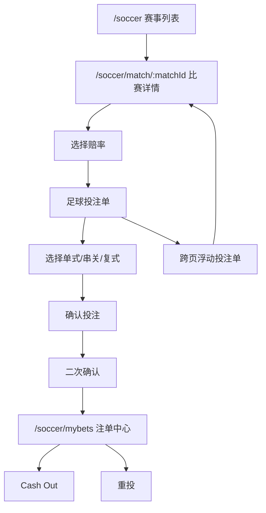
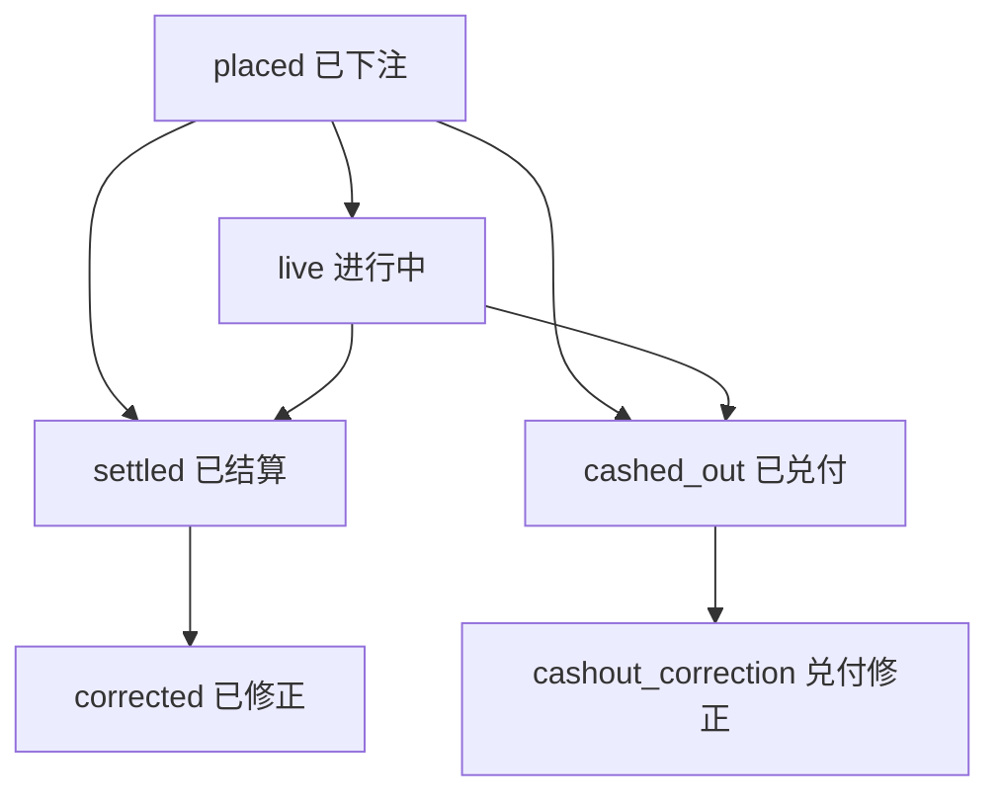

# TurboFlow 足球盘口交叉审计报告 v4.1

日期：2026-04-25

范围：当前本地 `mvp` 分支足球盘口实现与 v4.1 PRD。审计覆盖产品经理、用户路径、足球博彩专业从业者、技术实现一致性四个角度。

重要状态：当前本地改动尚未提交/推送到 GitHub。`mvp` 分支跟踪 `origin/mvp`，但仍存在大量 modified/untracked 文件。

本报告不纳入键盘无障碍专项与合规入口。

更新状态：2026-04-27 已完成一轮修复。当前代码已收紧单关多腿、跨场状态校验、报价过期、未知盘口、持久化恢复、钱包锁定资金、重投事务和 Cash Out 报价。传统盘口 PRD 已补充到 `docs/soccer-traditional/PRD.md`。本文保留原审计问题，阅读时应以本段更新状态和最新 PRD 为准。

---

## 1. 总体结论

当前足球盘口已经具备“赛事列表 → 比赛详情 → 选赔率 → 投注单 → 下单 → MyBets → Cash Out/重投”的前端 Demo 闭环，但还没有达到专业博彩产品的逻辑自洽程度。核心问题集中在四类：

1. **投注方式语义不清**：`single` 下可以存在多腿，但下单时仍按连乘赔率处理，产品含义与“单关”冲突。
2. **跨场状态校验不足**：下单时只知道当前比赛页的 suspended/ended 状态，投注单里其他比赛腿可能绕过关盘/完赛校验。
3. **互斥盘口只做拒绝，不做持续解释**：用户点击冲突盘口时只看到 toast，不知道哪些盘口因已选项而不可组合，也没有“替换冲突项”的路径。
4. **赔率锁定是展示而非规则**：30 秒倒计时存在，但过期后没有被 `placeBet` 作为硬性重报价/重确认条件。
5. **持久化恢复缺少产品规则**：投注单、钱包、设置、MyBets 都会落 localStorage，但刷新后如何处理过期报价、已完赛/暂停腿、历史 Cash Out 报价尚未定义。
6. **资金与注单状态机口径不完整**：钱包有 `locked` 但未使用；Cash Out、corrected、push/void/half_win 等状态缺少完整资金流转说明。

推荐先修 P0，再修 P1。否则后续继续加盘口、加真实赔率源或真实下单接口，会把这些歧义放大。

---

## 2. 用户主路径

### 当前路径优点

- `/soccer`、`/soccer/match/:matchId`、`/soccer/mybets` 三个核心页面已经形成闭环。
- 投注单可以跨比赛保存，离开比赛详情页后有浮动入口。
- MyBets 有状态筛选、日期筛选、Cash Out、重投、导出 CSV。
- 赔率格式、赔率变化 badge、LIVE 闪烁、骨架屏、盘口折叠都已覆盖 Demo 体验。

### 当前路径断点

- 用户选择第二个选项后，系统仍保留“单式”标签，容易误导。
- 互斥盘口被点击后仅 toast，用户无法从盘口列表持续理解“为什么不可选”。
- 浮动投注单使用 `item.odds` 计算组合赔率，而投注单主体使用 `oddsCurrent`，赔率变动后两个入口可能展示不一致。
- 用户从 MyBets 重投时按原赔率加入投注单，但没有明显提示“这是历史赔率，不是当前盘口价”。

---

## 3. P0 问题

### P0-1：`single` 多腿语义错误

影响文件：

- `src/stores/soccerBetSlipStore.ts`
- `src/components/soccer/SoccerBetSlip.tsx`
- `src/components/soccer/MyBetCard.tsx`

现状：

- `BETTING_LIMITS.minLegs.single = 1`，但没有限制 `single` 只能 1 腿。
- 当 `betType === 'single'` 且 `items.length > 1` 时，下单仍使用所有腿赔率连乘。
- MyBets 写入时 `betType` 仍可能是 `single`，但展示又像串关。

风险：

- 产品语义错误。博彩用户理解的“单关”不是多腿连乘。
- 钱包扣款、可能返还、MyBets 展示都可能让用户误解。

推荐决策：

- 一个选项默认 `single`。
- 添加第二个选项时弹出/提示选择：
  - “转为串关”
  - “拆成多张单关”
  - “继续选择后做复式”
- 若暂不做“多张单关”，则添加第二腿时自动切到 `accumulator`，并在投注单提示“已转为串关，全部命中才赢”。

### P0-2：跨场腿状态校验只覆盖当前页

影响文件：

- `src/pages/SoccerMatchPage.tsx`
- `src/components/soccer/SoccerBetSlip.tsx`
- `src/stores/soccerBetSlipStore.ts`

现状：

- `SoccerBetSlip` 只从当前 `currentMatchId` 构建 `suspendedSelectionKeys` 和 `endedMatchIds`。
- 投注单中其他比赛的腿，如果对应比赛已结束/盘口暂停，`placeBet` 不一定知道。

风险：

- 用户可以从 A 比赛页提交包含 B 比赛腿的注单，而 B 比赛可能已经关盘、完赛或作废。
- 真实博彩场景中这是严重风控漏洞。

推荐决策：

- 下单前按投注单所有 `matchId` 查询统一状态快照。
- 前端 Demo 可先用 `getMatchById` 聚合所有腿状态，生成完整 ctx。
- 生产版本必须由服务端最终判定。

### P0-3：赔率锁定未真正参与下单

影响文件：

- `src/services/oddsLock.ts`
- `src/stores/soccerBetSlipStore.ts`
- `src/components/soccer/SoccerBetSlip.tsx`

现状：

- `oddsLockedUntil` 只用于倒计时展示。
- `placeBet` 未检查锁是否过期。
- 只要赔率变化策略通过，过期后仍可下单。

风险：

- “锁定 30 秒”的产品承诺不成立。
- 用户以为价格仍锁定，实际按当前赔率或接受策略继续下单。

推荐决策：

- 30 秒内：允许按当前接受策略下单。
- 30 秒后：必须重报价/重新确认，或拒单 `odds_changed`。
- UI 文案从“锁定 12s”改为“报价有效 12s”，到期显示“报价已过期，请刷新/接受当前赔率”。

### P0-4：未知盘口默认 `novelty` 放行

影响文件：

- `src/data/soccer/marketFamily.ts`

现状：

- `getMarketFamily` 未识别标题时返回 `novelty`。
- `novelty` 与所有盘口都可组合。

风险：

- 新增盘口或全量盘口打开后，未分类的强相关盘口会被当作趣味盘放行。
- 例如 BTTS、双胜彩、半全场、多进球区间等都可能产生 related contingency。

推荐决策：

- 增加 `unknown` family。
- 未识别盘口默认不可与同场其他非 novelty 盘口组合。
- 只有明确标注的「开球权」等才归为 `novelty`。

### P0-5：持久化恢复后可能保留不可下单状态

影响文件：

- `src/stores/soccerBetSlipStore.ts`
- `src/stores/persist.ts`
- `src/stores/settingsStore.ts`
- `src/stores/walletStore.ts`
- `src/stores/myBetsStore.ts`

现状：

- 投注单 items、钱包、设置、MyBets 都会持久化。
- `soccerBetSlipStore` 初始化时直接恢复 `items`，没有重新核验比赛状态、盘口状态、赔率有效期。
- `oddsLockedUntil` 也被持久化；用户隔天回来仍可能看到历史腿，只是倒计时归零。
- MyBets 中 cashout 报价也会被持久化，刷新后可能继续显示旧报价。

风险：

- 用户刷新后继续提交已过期、已关盘、已完赛的投注腿。
- Demo 钱包余额和 MyBets 状态可能长期累积到不可解释。
- Cash Out 报价如果被当成稳定价格，会误导用户。

推荐决策：

- 恢复投注单时必须标记为“需刷新报价/状态”。
- 若比赛已 ended、盘口 void/cancelled，直接移除或标记不可下单。
- 若 `oddsLockedUntil` 已过期，要求用户接受当前赔率或刷新。
- Cash Out 报价不应长期持久化；恢复后应标记“需重新报价”。

### P0-6：资金口径与注单状态机不完整

影响文件：

- `src/stores/walletStore.ts`
- `src/stores/myBetsStore.ts`
- `src/components/soccer/MyBetCard.tsx`
- `src/components/soccer/MyBetsPanel.tsx`

现状：

- 下单只扣 `balance`，`locked` 字段预留但不使用。
- Cash Out 由页面调用 `cashout` 后再 `wallet.credit`，store 本身不保证资金一致。
- `correct` 只记录 `diffPayout`，不处理钱包补发或追回。
- `cashed_out` 后是否还允许 corrected 没有定义。
- `half_win`、`half_loss`、`dead_heat` 已在类型中存在，但资金计算没有产品口径。

风险：

- “余额 / 未结算投注额 / 已实现盈亏 / 可能返还”四个概念混在一起。
- Cash Out 后如果赛果 corrected，产品不知道是否补差、追回或保持兑付价。
- 后续接真实钱包时会遇到资金账不平。

推荐决策：

- Demo 也应定义四个资金展示口径：可用余额、未结算本金、已实现盈亏、可能返还。
- `locked` 若暂不使用，应在产品文档中明确“本 Demo 不展示锁定资金”。
- Cash Out 后默认不再参与常规结算；若 corrected 影响已兑付注单，必须作为单独规则定义。
- corrected 的 `diffPayout` 只作为注单说明，若要影响钱包，必须有明确资金流水。

---

## 4. P1 问题

### P1-1：互斥盘口展示策略不够产品化

现状：

- 冲突只在点击时 toast。
- 盘口列表中没有持续显示哪些盘口与当前投注单冲突。
- 没有“替换已选冲突项”的产品动作。

推荐决策：

- 不完全隐藏互斥盘口。
- 保留盘口卡标题，内容灰化或折叠。
- 标题显示：“与投注单中「胜平负」冲突”。
- 提供动作：“替换已选项”或“移除冲突项后选择”。

原因：

- 完全隐藏会让专业用户误以为盘口缺失。
- 只 toast 会让新用户不知道下一步怎么做。
- 灰化/折叠能兼顾可解释性与页面简洁度。

### P1-2：投注方式选择时机需要调整

现状：

- 投注单始终展示单式/串关/复式 tabs。
- 串关少于 2 腿时 disabled，但单式多腿没有相应约束。
- 复式需要精确腿数，但用户只有错误提示，没有前置引导。

推荐决策：

- 1 腿：只展示单关摘要。
- 2 腿：显示“单关分开下注 / 串关”选择。
- 3+ 腿：显示“单关分开下注 / 串关 / 复式”选择。
- 选复式后先选类型，再提示“需要 N 腿，当前 M 腿”。

### P1-3：浮动投注单赔率口径落后

影响文件：

- `src/components/soccer/SoccerBetSlipFloat.tsx`

现状：

- 浮动条使用 `it.odds` 计算总赔率。
- 主投注单使用 `it.oddsCurrent`。

风险：

- LIVE 赔率变化后，浮动条与投注单主体显示的组合赔率不一致。

推荐决策：

- 统一使用 `oddsCurrent`。
- 若存在变动，浮动条显示小 badge：“赔率已变动”。

### P1-4：MyBets 摘要收益口径不可靠

影响文件：

- `src/components/soccer/MyBetsPanel.tsx`

现状：

- 摘要 `totalProfit` 只对最近 5 条做 `payout - amount`。
- placed/live 注单 `payout = 0`，会被算成负收益。

风险：

- 用户右侧看到的总收益可能误导。

推荐决策：

- 只统计 settled/cashed_out/corrected 已实现收益。
- placed/live 单独显示“未结算金额”或“可能返还”。

### P1-5：Cash Out 价格每次兜底生成存在随机性

影响文件：

- `src/pages/SoccerMyBetsPage.tsx`

现状：

- 若注单没有 cashout，页面用随机公式兜底生成。
- 该逻辑依赖页面渲染和 bets length。

风险：

- Demo 可接受，但用户会误以为 Cash Out 是稳定报价。

推荐决策：

- Demo 中标注“模拟兑付价”。
- 真实产品必须由服务端返回报价与过期时间。

### P1-6：PRD 市场族命名与代码不一致

现状：

- PRD 写 `handicap_european`、`total_goals`、`btts`。
- 代码使用 `handicap_eu`、`total_bucket`、`overunder`，没有 `btts` family。

风险：

- 后续按 PRD 扩展代码时容易接错规则。

推荐决策：

- PRD 与代码统一命名。
- 如果 BTTS 当前不在 Lean Mode，应写成“待扩展”，不要写成已实现 family。

### P1-7：盘口数据命名与 selectionKey 依赖字符串，缺少一致性规则

影响文件：

- `src/data/soccer/mockData.ts`
- `src/data/soccer/fullMatchTabs.ts`
- `src/services/oddsRegistry.ts`
- `src/pages/SoccerMatchPage.tsx`
- `src/components/soccer/OddsTableMarket.tsx`

现状：

- 盘口互斥依赖 `marketTitle`。
- 赔率 registry 的 key 依赖 `matchId|marketTitle|selection`。
- oddsTable 的 selection 拼接为 `${column} ${line}`。
- MyBets 重投也依赖历史 `marketTitle` 和 `selection`。

风险：

- 文案变化会破坏互斥和赔率订阅。
- 同一个盘口如果中英文、空格、line 写法不一致，会造成“看起来同一盘口，系统认为不同盘口”。
- 后续扩展 full markets 时更容易出现漏拦或误拦。

推荐决策：

- 产品层定义稳定 marketId / selectionId，不以展示文案作为业务键。
- PRD 中保留展示文案，但规则矩阵绑定稳定 ID。
- Demo 可先建立标题映射表，避免继续扩大字符串耦合。

### P1-8：错误恢复路径缺少下一步动作

现状：

- odds_changed、market_closed、match_not_available、balance_insufficient、legs_too_few 等都有拒单文案。
- 但大多数只告诉用户“失败原因”，没有告诉用户下一步怎么恢复。

风险：

- 用户知道失败，但不知道该移除哪条腿、接受哪个赔率、选择哪种投注类型或调整多少钱。

推荐决策：

- 赔率变化：提供“一键接受全部当前赔率”。
- 盘口关闭/比赛不可用：标记具体腿，并提供“移除不可用项”。
- 余额不足：提示当前余额、缺口、可用 MAX。
- 复式腿数不匹配：提示需要 N 腿，当前 M 腿，并解释该复式类型。
- 互斥冲突：提供“替换冲突项”。

---

## 5. P2 问题

### P2-1：复式类型枚举多于 UI

现状：

- `SystemType` 包含 `lucky15`、`heinz`。
- UI 只展示 Trixie / Patent / Yankee。

建议：

- 若暂不支持，contracts 中注明“预留但 UI 不开放”。
- 或将 UI 可选列表与可下单列表统一。

### P2-2：二次确认只按腿数/金额触发

现状：

- 3 腿以上或金额 ≥ 1000 USDT 弹确认。

建议：

- 也可对“赔率已变动”“复式总投注额高于单注输入很多”“跨场超过 N 场”触发确认。

### P2-3：重投使用历史赔率缺少说明

现状：

- `duplicateToSlip` 用 `oddsAtPlacement` 重新加入投注单。

建议：

- 重投时重新取当前 oddsRegistry 价格。
- 若无当前价，才用历史赔率并提示“按历史价回填，提交前请确认当前赔率”。

### P2-4：盘口折叠只按数量，不按重要性

现状：

- 盘口超过 6 个时简单截断。

建议：

- 固定展示核心盘：胜平负、亚洲让分、合计、正确比分。
- 次级盘折叠。
- 与投注单中已选/冲突相关的盘口应优先展示标题。

### P2-5：CSV 导出字段对产品侧不够完整

现状：

- CSV 字段包括 betCode、placedAt、betType、stake、totalOdds、status、result、payout。
- 没有导出 legs、systemType、unitStake、cashout、correction 等细节。

建议：

- 产品侧定义“简版导出”和“明细导出”两个层级。
- 简版用于用户查看，明细用于客服/审计。

### P2-6：真实验收方式不应由产品审计定义

说明：

- 本报告只定义期望行为、异常状态和产品口径。
- 浏览器路径、E2E 脚本、移动端断点测试、自动化验证方式由开发/QA 决定。
- 产品侧最多标注“需开发验收”，不越俎代庖定义测试步骤。

---

## 6. 状态矩阵复核

| 场景 | 当前实现 | 审计结论 |
|------|----------|----------|
| scheduled + open | 可展示、可选择、可下单 | 基本合理 |
| live + open | 赔率 ticker 抖动，可下单 | 基本合理，但锁价需硬化 |
| suspended | 盘口遮罩；当前页已选项灰化；下单拒绝 | 仅当前页可靠，跨场不足 |
| settled | 盘口展示结算结果；不可交互 | 基本合理 |
| void | 当前页 void 盘口清理投注单 | 仅当前页可靠，跨场不足 |
| cancelled | 遮罩或 ended 拒绝 | 基本合理 |
| corrected | 盘口/注单支持修正展示 | 展示合理，缺真实触发链路 |
| persisted slip | 可恢复历史投注单 | 缺报价/状态重核规则 |
| cashed_out | 注单可兑付并入账 | 缺 corrected 后续关系定义 |
| half_win / half_loss / dead_heat | 类型存在 | 缺资金计算与展示口径 |

---

## 7. 推荐产品决策

### 7.1 互斥盘口怎么展示

推荐：**不隐藏，灰化/折叠 + 标题提示 + 替换动作**。

具体规则：

- 未选择任何同场盘口：正常展示。
- 选择后，冲突盘口卡片保留标题。
- 默认折叠内容区，标题右侧显示“与投注单中 X 冲突”。
- 展开后可看到赔率但按钮不可直接加入。
- 提供“替换 X 并选择此项”的动作。

不推荐完全隐藏：

- 会降低专业用户信任。
- 盘口突然消失不利于学习规则。
- 后续客服/审计难解释。

### 7.2 是否让用户选择串盘和不串盘

推荐：**必须让用户选择，但选择时机要基于腿数渐进出现**。

具体规则：

- 1 腿：默认单关，不展示复杂 tab。
- 2 腿：出现“分开单关 / 串关”。
- 3+ 腿：出现“分开单关 / 串关 / 复式”。
- 用户没有选择时，不应默默把 `single` 多腿按串关下单。

### 7.3 单关多选怎么处理

推荐：**拆成多张单关注单**。

如果短期不实现拆单：

- 添加第二腿时自动切换到串关。
- 显示提示：“已切换为串关，全部命中才赢”。

### 7.4 锁价怎么处理

推荐：**30 秒有效期到期后必须重报价/重新确认**。

规则：

- 倒计时 > 0：显示“报价有效 Xs”。
- 倒计时 = 0：显示“报价已过期”。
- 下单时若有过期腿，拒单或要求用户接受当前赔率。

### 7.5 持久化恢复怎么处理

推荐：**恢复旧状态时不信任旧报价和旧盘口状态**。

具体规则：

- 恢复投注单后，所有腿先进入“需刷新”状态。
- 已结束/取消/void 的腿直接不可下单。
- 报价过期的腿需要用户接受当前赔率。
- Cash Out 报价恢复后默认失效，需重新报价。

### 7.6 钱包和资金怎么展示

推荐：**拆分四个产品口径**。

- 可用余额：还能下注或已入账的资金。
- 未结算本金：placed/live 注单占用的本金。
- 已实现盈亏：settled/cashed_out/corrected 后已确定结果。
- 可能返还：未结算注单的上限展示，不等同收益。

### 7.7 注单状态机怎么定义

推荐状态流：

说明：

- `cashed_out` 不应再走普通 settled。
- 如果赛果修正影响已兑付注单，应使用单独的兑付修正规则，不要混入普通 corrected。
- push/void/half_win/half_loss/dead_heat 是腿级结果，必须定义如何汇总到注单级。

---

## 8. PRD 与代码一致性

### 一致处

- 赛事列表、比赛详情、注单中心三页存在。
- 投注单支持单式/串关/复式 UI。
- MyBets 支持 placed/live/settled/cashed_out/corrected 展示。
- 赔率格式、mock ticker、赔率变化 badge 已实现。
- Phase 9 合规和键盘无障碍未进入足球模块。

### PRD 写得过满或不准确

- PRD 写“赔率锁定”，但代码只是倒计时展示，并未强制下单规则。
- PRD 写 `btts` family，但代码没有 BTTS family。
- PRD 写“suspended 下单拒绝”，但实现只对当前页状态可靠。
- PRD 写“Cash Out 不可再次结算”，代码层没有真实结算引擎，因此只能算展示约束。

### 代码有但 PRD 没解释清楚

- `single` 多腿的实际处理。
- `lucky15` / `heinz` 在 contracts 和 generator 中存在，但 UI 不开放。
- 重投使用历史赔率。
- MyBetsPanel 的收益统计只看最近 5 条。
- 持久化恢复后的投注单状态。
- 钱包 `locked` 字段和资金展示口径。
- Cash Out 后 corrected 的关系。
- CSV 导出的明细层级。

---

## 9. 建议修复顺序

1. P0-1：修正 `single` 多腿语义。
2. P0-2：下单前聚合所有投注腿的比赛/盘口状态。
3. P0-3：锁价过期纳入下单校验。
4. P0-4：未知盘口改为 `unknown`，不默认 novelty 放行。
5. P0-5：持久化恢复时重核报价、盘口状态、比赛状态、Cash Out 报价。
6. P0-6：补齐资金口径和注单状态机，定义 Cash Out 与 corrected 的关系。
7. P1-1：盘口互斥展示改为灰化/折叠提示 + 替换动作。
8. P1-2：投注方式选择改为按腿数渐进出现。
9. P1-3：浮动投注单赔率口径改为 `oddsCurrent`。
10. P1-4：修正 MyBetsPanel 收益统计。
11. P1-5：Cash Out 明确模拟报价。
12. P1-6：统一 PRD 与代码 market family 命名。
13. P1-7：引入稳定 marketId / selectionId 或标题映射表。
14. P1-8：补足拒单后的恢复动作。

---

## 10. 不建议本轮做的内容

- 键盘无障碍专项。
- 合规入口、责任博彩页面、年龄声明。
- 真实后端赔率源。
- 真实钱包链上结算。
- 真实 Cash Out 报价服务。
- 浏览器 E2E 脚本、自动化验收路径、移动端断点测试步骤。

这些可以作为生产化阶段单独规划，不应混进当前足球盘口产品逻辑修复。
