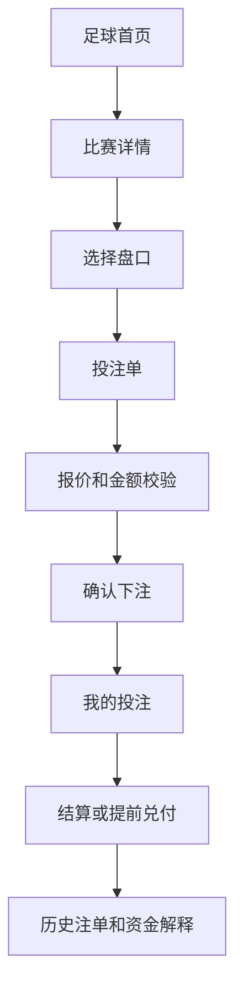
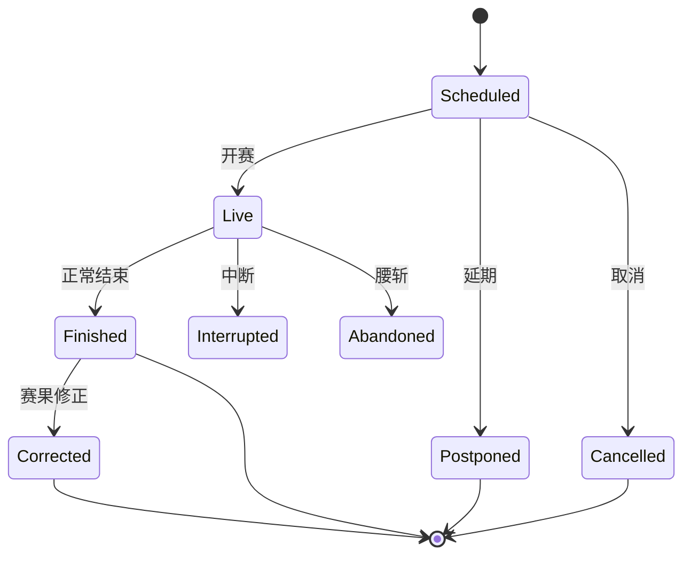
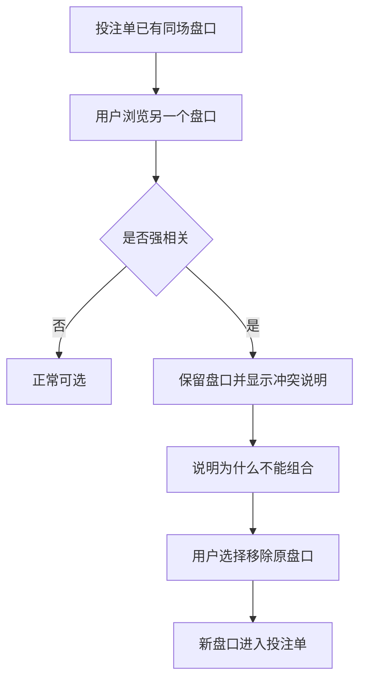
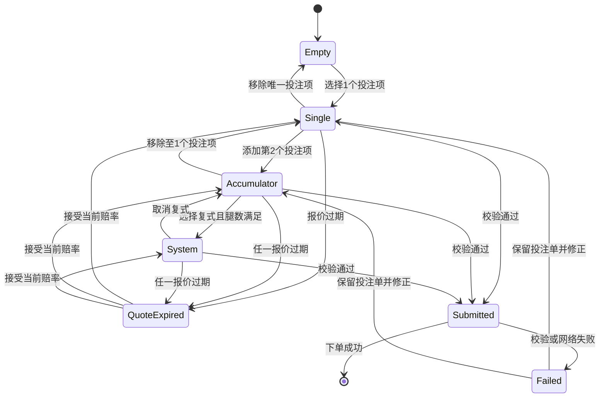
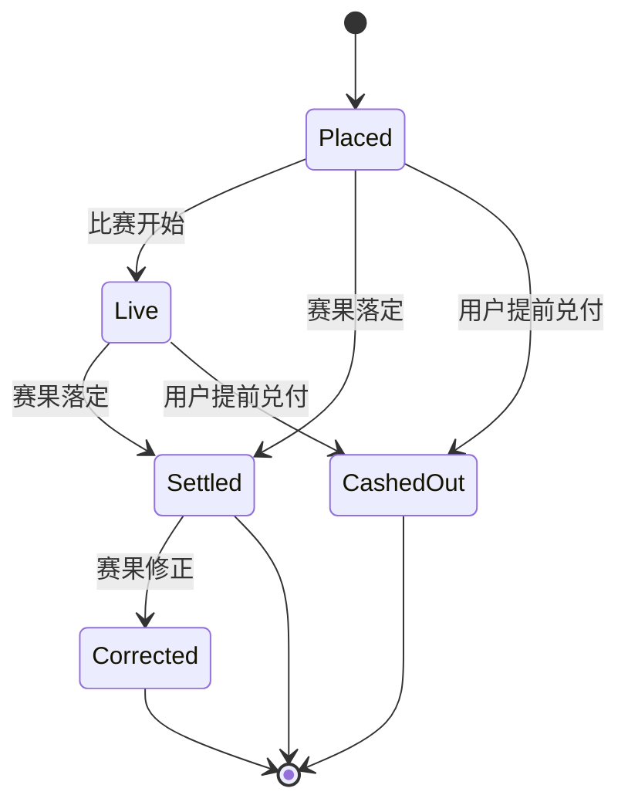

# TurboFlow 足球盘口产品需求文档 v4.2

## 1. 文档信息

版本：v4.2
日期：2026-04-27
对象：足球传统盘口产品
状态：当前评审稿

本版定义足球传统盘口的完整下注主路径：用户如何找比赛、看盘口、选择赔率、形成投注单、确认下注、查看注单、处理结算、提前兑付、重投和赛果修正。

返佣不是本版主需求。本版只说明足球注单在有效结算后，可以向统一返佣体系提供统计口径。返佣如何分层、如何计算、如何到账、如何冲正，后续单独出返佣 PRD。

## 2. 当前边界

本文覆盖足球传统盘口，不覆盖足球 CLOB。传统盘口是平台给出赔率，用户按赔率下注；CLOB 是用户挂单、吃单、订单簿撮合，两者的页面、资金模型和结算逻辑不能混写。

本文不展开真实账户、真实赛果源、正式提前兑付报价、合规和责任博彩专项。本文会定义这些能力在产品路径里的位置，但不会替代对应专项需求。

进球类盘口开赛后是否继续开放由后台开关控制。本文定义用户侧如何展示和拦截，不展开后台配置页面。

## 3. 用户、场景和主路径

足球盘口的核心不是“展示一堆赔率”，而是让不同熟练度的用户知道：当前比赛能不能下注，自己选的结果是什么，多个选择会不会互相冲突，提交前价格是否还有效，下注后钱和结果去了哪里。

新手球迷通常从首页进入，只想支持一场比赛结果。他最容易误解的是：连续点两个赔率，以为自己买了两张单关。产品必须在第二个投注项加入时明确告诉他，这已经变成串关，必须全部命中才赢。

熟练足彩用户会扫多个盘口。他关心的是盘口是否存在、是否开放、为什么某个盘口不能点。产品不能简单隐藏冲突盘口，而要保留盘口位置并解释原因，否则用户会误以为平台缺盘口或赔率没加载出来。

滚球用户根据比分、分钟和赔率变化下注。他面对的状态最多：比赛状态、盘口状态、报价状态、赔率变化可能同时发生。产品必须把这些状态拆开表达，避免把“比赛还在踢”“盘口暂停”“报价过期”混成同一种失败。

串关用户用多场比赛换更高返还。他需要在投注单里看到跨几场、几条腿、组合赔率、全部命中的风险，以及任一腿不可用时整张单都不能提交。

复式用户想用多腿组合分散风险。他最容易误解单注金额和总投注额。产品必须同时展示单注金额、注数、总投注额和可能返还。

注单用户下注后关心三件事：本金是否已锁定，结果是否已经落定，余额变化是否能解释。我的投注必须把未结算本金、已结盈亏、提前兑付、退款和修正差额拆开。

### 3.1 用户主流程

用户从首页进入比赛详情，在详情页判断比赛状态和盘口含义。点击开放赔率后，选择进入投注单。投注单负责告诉用户当前是单关、串关还是复式，金额是否合理，报价是否仍然有效，可能返还是多少。确认下注成功后，投注单清空，注单进入我的投注。后续结果、提前兑付、退款、修正和重投，都在我的投注里解释。

## 4. 页面和信息架构

### 4.1 足球首页

足球首页只解决一个问题：用户能不能快速找到值得进入的比赛。

首页按联赛分组展示比赛。每场比赛必须先让用户看清双方球队，再判断状态。未开赛比赛展示日期和时间，不展示比分；直播比赛展示 LIVE、当前比分和比赛分钟；已结束比赛展示结束状态和比分；延期、取消等异常比赛展示状态，不出现虚假的比分。

首页只展示少量核心赔率入口，例如胜平负、总进球和让球。复杂盘口不在首页展开，用户进入比赛详情后再判断。首页可以展示直播数量、即将开赛比赛和联赛筛选，但这些信息不能挤掉比赛本身。

### 4.2 比赛详情页

比赛详情页解决两个问题：这场比赛现在是什么状态，以及用户要押哪个判断。

页面顶部先展示路径位置，让用户知道自己在哪个联赛、哪场比赛。比赛头部展示球队、状态、时间或比分、场地等基础信息。比分只在直播、已结束、中断、腰斩、已修正等已经产生比赛进程的状态中出现。

盘口区按标签组织。每个盘口都要有标题、状态、选择项、赔率和选中反馈。盘口标题要回答“这组选择在判断什么”，例如胜平负判断赛果，合计判断总进球高低，正确比分判断精确比分。

辅助信息包括阵容、交锋、数据、事件等内容。它们帮助用户判断比赛，但不参与下注校验。辅助信息缺失时不能影响盘口和投注单。

投注单在详情页内承担最终确认。它不只是购物车，而是下注前的风控和解释区。用户在这里确认投注项、投注方式、金额、赔率、报价状态、可能返还和提交条件。

### 4.3 设计状态展板

设计状态展板不是用户下注路径的一部分。它用于产品和设计评审，把 lean 版本隐藏在交互里的页面、组件、元素和状态铺开。

展板需要覆盖首页、比赛详情、我的注单、未找到页、加载骨架、比赛头部、比赛信息右栏、lean 白名单盘口、盘口状态、同场互斥、进球类开关、投注单状态、浮动投注单、注单卡片、报价变化和拒单原因。设计师打开展板后，应能逐项看到需要画的页面和反馈，不需要通过反复点击演示页面才发现状态。

后续如果新增比赛状态、盘口状态、投注单反馈或注单状态，需要同步补充到展板。

## 5. 比赛和盘口状态

### 5.1 比赛状态

比赛状态决定整场比赛是否还能新增投注，也决定页面展示时间还是比分。

未开赛比赛可以下注，展示开赛时间。直播比赛可以下注，展示比分和分钟。已结束、中断、腰斩、延期、取消、已修正比赛不能新增投注，也不能提交已包含该比赛的投注项。

延期和取消不能展示比分。即使数据源异常带来了比分，用户侧也应按比赛状态处理，只展示状态和时间信息。比分只属于已经开始或已经结束的比赛。

### 5.2 盘口状态

盘口状态决定单个盘口能不能选择。比赛状态和盘口状态需要同时成立，用户才可以提交。

开放盘口可以选择。即将开放、暂停、已结算、作废、取消、已修正盘口保留展示但不可选。隐藏盘口不展示给用户。已在投注单里的盘口如果后来变成不可用，投注单必须阻止提交，并告诉用户移除不可用项。

暂停不是作废。暂停代表暂时不接受投注，可能恢复；作废代表盘口无效，已有注单按退款或结算规则处理；已结算代表盘口已有结果；已修正代表结果发生过调整。产品文案不能把这些状态都说成“不可用”。

### 5.3 进球类盘口开赛后控制

进球类盘口是指结果由进球、比分、得分、进球时间或进球队员直接决定的盘口。它包括总进球数、大小球、合计、正确比分、双方得分、首球、末球、进球时间、进球队员、球队准确进球、球队两个半场得分和不失球等。

角球、红黄牌、罚牌、开球权、胜平负、让球不属于进球类盘口。角球总数和红黄牌总数虽然带有“总数”，但判断对象不是进球，不受进球类开关影响。

后台开关打开时，进球类盘口在开赛后仍可继续投注。后台开关关闭时，进球类盘口在开赛后保留展示但不可选择；投注单中已有的进球类投注项也不可提交，需要用户移除。盘口自身状态优先于这个开关，如果某个进球类盘口本身已经作废、取消或结算，就按盘口自身状态展示。

## 6. 盘口选择和串关互斥

### 6.1 基础选择规则

点击开放赔率后，投注项进入投注单。再次点击同一投注项，取消选择。同一比赛同一盘口只保留一个选项，用户点另一个选项时直接替换，不要求先手动移除。

跨比赛投注项默认可以组合。第二个投注项加入后，投注单从单关切换为串关。串关不是多张单关，必须全部命中才赢。

同一比赛内，强相关盘口不能组合。原因不是技术限制，而是这些盘口并不是独立判断。例如正确比分可以推出胜平负、总进球和大小球；如果允许放在同一张串关里，会让用户误以为自己选择了多个独立事件。

### 6.2 互斥逻辑

当前需要明确限制的同场组合包括：

| 禁止组合 | 原因 |
|----------|------|
| 胜平负 × 亚洲让分盘 | 都在判断胜负方向，只是表达不同 |
| 胜平负 × 欧洲让球 | 欧洲让球是胜平负加固定让球条件 |
| 胜平负 × 正确比分 | 正确比分会推出胜、平、负 |
| 亚洲让分盘 × 欧洲让球 | 都是让球维度 |
| 亚洲让分盘 × 正确比分 | 正确比分会决定让球结果 |
| 欧洲让球 × 正确比分 | 正确比分会决定让球后的赛果 |
| 总进球数 × 大小球 | 总进球档位会决定大小球结果 |
| 总进球数 × 正确比分 | 正确比分会推出总进球数 |
| 大小球 × 正确比分 | 正确比分会推出大小球结果 |

趣味盘可以和其他盘口组合，前提是它与最终赛果相对独立。当前可以明确为趣味盘的是开球权。未分类盘口按保守规则处理：如果相关性不明确，暂不允许和同场其他非趣味盘口组合。

### 6.3 冲突发生后的反馈

同场互斥不能通过隐藏盘口解决。页面应保留冲突盘口，让用户知道盘口存在，只是当前不能和投注单里的某个盘口组合。

冲突反馈要包含三层信息：发生了什么、为什么、下一步怎么办。用户应该看到“与投注单中某盘口冲突”，也应该看到原因，例如“正确比分会决定胜平负”。如果用户想继续选择，页面可以提供“移除冲突项后选择”的动作。

## 7. 投注单、报价和提交

### 7.1 投注单生命周期

投注单从空单开始。用户选择 1 个投注项后，投注单成为单关。加入第 2 个投注项后，投注单成为串关。满足复式腿数并选择复式后，投注单进入复式状态。

报价有有效期。报价过期后，不清空投注项，但阻止用户按旧价格提交。赔率变化时，用户需要按接受策略确认当前赔率。任一投注项对应的比赛不可下注、盘口不可用、报价过期或同场冲突，整张投注单都不能提交。

### 7.2 单关、串关和复式

单关只有一个投注项。它只结算当前一个选择，投注单需要展示比赛、盘口、选择、赔率、金额、可能返还和可能净盈利。

串关由两个或更多投注项组成。串关必须提示“全部选项命中才赢”。当前版本不支持把多个投注项自动拆成多张单关。

复式是将多个投注项拆成多注组合的投注方式。Trixie 需要 3 腿，包含 3 个两串一和 1 个三串一，共 4 注。Patent 需要 3 腿，包含 3 个单关、3 个两串一和 1 个三串一，共 7 注。Yankee 需要 4 腿，包含 6 个两串一、4 个三串一和 1 个四串一，共 11 注。

复式必须展示单注金额、注数、总投注额和可能返还。用户输入 10 USDT 时，如果是 Yankee，总投注额是 110 USDT，不是 10 USDT。

### 7.3 下单前校验

提交前按顺序校验：是否重复提交、金额是否在范围内、投注方式和腿数是否匹配、余额是否足够、同场盘口是否冲突、可能返还是否超过上限、盘口是否开放、比赛是否可下注、报价是否有效、赔率变化是否已接受、提交是否成功。

失败时不丢失投注单。产品要保留用户已经选择的投注项和金额，并告诉用户下一步该做什么。例如金额过低就调整金额，报价过期就接受当前赔率，盘口已关闭就移除不可用项。

### 7.4 二次确认

投注项达到 3 个或更多、投注金额达到 1,000 USDT 或更高、选择复式投注时，需要二次确认。确认内容应包括所有投注项、投注方式、总赔率、投注金额、可能返还和可能净盈利。

二次确认不是为了打断用户，而是为了防止高风险选择在未复核的情况下提交。

## 8. 我的投注、资金和结算

### 8.1 资金口径

可用余额表示用户还能继续下注的钱。下注成功后，可用余额减少。

未结算本金表示已经下注但结果尚未落定的本金。下注成功后增加，结算、提前兑付或退款后减少。

可能返还是理想结果下最多拿回的钱，不是已经赚到的钱。可能净盈利是可能返还减去总投注额。已结盈亏只在结算、提前兑付或修正后出现。

这些金额不能混在一起展示。用户必须能分清“还能用的钱”“已经押出去的钱”“可能拿回的钱”和“已经发生的钱”。

### 8.2 注单生命周期

已下注表示注单成功生成，结果未出。本金进入未结算本金。进行中表示关联比赛正在进行，本金仍未结算。已结算表示按赛果完成结算，返还或亏损已经落定。已兑付表示用户在普通结算前按当前兑付金额结束注单，之后不再按最终赛果重复结算。已修正表示已结算结果被调整，页面需要展示原结果、新结果和补发或追回差额。

### 8.3 提前兑付

提前兑付是用户在普通结算前结束注单。用户看到的是兑付金额，不是盈利金额。

只有未结算注单可以提前兑付。用户确认后，注单变为已兑付，未结算本金减少，可用余额增加兑付金额。已兑付注单不再普通结算，但可以作为历史注单重投。

正式提前兑付报价如何生成，不在本文展开。本文只要求产品路径完整：能看到报价，能确认，确认后不可撤销，资金变化可解释。

### 8.4 重投

重投是复用历史注单，不是直接替用户下注。用户点击重投后，原单关回到单关，原串关回到串关，原复式保留复式类型。

重投必须重新确认当前赔率。任一投注项当前不可用，整张重投失败，不能留下半张投注单。失败时用户应看到明确原因，例如比赛不可下注、盘口已关闭或赔率需要重新确认。

### 8.5 赛果修正

赛果修正发生在已结算注单之后。我的投注需要展示原结果、新结果、补发或追回差额，以及余额为什么变化。

修正不能覆盖原记录。用户和客服都需要看到这张注单经历过什么变化，尤其是原本赢变输、输变赢、退款变结算等情况。

## 9. 返佣关联口径

返佣只作为足球注单结算后的外部统计结果出现，不进入用户下注主路径。

足球下注页不展示返佣入口。我的投注页不解释代理收益。足球产品只需要在注单进入有效结算后，向统一返佣体系提供必要口径：产品线、注单类型、有效投注额、币种、结算状态、作废或修正状态。

有效投注额不是用户点击下注金额的简单复刻，而是注单完成有效结算后可被统计的投注金额。作废、退本、比赛取消、下单失败不形成有效投注额。提前兑付是否计入有效投注额，以返佣专项 PRD 的最终口径为准。

返佣归属、层级、比例、到账、冲正、账号限制等内容不在本文展开。后续单独输出返佣 PRD。

## 10. 主要用户路径

### 10.1 赛前单关

用户进入足球首页，看到联赛和未开赛比赛。进入比赛详情后，页面展示开赛时间，不展示比分。用户选择一个开放赔率，投注单出现一个投注项，并显示单关状态。

用户输入金额后，投注单计算可能返还和可能净盈利。报价仍有效、金额合法、余额足够时，用户确认投注。下注成功后生成注单凭证，可用余额减少，未结算本金增加。比赛结算后，我的投注展示结果和资金变化。

### 10.2 跨场串关

用户先选择第一场比赛的赔率，投注单为单关。随后进入另一场比赛并选择赔率，投注单切换为串关。

投注单必须提示当前跨几场、几条腿、组合赔率是多少，以及串关需要全部命中才赢。只要任一投注项不可用、报价过期或比赛不可下注，整张串关都不能提交。

### 10.3 同场冲突

用户已选择同场胜平负后，再浏览正确比分。正确比分盘口仍然展示，但选择项不可直接加入投注单。页面说明“正确比分会决定胜平负，不能放进同一张串关”。

如果用户坚持选择正确比分，需要先移除胜平负。确认后，投注单移除原投注项，再加入正确比分。这个过程不能让两个强相关盘口短暂同时存在于同一张串关里。

### 10.4 滚球进球类控制

比赛已开赛后，用户进入直播比赛。若后台开关打开，进球类盘口仍按普通开放盘口处理，报价和金额校验通过即可提交。

若后台开关关闭，进球类盘口保留展示但不可选择。投注单中如果已有进球类投注项，也不能提交。角球和红黄牌盘口不受该开关影响，仍按自己的盘口状态处理。

### 10.5 历史注单重投

用户在我的投注中看到历史注单，点击重投。系统按原注单类型恢复投注单，但所有赔率必须使用当前赔率。

如果所有投注项仍可用，重投成功进入投注单，用户重新确认金额和报价后再下注。如果任一投注项不可用，整单重投失败，不保留部分投注项。

## 11. 需求清单

| 编号 | 优先级 | 需求 | 验收入口 |
|------|--------|------|----------|
| REQ-001 | P0 | 足球首页展示联赛、比赛、状态和核心赔率入口 | AC-001 |
| REQ-002 | P0 | 未开赛、延期、取消比赛不展示比分 | AC-002 |
| REQ-003 | P0 | 直播比赛展示比分和分钟 | AC-003 |
| REQ-004 | P0 | 比赛不可下注时，不得新增或提交相关投注项 | AC-004 |
| REQ-005 | P0 | 盘口状态必须准确反馈开放、暂停、作废、已结算等差异 | AC-005 |
| REQ-006 | P0 | 同一比赛同一盘口只保留一个选项 | AC-006 |
| REQ-007 | P0 | 第二个投注项加入后，投注单切换为串关 | AC-007 |
| REQ-008 | P0 | 同场强相关盘口不得组合 | AC-008 |
| REQ-009 | P0 | 投注单展示投注项、投注方式、金额、赔率、报价和返还 | AC-009 |
| REQ-010 | P0 | 复式展示单注金额、注数、总投注额和可能返还 | AC-010 |
| REQ-011 | P0 | 报价过期后不得按旧报价提交 | AC-011 |
| REQ-012 | P0 | 下单成功后生成注单并更新资金口径 | AC-012 |
| REQ-013 | P0 | 提前兑付后不再普通结算 | AC-013 |
| REQ-014 | P0 | 赛果修正展示原结果、新结果和差额 | AC-014 |
| REQ-015 | P0 | 重投必须整单成功或整单失败 | AC-015 |
| REQ-016 | P0 | 进球类盘口开赛后是否可投注由后台开关控制 | AC-016 |
| REQ-017 | P1 | 提供设计状态展板，平铺展示全部关键页面和状态 | AC-017 |
| REQ-018 | P1 | 足球注单结算后提供返佣统计所需的有效投注额口径 | AC-018 |

## 12. 场景验收

| 编号 | 场景 | 前置条件 | 用户动作 | 通过标准 |
|------|------|----------|----------|----------|
| AC-001 | 足球首页信息 | 有多场比赛 | 进入足球首页 | 能看到联赛、比赛、状态和核心赔率入口 |
| AC-002 | 未开赛不显示比分 | 比赛未开赛、延期或取消 | 查看比赛 | 不出现比分 |
| AC-003 | 直播显示比分 | 比赛直播中 | 查看比赛 | 显示比分和分钟 |
| AC-004 | 比赛不可下注 | 比赛已结束或异常 | 尝试下注 | 无法新增或提交相关投注项 |
| AC-005 | 盘口状态 | 盘口暂停、作废、结算或修正 | 查看盘口 | 盘口保留展示但不可选，并说明状态 |
| AC-006 | 同盘口替换 | 已选某盘口选项 | 选同盘口另一个选项 | 新选项替换旧选项 |
| AC-007 | 第二项变串关 | 投注单已有 1 项 | 添加另一可组合项 | 投注单提示串关，不能按多张单关提交 |
| AC-008 | 同场互斥 | 已选胜平负 | 查看正确比分 | 正确比分显示冲突原因和恢复动作，不能直接组合 |
| AC-009 | 投注单完整 | 投注单有投注项 | 展开投注单 | 能复核比赛、盘口、选择、赔率、金额、返还、报价 |
| AC-010 | 复式金额 | 已满足复式腿数 | 选择复式并输入金额 | 显示单注金额、注数、总投注额 |
| AC-011 | 报价过期 | 报价超过有效期 | 尝试提交 | 阻止提交，需接受当前赔率 |
| AC-012 | 下单成功 | 条件满足 | 确认投注 | 生成注单，余额和未结算本金变化 |
| AC-013 | 提前兑付 | 注单可兑付 | 确认兑付 | 注单已兑付，不再普通结算 |
| AC-014 | 赛果修正 | 已结算注单被修正 | 查看注单 | 展示原结果、新结果和差额 |
| AC-015 | 重投完整 | 历史注单含不可用项 | 点击重投 | 整单失败，不留下半张投注单 |
| AC-016 | 进球类开赛后控制 | 比赛已开赛，且存在进球类盘口 | 切换后台开关 | 开关打开时进球类盘口仍可投注；开关关闭时进球类盘口保留展示但不可选择；角球和红黄牌不受影响 |
| AC-017 | 设计状态展板 | 设计师需要覆盖 lean 版本全部页面、组件、元素和状态 | 打开展板 | 能一次性看到页面级状态、比赛状态、lean 盘口、盘口状态、进球类开关、投注单状态、浮动投注单、注单状态、报价变化和拒单原因 |
| AC-018 | 返佣统计口径 | 足球注单有效结算 | 查看返佣专项数据来源 | 足球产品能提供产品线、注单类型、有效投注额、币种和结算状态 |

## 13. 运营和客服解释口径

多个投注项会组成一张串关或复式。串关需要全部命中才赢，不会自动拆成多张单关。

胜平负和正确比分不能放进同一张串关，因为正确比分已经决定胜平负结果。总进球数和大小球不能组合，因为总进球档位会决定大小球结果。

盘口显示但不能点，说明盘口存在，但当前暂停、关闭、作废、已结算，或与投注单中已有盘口冲突。显示盘口不是承诺一定能下注。

进球类盘口开赛后不能投注，是因为后台开关关闭。角球和红黄牌不是进球类盘口，按各自状态处理。

报价过期后需要确认当前赔率，不能按旧价格下注。报价过期不代表投注项消失。

提前兑付代表用户已按当前金额结束注单，不能再按最终赛果重复结算。

重投代表复用整张历史注单。只保留一部分会造成误解，所以必须整单成功或失败。

足球盘口可能进入返佣统计，但返佣规则不在足球下注页解释。返佣归属、比例、到账和冲正以后续返佣 PRD 为准。

## 14. 开放问题和术语

### 14.1 开放问题

| 编号 | 问题 | 当前处理 |
|------|------|----------|
| OPEN-001 | 真实提前兑付报价如何生成和失效 | 本文只定义产品路径 |
| OPEN-002 | 合规和责任博彩入口如何接入 | 独立补充 |
| OPEN-003 | 部分作废的串关或复式如何精确计算有效投注额 | 归入结算和返佣专项确认 |

### 14.2 术语

| 术语 | 定义 |
|------|------|
| 投注单 | 用户下注前保存投注项、金额和投注方式的区域 |
| 投注项 | 一条比赛、盘口、选择和赔率 |
| 单关 | 只有一个投注项的注单 |
| 串关 | 多个投注项组成的一张注单，全部命中才赢 |
| 复式 | 多个投注项拆成多注组合的投注方式 |
| 盘口族 | 用于判断盘口之间是否相关的分类 |
| 同场互斥 | 同一比赛中两个强相关盘口不能放进同一张串关 |
| 报价有效期 | 用户选择赔率后，可以按该价格提交的时间窗口 |
| 未结算本金 | 已下注但结果尚未落定的本金 |
| 提前兑付 | 用户在普通结算前按当前兑付金额结束注单 |
| 有效投注额 | 注单有效结算后可进入外部统计的投注金额 |
