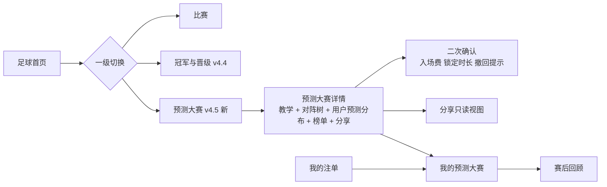
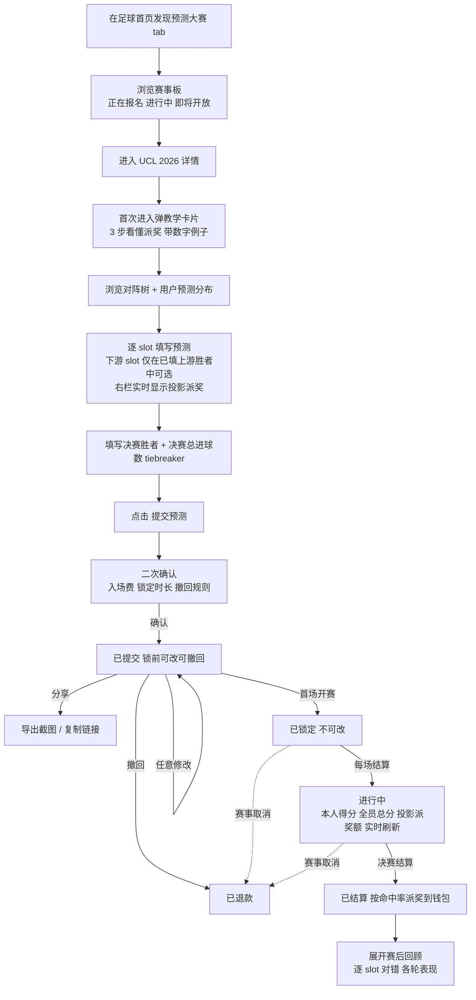
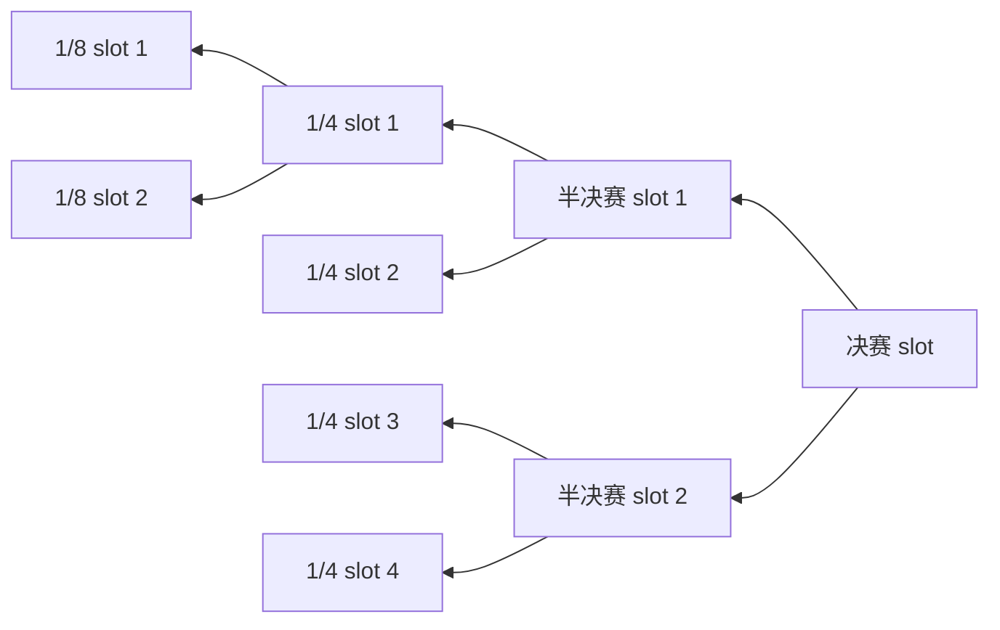
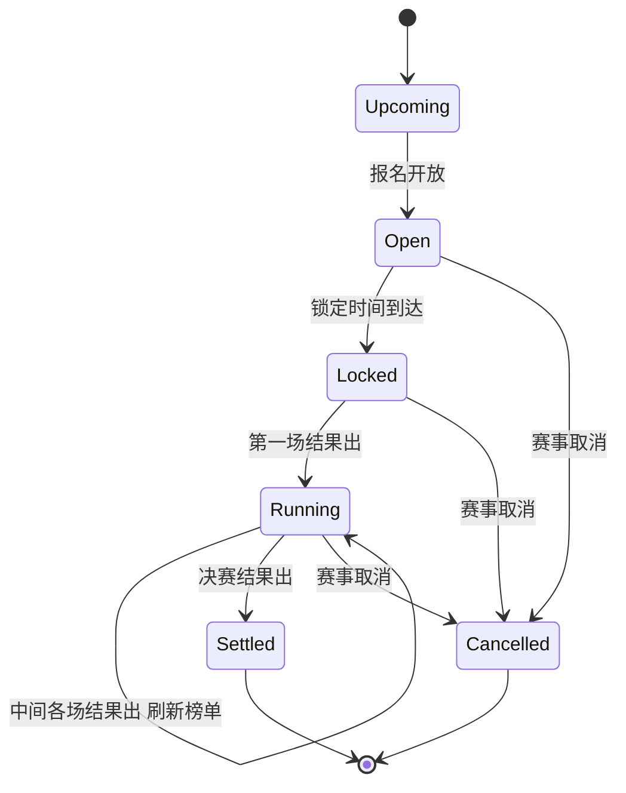
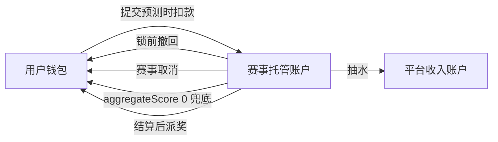

# TurboFlow 足球预测大赛产品需求文档 v4.5

版本：v4.5
对象：足球预测大赛 — 淘汰赛对阵树预测（Bracket Pool）
基线：v4.3《TurboFlow 足球盘口产品需求文档》、v4.4《TurboFlow 足球盘口产品需求文档 — 赛事级预测增量》
状态：已暂缓 / 当前产品与 mock 中隐藏

> 2026-05-07 更新：本方案已从当前产品范围、mock 入口和 Design Board 中隐藏。团队确认类似 TI 勇士战令的整届赛事预测（小组赛、淘汰赛、冠亚季殿军等）无法从外部稳定获得报价与可验证结算口径，暂不作为当前可上线/可设计能力推进。本文保留为历史研究与后续重启参考，不替代 v4.3 / v4.4，也不代表当前 mock 的可见功能。

> 本文不替代 v4.3 / v4.4。v4.3 定义足球单场盘口闭环，v4.4 增量补齐赛事级（冠军、晋级、赛季名次、两回合系列赛）个体盘口。原 v4.5 曾计划在两者之上新增一条**平行产品线**：付费入场的淘汰赛对阵树预测大赛。该方向目前暂停，不进入当前版本的信息架构、用户入口、注单资产、分享页或 Design Board 设计交付。

## 当前处理结论

- 足球首页不展示「预测大赛」tab。
- 不注册 `/soccer/predictions/:tournamentId`、`/soccer/predictions/:tournamentId/leaderboard`、`/soccer/predictions/share/:shareId` 等用户可访问路由。
- 「我的注单」只保留传统注单，不展示「我的预测大赛」资产 tab。
- Design Board 不再展示整届赛事预测大赛的报名、填表、榜单、分享、结算等状态，只保留“已隐藏能力 / 后续重启条件”的说明。
- 后续如要恢复，必须先解决外部报价来源、结算数据源、风险定价、关联性和运营兜底规则，再重新立项。

## 一、立项背景与五视角审核

### 1.1 立项背景

v4.4 用"按市场逐个押注"的方式承接了赛事级长期下注意愿（冠军、晋级、赛季名次、系列赛），但有三个问题不在 v4.4 的解题范围内：

1. **相关性问题**：长期市场之间存在显式相关性（夺冠 ⇒ 进决赛 ⇒ 晋级），v4.4 第一版直接禁用赛事级串关来回避，没有正面解决。
2. **球感比拼**：球迷长期追一项赛事的核心情感不是"我赢这一注"，而是"我比别人懂这支球队 / 这届赛事"。逐个市场押注难以承载这种情感。
3. **社交资产**：球迷喜欢和朋友比预测、晒预测、回头复盘。逐个市场押注没有"一份属于我的预测"这个可分享、可复盘的整体物。

预测大赛形态可以同时回答这三件事：

- 用户提交的是**一张内部一致的预测表**，相关性内化在表里，不需要平台定义相关性矩阵
- 一张表 = 一次完整的"我对这届赛事的判断"，是球感比拼的天然载体
- 一张表是可分享、可复盘的整体物，能撑起社交动作和赛后回顾

### 1.2 五视角审核摘要

立项前从五个视角审核了"按命中率分奖的对阵树预测大赛"形态，每个视角的关切都已落到 v1 范围或边界里：

| 视角 | 关键关切 | 在 v4.5 的落点 |
|------|----------|----------------|
| 赛事创办者 | 冷启动、反作弊、资金托管、合规、运营配置 | 第十一至十四章专题 + 第十五章配置项清单 |
| 预测市场玩家 | wisdom of crowds 信号透明、晚交策略 | 第七章用户预测分布快照、锁定时机不前置关闭修改 |
| 足球爱好者 | 理解门槛、分享、赛后复盘 | 第八章教学卡片、第九章分享、第十章回顾 |
| 产品经理 | 信息架构清晰、榜单形态匹配派奖逻辑 | 第四章入口分离与差异化文案、第六章榜单设计 |
| 足球博彩用户 | 赔率→命中率的认知断层、资金锁定 | 第八章教学 + 第七章资金锁定醒目提示 |

## 二、产品定位

### 2.0 业务背景与增长边界

TurboFlow 当前主业务是 Perp DEX，足球预测市场是新的业务板块。v4.5 的首要目标不是做一场独立的大型营销 campaign，而是在现有约 500 DAU、推广尚未全面发力的阶段，用一个规则清晰、社交性较强的足球预测大赛验证三件事：

1. **现有交易用户是否愿意尝试预测市场**：从 Perp 用户自然导流到足球预测大赛，观察 tab 曝光、详情访问、填表完成和提交率。
2. **现有推广体系是否能带动预测市场入场**：沿用平台已有推广码和邀请码体系，观察代理、伞下与普通邀请用户对预测大赛的带量效果。
3. **预测市场是否能沉淀新场景**：用户通过一张对阵树完成预测、分享、赛中回访和赛后复盘，为后续冠军盘、系列赛盘和更多体育预测产品提供行为基础。

因此，v4.5 v1 的运营增长原则是：

- **复用现有推广体系，不新造 referral 系统**：代理推广码和普通邀请码继续由平台既有规则管理。
- **轻量站内运营优先**：首页入口、预测大赛 tab、详情页提示、分享页 CTA、我的预测大赛承接足够；不做复杂任务中心、营销后台和自动化 CRM。
- **返佣口径与奖金池口径分离**：用户入场费进入奖池和结算体系；推广 / 邀请返佣只按平台定义的预测市场收入口径计算，不改变用户可分配奖金池。
- **分享不覆盖归属**：用户从分享页进入可以被记录为分享来源，但不得覆盖其已有推广码 / 邀请码归属。

### 2.1 与 v4.4 的边界

| 维度 | v4.4 赛事级个体盘 | v4.5 预测大赛 |
|------|-------------------|---------------|
| 投注对象 | 单个市场，平台报价 | 一张对阵树预测，包含整届赛事所有 slot |
| 资金模型 | 金额 × 赔率 = 返还 | 入场费 → 奖金池 → 按命中率分奖（同注分彩 by accuracy）|
| 派奖公式 | 命中即按所选赔率结算 | `payout_i = (totalScore_i / aggregateScore) × netPool` |
| 信号来源 | 平台报价 | 平台报价 + 用户群体预测分布（wisdom of crowds）|
| 用户心理 | 押注 | 球感比拼 + 参与感 |
| 资金占用 | 单注独立、可逐单结清 | 整个赛事周期锁定（v1 锁前可全额撤回，锁后无法取消）|
| 串关相关性 | v4.4 第一版禁用赛事级串关 | 天然不存在（用户提交的整张表本身就是一致的）|

### 2.2 与 v4.4 的并存关系

- v4.4 个体盘和 v4.5 预测大赛**独立结算、互不冲销、可同时参与**。同一个用户既可以买 v4.4 单注"皇马夺冠"，又可以参与 v4.5"UCL 2026 淘汰赛预测大赛"，两笔互不影响。
- 用户钱包统一，但两套余额来源在「我的注单」中分 tab 展示。
- 两者**不可串关 / 不可组合下注**（v1 明确不开放），原因详见 v4.4 第 8.3 节。
- v4.4 PRD 末尾会加一段交叉引用，提示读者本文档存在。

### 2.3 不是什么

- 不是订单簿 / CLOB。没有用户挂单，没有买卖盘，没有撮合。
- 不是 fantasy 球员选秀。没有"组队"概念，没有球员个人数据计分。
- 不是 fixed-odds 博彩。入场前不能告诉用户"如果赢了拿多少"，只能告诉投影区间。
- 不是免费预测游戏。v1 是真金入场，按命中率分奖。

## 三、v1 范围

### 3.1 本期做什么

**核心机制**

| 范围 | 说明 |
|------|------|
| 一个示例正在报名的赛事 | UEFA Champions League 2026 淘汰赛（R16 起 16 队，15 个 slot） |
| 一个示例即将开放的赛事 | FIFA World Cup 2026 淘汰赛（仅卡片占位 + 倒计时，不可入场） |
| 入场政策 | 单笔入场，每用户每赛事 1 份预测表，固定入场费（v1 mock 10 USDT） |
| 报名开放时间 | 每届赛事单独配置 `openAt`，即将开放卡片展示报名开放倒计时；不得用 `lockAt` 冒充开放时间 |
| 成团与保底 | 每届赛事配置 `minEntrants` 和 `guaranteedPool`；未达最低参赛人数时延期或退款，保底池由运营配置 |
| 锁定时机 | 淘汰赛首场开赛瞬间锁定，锁前可任意修改、可全额撤回 |
| 评分规则 | R16 = 1pt × 8、QF = 2pt × 4、SF = 4pt × 2、Final = 8pt（满分 32），猜中冠军不额外加分 |
| Tiebreaker | 决赛总进球数最接近者，仅用于**同分时的榜单展示排序**，**不影响派奖** |
| 派奖公式 | `payout_i = (totalScore_i / aggregateScore) × netPool`，按命中率分奖 |
| 抽水 | 10%（赛事开赛前公示，开赛后不得变更） |
| 实时刷新 | 每场结算后即刷新本人得分、全员总分、本人投影派奖额 |
| 异常 | 赛事取消 → 全额退款；锁前撤回 → 全额退款；全员总分 = 0 → 全额退款且抽水降为 0 |

**v1 必须落地的产品体验**

| 范围 | 说明 |
|------|------|
| 用户预测分布快照（wisdom of crowds） | 每个 slot 显示当前用户群体预测占比，锁定前实时刷新、锁定后冻结 |
| 晚交策略 | v1 mock 采用“分布延迟 + 锁前冻结”：分布展示为延迟快照，锁定前 2 小时冻结，不再实时刷新 |
| 教学卡片 + 数字示例 | 入场前一次展示"3 步看懂派奖"，带具体数字示例 |
| 分享 / 导出预测表 | 截图导出 + 链接分享只读视图（带签名 token） |
| 未来即将开放赛事板 | 首页预测大赛 tab 同时列"正在报名 / 进行中 / 即将开放"三段 |
| 赛后回顾视图 | 结算页展示逐 slot 对错、各轮表现、最终得分与派奖 |
| 资金锁定时长醒目提示 | 入场前 + 二次确认 + 我的注单卡片三处展示锁定时长和锁前可撤回 |
| 榜单形态 | 前 100 + 本人置顶 + 完整榜单分页，页头明确"按命中率分奖、名次仅供展示" |
| 设计状态展板 | 12 个状态展板覆盖完整生命周期（含教学、分享、回顾、撤回、兜底退款）|

### 3.2 本期不做什么

| 不做项 | 原因 |
|--------|------|
| 小组赛预测 | bracket 之外的小组阶段算法和奖金分配复杂，留 v4.6 |
| 完整名次表预测（如英超 1–20）| 评分需要"位次差"算法 + UI 重，留 v4.6 |
| 多档入场费 / 多次入场 | 第一版反作弊和奖金池切分太重；下一版评估 |
| 二级市场（卖出 entry）| 不在产品定位；v1 接受"3 个月资金锁定"为已知约束 |
| 自动续约 / 同盘多季 | 留运营手动配置每届赛事 |
| 跨赛事联赛年票 | 不在本期 |
| 与 v4.4 个体盘串关 | 见 v4.4 第 8.3 节，长期盘相关性建模未定型前不开放 |
| 后台运营 UI | v1 配置写死在 mock；本文第十五章定义运营配置项字段，下一版做后台 |

### 3.3 与 v4.3 / v4.4 的关系

| 模块 | 处理 | 说明 |
|------|------|------|
| 足球首页 | **扩展** | 一级切换从「比赛 / 冠军与晋级」扩为「比赛 / 冠军与晋级 / 预测大赛」；每个 tab 顶部加差异化文案带 |
| 比赛详情页 | **不变** | 沿用 v4.3 |
| 单场 10 个盘口 | **不变** | 沿用 v4.3 |
| 投注单 / 二次确认 | **不变** | 预测大赛走独立提交流程，不进入 v4.3 / v4.4 投注单 |
| 我的注单 | **扩展** | 新增「我的预测大赛」tab，与传统注单 tab 并列；卡片样式不复用 |
| 我的注单状态机 | **不变** | 预测大赛 entry 走独立状态机（见第七章），不混入注单状态机 |
| 资金 / 钱包 | **共用** | 入场费、退款、派奖统一走钱包；账本上区分来源 |
| 设计状态展板 | **扩展** | 新增 12 个预测大赛展板，分组独立 |
| 风控、权限、合规 | **扩展** | 新增第十一至十三章专题；v4.3 / v4.4 已有约束继续适用 |

## 四、信息架构

### 4.1 三个一级 tab



### 4.2 三个 tab 的差异化文案

每个 tab 落地页的最顶部都有一行短文案，让用户立刻明白这个 tab 在做什么——避免"冠军与晋级"和"预测大赛"在认知上混淆。

| Tab | 顶部文案 |
|------|----------|
| 比赛 | "按比赛逐场下注" |
| 冠军与晋级 | "对单个市场逐个押注，按赔率结算" |
| 预测大赛 | "一份对阵树预测，入场费汇成奖金池，按命中率分奖" |

### 4.3 路由

| 路由 | 功能 |
|------|------|
| `/soccer/predictions/:tournamentId` | 对阵树详情页：教学卡片、对阵树、用户预测分布、我的预测、底部榜单 |
| `/soccer/predictions/:tournamentId/leaderboard` | 完整榜单页：分页、搜索、排序 |
| `/soccer/predictions/share/:shareId` | 只读分享视图：对阵树 + 当时的用户预测分布快照，不显示资金，不可编辑 |

### 4.4 不复用比赛详情页 / 赛事级详情页

预测大赛有独立的对阵树页面。它和 v4.4 赛事级详情页的结构完全不同——后者是市场卡片列表，前者是横向对阵树。两者必须分开。

## 五、用户与使用场景

### 5.1 角色与典型动机

| 角色 | 典型动机 | 使用路径 |
|------|----------|----------|
| 球感比拼用户 | 想证明自己比朋友 / 群里更懂这届赛事 | 详情页填表 → 分享给朋友 PK |
| 长持单用户 | 看好某队夺冠，但不想逐市场买十几注 | 详情页一次性填完 → 锁前微调 → 等结算 |
| 预测市场玩家 | 关注用户群体的预测分布，自己的预测想拿"信息差" | 看 wisdom of crowds → 选少数派 / 多数派 → 提交 |
| 足球迷 | 看球的乐趣 + 一点点小钱 | 教学卡片看懂规则 → 提交 → 决赛后看回顾 |
| 跨产品组合用户 | 已在 v4.4 买"皇马夺冠"，想在预测大赛里再做一份"对阵树" | 入两个产品并行 |

### 5.2 典型路径



## 六、对阵树数据模型

### 6.1 结构

一个预测大赛 tournament 包含 N 轮，每轮 M 个 slot。每个 slot 是一个 tie（对应 v4.4 已有的 `subject.scope = tie`）或一场比赛（决赛单场）。Slot 之间形成树：每个父 slot 的两位候选 = 它的两个子 slot 的预测胜者。



### 6.2 字段定义

| 数据对象 | 字段 | 类型 | 必填 | 说明 |
|----------|------|------|------|------|
| `BracketSlot` | `id` | 字符串 | 是 | slot 唯一 ID |
| `BracketSlot` | `round` | 枚举 R16 / QF / SF / F | 是 | 所属轮次 |
| `BracketSlot` | `parentSlotId` | 字符串 | 否 | 父 slot ID（决赛 slot 无父）|
| `BracketSlot` | `childSlotIds` | `[string, string]` | 否 | 子 slot ID（R16 slot 无子，candidates 直接给死）|
| `BracketSlot` | `candidates` | `[string, string]` | 否 | R16 slot 的初始两支队伍 |
| `BracketSlot` | `tieSubject` | `BetSubject (scope=tie)` | 是 | 复用 v4.4 BetSubject，便于跨产品对账 |
| `BracketTournament` | `status` | 枚举 upcoming/open/locked/running/settled/cancelled | 是 | 赛事生命周期状态 |
| `BracketTournament` | `openAt` | 时间 | 是 | 报名开放时间；upcoming 卡片展示该字段的倒计时 |
| `BracketTournament` | `entryFee` / `currency` / `rake` | 数字 / 字符串 / 数字 | 是 | 入场费、币种、抽水比例 |
| `BracketTournament` | `minEntrants` / `guaranteedPool` | 数字 / 数字 | 是 | 最低成团人数、保底奖金池 |
| `BracketTournament` | `lockAt` / `settleAt` | 时间 | 是 | 锁定时间、预计结算时间 |
| `BracketTournament` | `fundLockHint` | 文本 | 是 | 用户可读的资金锁定提示，例如"你的入场费将锁定约 12 周" |
| `BracketTournament` | `tiebreakerLabel` | 文本 | 是 | tiebreaker 文案，例如"决赛总进球数（含加时）" |
| `BracketTournament` | `lateStrategyLabel` / `distributionPolicyLabel` | 文本 | 是 | 晚交策略和分布展示策略的用户可读说明 |
| `BracketTournament` | `teachingCard` | 对象 | 是 | 教学卡片内容（3 步 + 数字示例）|
| `BracketTournament` | `poolSnapshot` | 对象 | 是 | 实时奖金池快照：参赛人数、毛池、净池、全员总分 |
| `BracketTournament` | `distribution` | 数组 | 是 | 各 slot 的用户预测分布快照；锁定后所有 snapshot 的 frozen = true |
| `BracketTournament` | `configMeta` | 对象 | 是 | 运营配置元信息（哪些字段开赛后可改、哪些不可改）|
| `UserBracketEntry` | `picks` | `Record<slotId, teamId>` | 是 | 用户在每个 slot 的选择 |
| `UserBracketEntry` | `tiebreakerGuess` | 数字 | 否 | 决赛总进球数预测 |
| `UserBracketEntry` | `status` | 枚举 draft/submitted/locked/settled/refunded | 是 | entry 生命周期状态 |
| `UserBracketEntry` | `refundReason` | 枚举 user_withdraw/tournament_cancelled/aggregate_zero | refunded 时必填 | 退款原因 |
| `UserBracketEntry` | `scoreBreakdown` | 数组 | 进行中起填 | 分轮命中和得分 |
| `UserBracketEntry` | `totalScore` / `scoreShare` / `projectedPayout` / `finalPayout` | 数字 | 进行中起填 | 实时分数、占总分比例、投影派奖、实得派奖 |
| `UserBracketEntry` | `shareId` | 字符串 | 否 | 分享视图的签名 token |
| `UserBracketEntry` | `review` | `SettlementReview` | 已结算时必填 | 赛后回顾结构化数据 |

### 6.3 派奖公式

```
入场费：fixed (v1 mock = 10 USDT)
毛池：grossPool = entryFee × entrants
计奖池：basePool = max(grossPool, guaranteedPool)
净池：netPool = basePool × (1 − rake)
全员总分：aggregateScore = Σ totalScore_i
单人派奖额：payout_i = aggregateScore > 0 ? (totalScore_i / aggregateScore) × netPool : 0
```

兜底：`aggregateScore = 0` 时（极端：全员 R16 起就全错），全额退入场费且抽水降为 0。

最低成团人数：报名锁定时若有效 entry 数低于 `minEntrants`，本届预测大赛不进入 locked，运营可选择延期一次或全额退款。v1 mock 默认展示“未达最低人数时全额退款”的路径，不模拟延期。

### 6.4 运营配置元信息

`configMeta` 里把字段分为两类：

| 类别 | 字段示例 | 说明 |
|------|----------|------|
| `configurableByOps` | `entryFee` / `rake` / `lockAt` / `settleAt` / `fundLockHint` / `teachingCard.worked_example` | 运营在赛事开放前可配置 |
| `immutableAfterOpen` | `entryFee` / `rake` / `rounds 权重` / `tiebreakerLabel` | 一旦赛事进入 `open` 状态就锁住，不允许变更 |

不可变的目的是公平：用户报名时看到的规则不能被中途修改。

## 七、赛事级生命周期与文案

### 7.1 状态机



用户 entry 状态机独立于赛事状态：`draft → submitted → locked → settled` 或在任一点 → `refunded`。

### 7.2 状态语义和文案

| 赛事状态 | 进入条件 | 用户表现 | 文案要点 |
|----------|----------|----------|----------|
| 即将开放 (upcoming) | 赛事已配置但未开放报名 | 仅卡片可见，不可入场 | "即将开放：MM/DD 开放报名" |
| 报名中 (open) | 报名开放至锁定时间前 | 可入场、可修改、可撤回 | "报名中｜锁定倒计时 X 天 Y 小时" |
| 已锁定 (locked) | 锁定时间到达，第一场未结算 | 不可改、不可撤回 | "已锁定，等待第一场开赛" |
| 进行中 (running) | 至少一场结果出，决赛未结算 | 实时本人得分、全员总分、投影派奖 | "进行中｜你当前 X 分，预计派奖 ≈ Y USDT" |
| 已结算 (settled) | 决赛结果出且官方确认 | 派奖到账，赛后回顾可展开 | "已结算｜实得派奖 Y USDT" |
| 已取消 (cancelled) | 赛事取消 | 全员退款 | "赛事取消，已全额退款" |

### 7.3 资金锁定时长醒目提示

足球博彩用户对"几个月资金锁定"敏感，必须在三处显式展示：

1. **赛事头部**：状态徽标旁附 `fundLockHint`（例如"入场费将锁定约 12 周"）
2. **二次确认弹窗**：作为大字体醒目带，配合"锁前可全额撤回，锁后无法取消"
3. **我的注单卡片**：处于 submitted/locked 状态时持续展示

文案不可隐藏，不可缩进折叠。

## 八、教学与新手引导

### 8.1 教学卡片

入场前必须让用户看懂"按命中率分奖"。教学卡片在用户首次进入某届赛事详情页时弹一次，以后可在头部"如何派奖"按钮重新打开。

教学卡片三步：

1. **入场**：付入场费，所有人的入场费汇成奖金池，平台抽水 X%
2. **填表**：填完整张对阵树，每命中一个 slot 按轮次拿分（R16=1pt、QF=2pt、SF=4pt、F=8pt）
3. **派奖**：决赛后按"本人得分 / 全员总分 × 净池"分钱

紧跟一段**数字示例**（取自 `teachingCard.worked_example`）：

> 假设你最终拿了 12 分，全员总分是 5000 分，净池是 9000 USDT。
> 那你能拿到 `12 / 5000 × 9000 = 21.6 USDT`。

### 8.2 投影派奖实时显示

对阵树页面右栏「我的预测」面板实时显示：

```
本人得分：X
本人占比：X / 全员总分 = Y%
投影派奖：≈ Z USDT
```

锁前未提交时，使用"如果按当前选择"的措辞；锁后使用"目前你"的措辞。

### 8.3 wisdom of crowds（用户预测分布）

每个 slot 卡片内显示一条占比条：双方球队 + 当前用户群体预测占比（例如皇马 62% / 莱比锡 38%）。锁定前实时刷新；锁定瞬间冻结所有 snapshot 并标注"已冻结于 MM/DD HH:mm"。

这条信息对预测市场玩家是核心信号，对足球爱好者是"群众怎么看"的谈资。

### 8.4 晚交策略

预测市场玩家会观察用户群体预测分布后再提交。v1 不做复杂隐藏机制，但必须避免“实时分布 + 压秒提交”形成过强后手优势。

v1 mock 采用以下策略：

- 分布展示为延迟快照，文案标注“约 15 分钟延迟”。
- 锁定前 2 小时冻结用户预测分布，之后只允许修改自己的预测，不再刷新 crowds 占比。
- 已提交和未提交用户看到同样的延迟分布，避免把“提交”变成解锁信息的门槛。
- 锁定后所有分布快照永久冻结，用于分享视图和赛后回顾。

这是一版保守策略。后续若发现晚交优势仍然过强，可评估“提交后解锁完整分布”或“仅展示粗粒度分布”等更强方案。

## 九、分享与社交

### 9.1 分享只读视图

每张已提交的 entry 自动生成一个 `shareId`。分享路由 `/soccer/predictions/share/:shareId` 是只读视图：

- 显示对阵树 + 当时的用户预测分布快照
- **不显示**：资金、入场费、本人得分、投影派奖
- **可显示**：用户名、提交时间、tiebreaker 选择
- 顶部 CTA："看完想自己来一份？立即参加"，点击跳到 `/soccer/predictions/:tournamentId`

### 9.2 截图导出

详情页右栏有"分享"按钮，点击弹出 `PredictionShareDialog`：

- 公开链接预览：对阵树 + 用户名 + 提交时间 + tiebreaker；不显示资金、得分、投影派奖
- 截图导出预览：默认隐藏收益；可在后续版本增加“显示收益”的本地私有选项
- 三个动作：复制链接 / 下载图片 / 复制文案

### 9.3 不做的社交动作

- 不做站内好友列表 / 关注关系
- 不做评论区
- 不做"挑战某用户"功能
- v1 只做"自己的预测可分享出去"，不做"在站内互动"

## 十、赛后回顾

### 10.1 回顾视图

赛事结算后，用户在「我的预测大赛」卡片内可以展开赛后回顾，包含：

- **逐 slot 列表**：你的选择 / 实际胜者 / 是否命中 / 该 slot 得分
- **各轮汇总**：R16 X/8、QF X/4、SF X/2、F X/1
- **一句 highlight**：从 `SettlementReview.highlight` 取，例如"你最强的是 SF 轮（2/2 全对）"

回顾视图同步在设计状态展板的"已结算"状态中呈现。

### 10.2 不做的回顾动作

- 不做"和朋友回顾对比"
- 不做"历届赛事回顾汇总"
- v1 只做单赛事单 entry 的回顾

## 十一、反作弊

### 11.1 风险

| 风险 | 说明 |
|------|------|
| 多账号多策略覆盖 | 同一自然人用多个账号提交不同 bracket，降低单一预测的方差，破坏“每人一份判断”的公平性 |
| 多账号刷参赛人数 | 同一自然人开多账号填多份预测表，稀释奖金池 |
| 自动化批量提交 | 脚本批量生成 entry |
| 协同作弊 | 多账号同填以期分奖 |

### 11.2 v1 对策

| 对策 | 说明 |
|------|------|
| 单账号 1 entry | 同一账号同一赛事仅可提交一份预测表 |
| 支付账户 / 钱包维度去重 | 同一支付来源或钱包来源在同一赛事内只允许一份 entry |
| 设备与行为相似度风控 | 以提交时间、预测相似度、设备特征、操作节奏识别批量提交 |
| 提交频率限制 | 同一设备、同一网络环境下短时间大量提交触发人工复核 |

协同作弊与多账号多策略覆盖会影响真实用户对公平性的感知。v1 mock 只展示风控提示和人工复核状态，不模拟真实身份认证流程。

## 十二、资金托管与派奖时效

### 12.1 资金流



### 12.2 派奖时效

| 场景 | SLA |
|------|-----|
| 决赛官方结果出，无争议 | 4 小时内派奖到所有得分用户钱包 |
| 决赛官方结果有争议（如申诉中）| 派奖延迟，状态显示"等待官方最终结果"，不超过 72 小时未确认则按当前结果派奖并附公告 |
| 锁前撤回 | 实时退回钱包 |
| 赛事取消 | 24 小时内全额退回钱包 |

### 12.3 平台抽水

- 抽水 10%，赛事开放报名前公示，开放后不得变更
- `aggregateScore = 0` 兜底情况下抽水降为 0
- 抽水从净池计算前扣除，进入平台收入账户

## 十三、法律 / 合规定性

### 13.1 产品定性

v4.5 在产品定位上属于"基于知识技能的预测大赛（skill-based prediction contest）"：

- 用户的预测命中率主要取决于足球知识、对球队实力的判断、对赛事走向的洞察
- 派奖按命中率比例分配，不存在"庄家赔率"
- 区别于"押注随机事件"的纯运气类博彩

### 13.2 用户协议要点

- 入场费即风险敞口，按命中率分奖，平台不保证回报
- 用户须确认对入场费的资金占用时长有充分预期
- 平台保留对异常批量提交、疑似多账号多策略覆盖和自动化提交进行人工复核的权利

### 13.3 与博彩牌照的关系

具体合规口径以法务专项为准；产品层面在用户协议、产品文案、风控规则上保持"技能竞赛"的一致表述。

## 十四、与 v4.4 的并存

### 14.1 资金独立、产品并行

- 同一用户可同时参与 v4.4 个体盘和 v4.5 预测大赛
- 两套结算独立，互不冲销
- 两套体验入口独立，不在同一投注单中混合
- 两套文案明确区分，避免用户认知混淆

### 14.2 不可串关 / 不可组合

明确不开放：

- v4.4 个体盘 × v4.5 预测大赛 串关 ❌
- v4.5 同赛事多份 entry 串关 ❌
- v4.5 跨赛事 entry 串关 ❌

原因详见 v4.4 第 8.3 节，长期盘相关性建模未定型前不开放。

### 14.3 我的注单 tab 化

「我的注单」页面扩展为两个 tab：

| Tab | 内容 |
|------|------|
| 传统注单 | 沿用 v4.3 / v4.4 的注单卡片 |
| 我的预测大赛 | v4.5 entry 卡片，状态机和卡片样式独立 |

## 十五、运营配置项清单

PRD 必须把每个赛事运营可配置的字段定义清楚，即使 v1 不做后台 UI、所有配置写死在 mock 里——这是为了下一版做后台时不需要重新定义。

### 15.1 赛事元信息

| 字段 | 类型 | 是否可变 | 说明 |
|------|------|----------|------|
| `id` | 字符串 | 创建后不可变 | 赛事唯一 ID |
| `name` / `shortName` | 文本 | 开放报名前可改 | 中英文名 |
| `competitionId` | 字符串 | 创建后不可变 | 关联的赛事 ID（与 v4.4 BetSubject 对账）|
| `region` | 文本 | 开放报名前可改 | 地区标签 |

### 15.2 对阵树

| 字段 | 类型 | 是否可变 | 说明 |
|------|------|----------|------|
| `rounds[].id` / `rounds[].label` | 枚举 / 文本 | 创建后不可变 | R16/QF/SF/F |
| `rounds[].weight` | 数字 | 开放报名后不可变 | 评分权重 |
| `slots[]` | 数组 | 开放报名前可改 | 对阵树结构 |
| `slots[].candidates` | 数组 | R16 slot 在锁定前可调整（如官方有变动）| R16 起始两支队伍 |

### 15.3 资金参数

| 字段 | 类型 | 是否可变 | 说明 |
|------|------|----------|------|
| `entryFee` | 数字 | 开放报名前可改，开放后不可变 | 入场费 |
| `currency` | 字符串 | 创建后不可变 | 币种 |
| `rake` | 数字 | 开放报名前可改，开放后不可变 | 抽水比例 |

### 15.4 时间

| 字段 | 类型 | 是否可变 | 说明 |
|------|------|----------|------|
| `openAt` | 时间 | 开放报名前可改，开放后不可改 | 报名开放时间 |
| `lockAt` | 时间 | 开放报名后仅运营提前调整（不可推迟到第一场后）| 锁定时间 |
| `settleAt` | 时间 | 仅展示，可调整 | 预计结算时间 |

### 15.5 文案

| 字段 | 类型 | 是否可变 | 说明 |
|------|------|----------|------|
| `tiebreakerLabel` | 文本 | 开放报名前可改 | tiebreaker 文案 |
| `fundLockHint` | 文本 | 开放报名前可改 | 资金锁定提示 |
| `lateStrategyLabel` | 文本 | 开放报名前可改 | 晚交策略提示 |
| `distributionPolicyLabel` | 文本 | 开放报名前可改 | 用户预测分布展示策略 |
| `teachingCard` | 对象 | 开放报名前可改，开放后仅文案微调（数字示例不可变）| 教学卡片 |

## 十六、UI / 页面规格

### 16.1 足球首页：预测大赛 tab

- 顶部差异化文案带："一份对阵树预测，入场费汇成奖金池，按命中率分奖"
- 三段卡片列表：「正在报名」「进行中」「即将开放」
- 卡片字段：赛事名 + 状态徽标 + 奖金池总额 + 入场费 + 锁定倒计时 + 已参加状态 + "如何派奖"教学入口

### 16.2 预测大赛详情页 (`/soccer/predictions/:tournamentId`)

四块布局：

| 区域 | 内容 |
|------|------|
| 顶部赛事头 | 赛事名 + 状态徽标 + 奖金池总额 + 抽水比例 + 入场费 + 锁定倒计时 + 参赛人数 + 全员总分 + 资金锁定时长醒目提示带 + "如何派奖"按钮 |
| 教学卡片（首次进入弹一次） | 3 步说明 + 数字示例 |
| 主区对阵树 | 横向布局（R16 → QF → SF → F），每个 slot 显示双方 logo + 名称 + 用户预测占比条 + 可点击下拉；下游 slot 在上游未填时禁用并提示"先填上游" |
| 右栏「我的预测」 | 进度（已填 X/15）+ tiebreaker 输入 + 本人得分 + 本人占总分比例 + 本人投影派奖额 + 提交 / 编辑 / 撤回按钮 + 分享按钮 |
| 底部「全员得分榜」 | 按得分降序前 100 名（含每人得分 / 占比 / 投影派奖额），本人不在前 100 时单独置顶高亮；页头明确"按命中率分奖、名次仅供展示"；右上角链接到完整榜单页 |

### 16.3 完整榜单页 (`/soccer/predictions/:tournamentId/leaderboard`)

- 分页表格：每行展示用户名 / 得分 / 占总分比例 / 投影派奖额
- 排序：按得分（默认降序）/ 按 tiebreaker
- 搜索：按用户名
- 页头明确"按命中率分奖、名次仅供展示"

### 16.4 分享只读视图 (`/soccer/predictions/share/:shareId`)

- 对阵树 + 当时的用户预测分布快照
- 不显示资金、不可编辑
- 顶部 CTA："立即参加"

### 16.5 二次确认弹窗

不复用 v4.3 ConfirmBetDialog。字段：

- 赛事名 + 入场费金额 + 当前奖金池总额
- 派奖规则一句话摘要
- **资金锁定时长醒目提示**："你的入场费将锁定 X 周，锁前可全额撤回，锁后无法取消"
- 锁定时间倒计时
- "我已了解上述规则" 勾选 + 确认按钮

### 16.6 我的预测大赛卡片

- 顶部：赛事名 + 状态徽标 + 入场费 + 资金锁定时长（submitted/locked 状态显示）
- 中部：本人得分 + 占总分比例 + 投影派奖额（进行中起显示）；最终得分 + 实得派奖（已结算时显示）
- 底部：操作按钮（编辑 / 撤回 / 查看回顾 / 重投）
- 已结算状态可展开赛后回顾视图

### 16.7 设计状态展板

新增预测大赛分组，覆盖 12 个状态：

1. 报名中空表（首次进入展示教学卡片）
2. 报名中部分填写（下游 slot 因依赖被禁用）
3. 报名中已填满待提交
4. 二次确认弹窗
5. 已提交可编辑（含锁定时长提示）
6. 分享导出弹窗
7. 已撤回（已退款）
8. 已锁定（无法修改）
9. 进行中（中段，部分轮次结算后的实时分数和投影派奖）
10. 已结算（含赛后回顾展开态）
11. 赛事取消已退款
12. 全员总分为 0 的兜底退款

## 十七、异常情况与边界条件

| 场景 | 触发条件 | 系统行为 | 用户提示 | 是否阻塞 |
|------|----------|----------|----------|----------|
| 锁定时间到达 | `lockAt` 时间到 | 所有 entry 状态从 submitted/draft → locked；未提交的 draft 自动废弃 | "已锁定，无法修改" | 是 |
| 赛事取消 | 运营触发 | 所有 entry 全额退款，refundReason = tournament_cancelled | "赛事取消，已全额退款" | 是 |
| `aggregateScore = 0` 兜底 | 决赛后全员总分为 0 | 所有 entry 全额退款，抽水降为 0，refundReason = aggregate_zero | "本届赛事所有用户均未命中，已全额退款" | 是 |
| 锁前撤回 | 用户在 submitted 状态点击撤回 | entry 状态 → refunded，refundReason = user_withdraw | 二次确认"确认撤回？入场费将退回钱包" | 否 |
| 锁前保存修改 | 用户已提交 entry 后修改 picks 或 tiebreaker | 只更新 entry，不重复扣入场费 | “预测已保存，入场费不重复扣除” | 否 |
| 未达最低参赛人数 | 锁定时有效 entry 数 < `minEntrants` | 不进入 locked，按运营配置退款或延期；v1 mock 展示全额退款 | “未达最低参赛人数，已全额退款” | 是 |
| 已锁定后试图编辑 | 用户在 locked / running 状态点开编辑 | 阻止编辑 | "已锁定，无法修改" | 是 |
| 未填完试图提交 | 用户进度 < 15/15 | 阻止提交 | "还有 X 个 slot 未填，请补齐后提交" | 是 |
| tiebreaker 未填 | 提交时 tiebreakerGuess 为空 | 阻止提交 | "请填写决赛总进球数预测" | 是 |
| 钱包余额不足 | 提交时余额 < entryFee | 阻止提交，跳转充值 | "余额不足，请充值后再提交" | 是 |
| 多账号 / 重复提交 | 同账号同赛事已有 submitted entry | 阻止再次提交 | "你已提交过本届预测，请前往我的预测大赛修改" | 是 |
| 用户预测分布缺失 | 后端未返回某 slot 的 distribution | 该 slot 占比条隐藏，slot 仍可填 | 不阻断填表 | 否 |
| 疑似批量提交 | 提交行为命中频率或相似度风控 | 暂停确认，进入人工复核提示 | "当前提交需要人工复核，请稍后查看结果" | 是 |

## 十八、推广码 / 邀请码接入

### 18.1 接入原则

TurboFlow 已有两套增长归因体系：

| 体系 | 用户类型 | 现有能力 | v4.5 处理 |
|------|----------|----------|-----------|
| 推广码 | 代理商 / 伞下用户 | 无限极返佣、代理侧可调整返佣比例 | 预测大赛 entry 归因到既有推广码链路，不在 v4.5 内重写层级和比例 |
| 邀请码 | 普通用户 | 一级返佣、不可调整返佣比例 | 预测大赛 entry 归因到既有邀请码链路，不扩展多级返佣 |

v4.5 不新增第三套 referral 体系。预测表分享链接只记录“来自某 entry 的分享访问”，用于产品分析和页面回流；它不是返佣邀请链接，也不覆盖用户已有推广 / 邀请归属。

### 18.2 归因优先级

| 场景 | 归因处理 |
|------|----------|
| 用户已有推广码归属 | 提交预测大赛时沿用既有推广码归属 |
| 用户已有邀请码归属 | 提交预测大赛时沿用既有邀请码归属 |
| 用户无归属，通过推广码链接进入 | 按平台既有推广码规则建立归属 |
| 用户无归属，通过邀请码进入 | 按平台既有邀请码规则建立归属 |
| 用户已有归属，通过预测表分享页进入 | 记录 `shareSourceEntryId`，但不覆盖原归属 |
| 用户无归属，通过预测表分享页进入 | v1 只记录分享来源，不自动建立返佣归属；后续是否绑定邀请码另行评估 |

### 18.3 返佣口径

预测大赛的奖金池与返佣口径必须分离：

- 用户入场费进入预测大赛资金流，按 `grossPool → netPool → payout` 计算奖金池和派奖。
- 平台抽水 / 收入口径可作为推广或邀请返佣的计算基础，具体比例由既有推广系统决定。
- 返佣不从用户可分配净池中二次扣除，不改变 `payout_i = totalScore_i / aggregateScore × netPool`。
- UI 只做轻量提示：“本次参与将按你当前推广 / 邀请归属计入平台规则”，不展示代理层级、返佣比例和后台结算明细。

### 18.4 v1 不做

| 不做项 | 原因 |
|--------|------|
| 预测大赛专属邀请码体系 | 已有平台邀请码，避免重复体系 |
| 分享预测表自动变返佣链接 | 容易覆盖既有推广 / 邀请归属，先不做 |
| 多级邀请可视化 | 属于推广后台能力，不在预测大赛 v1 页面内展示 |
| 返佣比例配置 UI | 沿用现有推广系统，v4.5 只消费归因结果 |
| 任务中心 / 活动中心 | 对 500 DAU 阶段过重，先用站内入口和分享页验证 |

## 十九、数据字段（增量）

只列 v4.4 之外新增的字段。其它字段沿用 v4.4。

| 数据对象 | 字段 | 类型 | 必填 | 说明 |
|----------|------|------|------|------|
| BracketTournament | `id` / `name` / `shortName` / `competitionId` / `region` / `phase` | 字符串 | 是 | 赛事元信息 |
| BracketTournament | `status` | 枚举 | 是 | 赛事生命周期 |
| BracketTournament | `rounds[]` / `slots[]` | 数组 | 是 | 对阵树结构 |
| BracketTournament | `entryFee` / `currency` / `rake` | 数字/字符串/数字 | 是 | 资金参数 |
| BracketTournament | `openAt` / `lockAt` / `settleAt` | 时间 | 是 | 时间 |
| BracketTournament | `minEntrants` / `guaranteedPool` | 数字 | 是 | 最低成团人数和保底池 |
| BracketTournament | `fundLockHint` / `tiebreakerLabel` | 文本 | 是 | 文案 |
| BracketTournament | `lateStrategyLabel` / `distributionPolicyLabel` | 文本 | 是 | 晚交策略和分布策略说明 |
| BracketTournament | `teachingCard` | 对象 | 是 | 教学卡片 |
| BracketTournament | `poolSnapshot` | 对象 | 是 | 实时奖金池快照 |
| BracketTournament | `distribution[]` | 数组 | 是 | 各 slot 用户预测分布 |
| BracketTournament | `configMeta` | 对象 | 是 | 运营配置元信息 |
| BracketTournament | `marketVertical` | 字符串 | 是 | 固定为 `prediction_market`，用于和 Perp 主业务区分 |
| BracketTournament | `growthContext` | 对象 | 是 | 站内增长上下文：当前 DAU、tab 曝光、来源占比等 mock 指标 |
| BracketTournament | `affiliatePolicy` / `invitePolicy` | 对象 | 是 | 推广码 / 邀请码接入口径，不含真实返佣比例 |
| UserBracketEntry | `id` / `tournamentId` | 字符串 | 是 | entry 标识 |
| UserBracketEntry | `picks` | 对象 | 是 | 各 slot 选择 |
| UserBracketEntry | `tiebreakerGuess` | 数字 | 提交时必填 | tiebreaker 选择 |
| UserBracketEntry | `status` / `refundReason` | 枚举 | 见说明 | 状态机 |
| UserBracketEntry | `submittedAt` / `lockedAt` / `settledAt` / `refundedAt` | 时间 | 见说明 | 状态时间戳 |
| UserBracketEntry | `scoreBreakdown[]` / `totalScore` / `scoreShare` / `projectedPayout` / `finalPayout` | 见说明 | 进行中起填 | 分数与派奖 |
| UserBracketEntry | `rankDisplay` | 数字 | 进行中起填 | 仅榜单展示，不影响派奖 |
| UserBracketEntry | `shareId` | 字符串 | 提交时填 | 分享视图 token |
| UserBracketEntry | `review` | 对象 | 已结算时填 | 赛后回顾结构化数据 |
| UserBracketEntry | `attribution` | 对象 | 否 | 当前 entry 的推广 / 邀请 / 分享来源 mock 归因 |

## 二十、埋点（增量）

| 事件名 | 触发时机 | 属性 | 用途 |
|--------|----------|------|------|
| `soccer_pool_tab_view` | 进入预测大赛 tab | 赛事数量、各状态分布 | 入口转化 |
| `soccer_pool_view` | 进入预测大赛详情页 | tournamentId、状态、参赛人数 | 详情页转化 |
| `soccer_pool_teaching_open` | 教学卡片展开 | 触发来源（首次自动 / 手动）| 教学触达 |
| `soccer_pool_pick` | 用户在某 slot 选择 | tournamentId、slotId、teamId、轮次、当前用户分布占比 | 行为分析（少数派 vs 多数派）|
| `soccer_pool_submit` | 点击提交预测 | tournamentId、入场费、当前进度、sourceType、sourceCodeMasked | 提交转化 |
| `soccer_pool_submit_success` | 提交成功 | tournamentId、入场费、rakeContribution、entryFromShare | 成交转化 |
| `soccer_pool_withdraw` | 用户撤回 entry | tournamentId、撤回时距离锁定的剩余时间 | 撤回行为分析 |
| `soccer_pool_share_export` | 分享导出 | tournamentId、动作（复制链接 / 下载图片 / 复制文案）、shareSourceEntryId | 社交分享 |
| `soccer_pool_share_view` | 访问分享页 | shareId、tournamentId、shareSourceEntryId、viewerHasAttribution | 分享页回流 |
| `soccer_pool_share_join_click` | 分享页点击参加 | shareId、tournamentId、keepExistingAttribution | 分享页转化 |
| `soccer_pool_review_open` | 赛后回顾展开 | tournamentId、最终得分、最终占比 | 回顾触达 |
| `soccer_pool_next_event_click` | 赛后点击下一届 / 即将开放赛事 | sourceTournamentId、targetTournamentId | 跨届承接 |

## 二十一、验收标准

| 场景 | Given | When | Then |
|------|-------|------|------|
| 一级 tab 切换 | 足球首页有预测大赛数据 | 用户点击「预测大赛」 | 主区切换为预测大赛列表，比赛和冠军与晋级筛选状态保持 |
| 三段卡片展示 | 当前有 1 个正在报名 + 1 个即将开放 | 进入预测大赛 tab | 列表展示两段，每段标题清晰；空段显示"暂无" |
| 教学卡片首次弹出 | 用户首次进入某届赛事详情 | 详情页加载完成 | 自动弹出教学卡片，含 3 步说明 + 数字示例；用户关闭后下次不再自动弹 |
| 教学卡片重新打开 | 用户已关闭过教学卡片 | 点击头部"如何派奖"按钮 | 重新弹出教学卡片 |
| 用户预测分布展示 | 某 slot 已有用户填写 | 用户查看该 slot | 卡片内显示双方占比条（如皇马 62% / 莱比锡 38%）；锁定后占比条标注"已冻结" |
| 下游 slot 依赖 | 用户未填某 R16 slot | 用户尝试填该 slot 的父 QF slot | 该 QF slot 不可填，提示"先填上游 slot" |
| 提交校验 | 用户进度未到 15/15 | 用户点击提交 | 阻止提交，提示"还有 X 个 slot 未填" |
| tiebreaker 校验 | 用户已填 15/15 但未填 tiebreaker | 用户点击提交 | 阻止提交，提示"请填写决赛总进球数预测" |
| 二次确认弹窗 | 用户提交预测 | 弹出二次确认 | 显示赛事名、入场费、奖金池摘要、资金锁定时长醒目提示、锁定倒计时、勾选确认 |
| 锁前保存修改 | 用户已提交 entry 且未锁定 | 用户修改并点击保存 | 不弹扣费版确认，不重复扣入场费；提示“预测已保存” |
| 资金锁定提示三处呈现 | 用户在 submitted 状态 | 查看赛事头部 / 二次确认 / 我的预测大赛卡片 | 三处都显式展示 fundLockHint 和锁前可撤回 |
| 锁前撤回 | 用户在 submitted 状态 | 点击撤回 | 二次确认后退款到钱包，entry 状态 → refunded，refundReason = user_withdraw |
| 未达最低人数 | 锁定时有效 entry 数低于 `minEntrants` | 系统结算报名状态 | 本届不锁定，entry 全额退款；mock 展示退款状态 |
| 锁定后无法编辑 | 赛事进入 locked 状态 | 用户尝试编辑 entry | 阻止编辑，提示"已锁定，无法修改" |
| 实时投影派奖 | 赛事进入 running 状态，部分场次已结算 | 用户查看详情页右栏 | 显示本人得分、占总分比例、投影派奖额；每场结算后刷新 |
| 榜单形态 | 参赛人数 > 100 | 用户查看详情页底部榜单 | 显示前 100 名 + 本人置顶（不在前 100 时）；页头明确"按命中率分奖、名次仅供展示" |
| 完整榜单页 | 用户点击"查看完整榜单" | 跳转 | 进入完整榜单页，分页 + 搜索 + 排序 |
| tiebreaker 同分排序 | 多个用户 totalScore 相同 | 查看榜单 | 同分用户按 tiebreaker 与实际值的距离排序；不同分用户仍按得分优先 |
| 分享导出 | 用户已提交 entry | 点击分享按钮 | 弹出 PredictionShareDialog，含三个动作（复制链接 / 下载图片 / 复制文案） |
| 分享只读视图 | 用户访问分享链接 | 加载页面 | 显示对阵树 + 当时的用户预测分布快照；不显示资金；顶部 CTA"立即参加" |
| 已结算赛后回顾 | 赛事已结算 | 用户在我的预测大赛卡片点击展开回顾 | 显示逐 slot 对错、各轮汇总、一句 highlight |
| 赛事取消退款 | 运营触发取消 | 系统执行 | 所有 entry 全额退款，refundReason = tournament_cancelled |
| aggregateScore = 0 兜底 | 决赛后全员总分为 0 | 系统结算 | 所有 entry 全额退款，抽水降为 0，refundReason = aggregate_zero |
| 推广码归因提交 | 用户已有推广码归属 | 用户提交 entry | entry 记录 sourceType = promo_code；返佣按既有推广系统处理，不改变奖金池 |
| 邀请码归因提交 | 用户已有邀请码归属 | 用户提交 entry | entry 记录 sourceType = invite_code；按一级邀请口径处理 |
| 分享页不覆盖归属 | 用户已有推广 / 邀请归属 | 从分享页点击参加并提交 | 保持原归属，另记录 shareSourceEntryId |
| 多账号阻止重复提交 | 同账号已有 submitted entry | 用户尝试再次提交 | 阻止提交，跳转到现有 entry |
| 风控复核提示 | 提交命中批量或相似度规则 | 用户提交 entry | 阻止即时确认，提示进入人工复核 |

## 二十二、上线依赖与风险

| 类型 | 依赖 / 风险 | 处理方案 |
|------|-------------|----------|
| 后端 | 对阵树配置、用户预测分布聚合、官方结果接入、奖金池与派奖结算 | 前端只渲染状态，不在前端推断 |
| 数据源 | 官方淘汰赛对阵和赛果稳定推送 | 第三方异常时暂停 running 状态的实时刷新，运营兜底 |
| 设计 | 对阵树、教学卡片、分享视图、赛后回顾、12 个展板 | 按 16.7 展板新增项逐项验收 |
| 法务 / 合规 | 技能竞赛定性、用户协议、地区限制名单 | 上线前完成法务专项 |
| 运营 / 客服 | "锁定时长""派奖时效""赛事取消""aggregateScore = 0 兜底"四类话术 | 上线前完成话术清单 |
| 风险：用户混淆 | 用户把 v4.4 个体盘和 v4.5 预测大赛混为一谈 | 三个 tab 顶部差异化文案带 + 详情页教学卡片 |
| 风险：资金锁定投诉 | 用户对几个月资金占用不适应 | 三处醒目提示 + 锁前可全额撤回兜底 |
| 风险：冷启动失败 | 单赛事卡片用户感知是一次性活动 | 三段卡片列表 + 即将开放赛事板 |
| 风险：得 0 分用户体验 | 全员得 0 分以外的用户得 0 分时不派奖 | 教学卡片明确"得 0 分者不派奖"，避免误期 |
| 风险：协同作弊摊薄奖金池 | 多账号同填稀释参与者奖金 | KYC 唯一性 + 设备指纹兜底 |
| 风险：返佣口径误解 | 代理或用户误以为返佣会从奖金池里扣 | 文档和 UI 明确：返佣按平台收入口径，不改变净池派奖 |
| 风险：分享覆盖归属 | 用户从预测表分享页进入后覆盖原推广关系 | 分享页只记录分享来源，不覆盖既有推广 / 邀请归属 |
| 风险：过度运营建设 | 预测市场初期就做大型 campaign / CRM / 任务中心 | v1 只做轻量站内入口、归因字段、分享回流和下一届承接 |

## 二十三、术语表（增量）

| 术语 | 定义 |
|------|------|
| 预测大赛 | TurboFlow v4.5 新增的足球预测产品，付费入场 + 对阵树预测 + 按命中率分奖 |
| 对阵树 (bracket) | 淘汰赛从 R16 起逐轮配对的胜者推进树形结构 |
| Slot | 对阵树中的一个对位单元，对应一场 tie 或一场决赛 |
| 同注分彩 (parimutuel) | 所有人入场费汇成奖金池，按命中率比例分配 |
| 按命中率分奖 (by accuracy) | `(本人得分 / 全员总分) × 净池` 的派奖公式 |
| 净池 (netPool) | 入场费总和扣除抽水后的可分配金额 |
| 全员总分 (aggregateScore) | 所有 entry 的 totalScore 之和 |
| 用户预测分布 (wisdom of crowds) | 各 slot 上用户群体的预测占比快照，锁定后冻结 |
| Entry | 用户提交的一份预测表 |
| Tiebreaker | 决赛总进球数预测，仅用于榜单排序，不影响派奖 |
| 资金锁定时长 (fundLockHint) | 入场费从提交到结算 / 退款的预期占用时长 |
| 兜底退款 | aggregateScore = 0 / 赛事取消触发的全额退款 |
| 推广码归因 | 代理商或伞下用户通过平台既有推广码体系建立的来源关系 |
| 邀请码归因 | 普通用户通过平台既有邀请码体系建立的一级邀请关系 |
| 分享来源 | 用户从某份预测表分享页进入的访问来源，仅用于产品分析和回流，不覆盖推广 / 邀请归属 |

## 二十四、开放问题

| 编号 | 问题 | 当前建议 |
|------|------|----------|
| OPEN-013 | 是否支持单赛事多份 entry（不同填法）| v1 不做；后续看用户反馈和反作弊能力 |
| OPEN-014 | 是否支持多档入场费（10 / 50 / 200 USDT 各自独立池）| v1 不做；后续按运营需要 |
| OPEN-015 | 是否支持小组赛 + 淘汰赛组合预测 | v4.6 调研，需要新评分算法 |
| OPEN-016 | 是否支持联赛完整名次表预测（如英超 1–20）| v4.6 调研，需要"位次差"评分 |
| OPEN-017 | 是否做"挑战某用户"等站内社交动作 | v1 不做，等社交关系链准备好再评估 |
| OPEN-018 | 是否做实时榜单（WebSocket 推送）| v1 用接口拉取，后续看负载评估 WS 推送 |
| OPEN-019 | 决赛官方结果争议处理的统一口径 | 以法务和合规专项为准，第十二章给出 72 小时兜底 |
| OPEN-020 | 抽水比例是否按赛事规模动态调整 | v1 固定 10%，后续看运营 |
