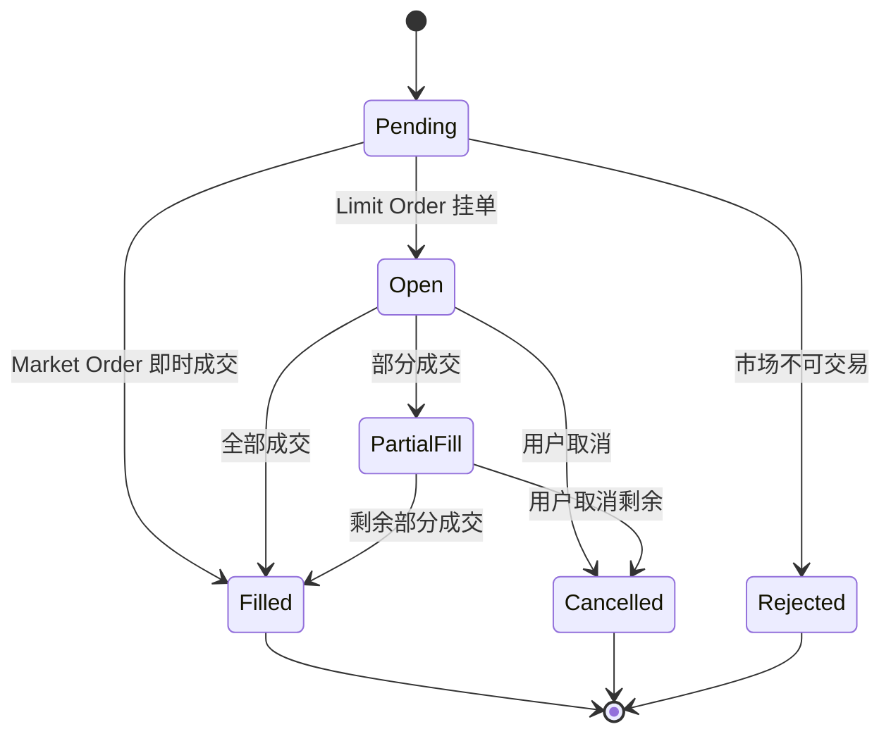
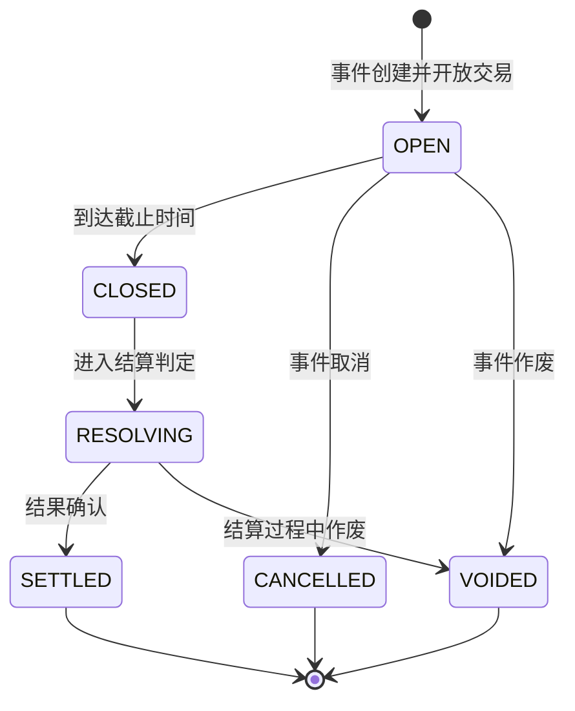

# TurboFlow MVP — 产品逻辑与公式手册

> 本文档仅描述 MVP 版本的产品规则、业务公式和状态流转，不涉及代码实现或界面设计。

---

## 1. 市场与合约模型

### 1.1 核心概念

TurboFlow 是一个预测市场平台。用户对未来事件的结果进行交易，买入 **YES**（认为会发生）或 **NO**（认为不会发生）。

- **事件（Event）**：一个可被验证结果的预测主题（如"BTC 在 2026 年 3 月前会超过 $100K 吗？"）
- **合约（Contract）**：事件下的可交易标的。一个事件可包含多个合约。

### 1.2 市场类型

| 类型 | 说明 | 示例 |
|------|------|------|
| **Standard** | 标准预测市场，独立的二元合约 | Fed 利率决议、BTC 价格里程碑、宏观事件 |
| **Sports** | 体育赛事，含主客队信息和赛事元数据 | NBA/NFL 比赛胜负、让分、大小分 |
| **Instant (Live)** | 短周期实时市场（如 5 分钟价格预测） | "BTC 在 5 分钟内会高于 $98,500 吗？" |
| **Multi-option** | 多选一市场，多个合约中只有一个结果为 YES | 奥斯卡最佳影片、总统候选人 |

### 1.3 结果模型

- **Independent（独立）**：每个合约独立结算，一个事件下的多个合约可以同时为 YES 或同时为 NO
- **Mutually-exclusive（互斥）**：多个合约中有且仅有一个结果为 YES，其余全部为 NO

**互斥市场的风险说明**：在互斥市场中，用户持有多个合约的 YES 头寸时，最多只有一个合约结算为 YES。理论上可通过 Grouped Collateral（组合保证金）优化资金占用，降低用户的总保证金需求。**MVP 阶段按独立保证金计算**，即每个头寸独立冻结资金，不做组合保证金优化。后续版本可引入 Negative Risk 机制。

### 1.4 合约子类型（体育赛事）

| 子类型 | 说明 |
|--------|------|
| **Binary** | 标准二元合约（是/否） |
| **Moneyline** | 胜负盘 |
| **Spread** | 让分盘 |
| **Total** | 大小分 |

---

## 2. 定价模型

### 2.1 YES/NO 定价

每个合约有两个维度的价格：

**理论互补关系（合约设计层面）：**

\[
p_{yes} + p_{no} = 1.00 \text{ USDC}
\]

此恒等式在合约设计层面始终成立，反映 YES 和 NO 作为互补结果的完整概率空间。

**可成交价格（Orderbook 层面）：**

实际交易中，价格由 Orderbook 的 bid/ask 决定，存在价差（spread）：

| 价格类型 | 含义 |
|----------|------|
| **Best Bid** | 买方出价最高的挂单价格 |
| **Best Ask** | 卖方要价最低的挂单价格 |
| **Midpoint** | (Best Bid + Best Ask) / 2 |
| **Last Traded** | 最近一笔成交的价格 |

页面展示的"价格"通常为 midpoint 或 last traded price，**不等于用户可立即成交的价格**。实际成交价格取决于 orderbook 深度和订单类型。

**概率映射：**

\[
\text{probability} \approx \text{displayPrice} \times 100\%
\]

### 2.2 收益规则

每份合约的最终收益（payoutPerShare）固定为 **1 USDC**：

- 如果结算结果为 **YES**：持有 YES 的每份获得 1 USDC，持有 NO 的每份获得 0
- 如果结算结果为 **NO**：持有 NO 的每份获得 1 USDC，持有 YES 的每份获得 0

### 2.3 盈亏计算

**买入总成本（含手续费）：**

\[
\text{entryCost} = \text{avgPrice} \times \text{quantity} + \text{fee}_{entry}
\]

**当前市值：**

\[
\text{currentValue} = \text{currentPrice} \times \text{quantity}
\]

**未实现盈亏（Unrealized P&L）：**

\[
\text{unrealizedPnl} = \text{currentValue} - \text{entryCost}
\]

\[
\text{unrealizedPnlPercent} = \frac{\text{unrealizedPnl}}{\text{entryCost}} \times 100\%
\]

**已实现盈亏（卖出或结算后）：**

\[
\text{exitProceeds} = \text{exitPrice} \times \text{quantity} - \text{fee}_{exit}
\]

\[
\text{realizedPnl} = \text{exitProceeds} - \text{entryCost}
\]

**结算盈亏：**

\[
\text{settlementPnl} = (\text{payoutPerShare} \times \text{quantity}) - \text{entryCost} \quad \text{(胜出方)}
\]

\[
\text{settlementPnl} = 0 - \text{entryCost} \quad \text{(败出方)}
\]

### 2.4 费用模型

交易费用按以下公式计算：

\[
\text{fee} = \text{price} \times \text{quantity} \times \text{feeRate}
\]

其中 feeRate 按市场类型决定：

| 市场类型 | feeRate | 说明 |
|----------|---------|------|
| 所有类型（MVP） | 0% | MVP 阶段零费率，公式保留费用项以便后续启用 |

**后续扩展方向**：可按 maker/taker 区分费率（如 Polymarket 的 maker 0% / taker 1-2%），或按市场类型和交易量阶梯定价。

---

## 3. 交易机制

### 3.1 订单模型

每笔订单包含两个维度：

| 维度 | 可选值 | 含义 |
|------|--------|------|
| **Outcome（结果方向）** | YES / NO | 用户预期的事件结果 |
| **Action（交易动作）** | BUY / SELL | 买入建仓 / 卖出平仓 |

四种组合的语义：

| Action | Outcome | 含义 |
|--------|---------|------|
| BUY YES | 看好事件发生 | 花费 yesPrice 买入 YES 份额 |
| BUY NO | 看好事件不发生 | 花费 noPrice 买入 NO 份额 |
| SELL YES | 卖出 YES 头寸 | 卖出持有的 YES 份额，收回资金 |
| SELL NO | 卖出 NO 头寸 | 卖出持有的 NO 份额，收回资金 |

> 在 CLOB（中央限价订单簿）中，BUY YES 和 SELL NO 对应同一个 orderbook 的两面，但从用户视角和仓位记账上是不同的操作。

### 3.2 订单类型

| 订单类型 | 行为 | 适用场景 |
|----------|------|----------|
| **Market Order** | 按当前最优可成交价即时成交 | 希望立即成交，接受当前价格 |
| **Limit Order** | 设定目标价格挂单，等待撮合 | 希望更好价格，愿意等待 |

**Market Order**：用户输入花费金额（USDC），系统按当前 best ask（BUY）或 best bid（SELL）计算份数。实际成交价可能因 orderbook 深度产生滑点。

**Limit Order**：用户设定单价（0.01–0.99 USDC）和数量，总成本自动计算。

### 3.3 订单生命周期

订单的可能状态：

| 状态 | 含义 |
|------|------|
| **Pending** | 订单已提交，待处理 |
| **Open** | 挂单中，等待撮合成交 |
| **PartialFill** | 部分成交 |
| **Filled** | 全部成交 |
| **Cancelled** | 用户取消 |
| **Rejected** | 系统拒绝（如市场已关闭） |

**状态流转：**

BUY 和 SELL 订单共享同一状态机。区别在于：
- **BUY + Filled** → 系统创建/增加仓位
- **SELL + Filled** → 系统减少/移除仓位

### 3.4 成交落账

当订单状态变为 Filled 时，系统同时执行：

1. 创建一条**成交记录**（Trade），记录 action、outcome、成交价格、数量、手续费、时间
2. 根据 action：
   - **BUY**：更新或创建一条仓位记录，累加持仓数量并更新加权平均价
   - **SELL**：按成交数量减少仓位，若 sellQty >= positionQty 则移除仓位

### 3.5 订单有效期（Time-in-Force）

| TIF 类型 | 全称 | 行为 |
|----------|------|------|
| **GTC** | Good-Till-Cancelled | 持续有效直到用户取消或完全成交 |
| **GTD** | Good-Till-Date | 到指定时间自动取消 |
| **IOC** | Immediate-or-Cancel | 立即尽量成交，未成交部分自动取消 |
| **FOK** | Fill-or-Kill | 全部成交或全部取消，不接受部分成交 |

**MVP 范围**：当前仅支持 GTC。所有限价单默认 GTC 有效期。

### 3.6 模拟成交（仅 Demo）

Limit Order 在 MVP 中不连接真实撮合引擎。为演示目的，提供"模拟成交"功能，可手动触发将 Open 状态的限价单变为 Filled。

---

## 4. 组合投注

TurboFlow 支持两种组合投注产品：

### 4.1 产品定义

| 产品 | 名称 | 核心规则 |
|------|------|----------|
| **Parlay** | 串关 | 所有腿必须全部正确才能获得收益，赔率更高，风险更高 |
| **Bundle** | 组合投注 | 每腿独立结算，赢的腿获得收益、输的腿归零，风险较低 |

> 用户在创建组合投注时选择 Parlay 或 Bundle 模式。两者共享投注分配逻辑，但结算方式不同。

### 4.2 组合赔率公式

组合赔率（Combined Odds）的计算方式：

\[
\text{combinedOdds} = \frac{1}{p_1 \times p_2 \times \cdots \times p_n}
\]

其中 \(p_i\) 为第 \(i\) 腿的买入价格（USDC decimal）。

**示例**：3 腿，各腿价格分别为 0.65、0.40、0.50：

\[
\text{combinedOdds} = \frac{1}{0.65 \times 0.40 \times 0.50} = \frac{1}{0.13} \approx 7.69\text{x}
\]

> 组合赔率在两种模式下均作为展示指标，但仅在 Parlay 模式中作为实际收益乘数。

### 4.3 投注分配与 Residual 处理

采用**等额分配**策略：

\[
\text{stakePerLeg} = \frac{\text{totalStake}}{n}
\]

每腿根据自身价格计算份数（取整）：

\[
\text{shares}_i = \text{round}\left(\frac{\text{stakePerLeg}}{p_i}\right)
\]

由于取整，每腿实际成本不等于理论分配额：

\[
\text{legCost}_i = \text{shares}_i \times p_i
\]

\[
\text{actualTotalCost} = \sum_{i=1}^{n} \text{legCost}_i
\]

\[
\text{residual} = \text{totalStake} - \text{actualTotalCost}
\]

**Residual 处理**：
- 正值（多余资金）：退回可用余额
- 负值（不足，通常极小，如 $0.05）：从余额补扣

**示例**：总投注 $150，3 腿：

| 腿 | 价格 | 理论分配 | 份数 | 实际成本 (legCost) |
|----|------|----------|------|--------------------|
| A: BTC > $100K | 0.65 | $50 | round(50/0.65) = 77 | 77 × 0.65 = $50.05 |
| B: ETH > $5K | 0.40 | $50 | round(50/0.40) = 125 | 125 × 0.40 = $50.00 |
| C: Fed Rate Cut Q2 | 0.50 | $50 | round(50/0.50) = 100 | 100 × 0.50 = $50.00 |
| **合计** | | $150 | | **$150.05** |
| **Residual** | | | | **−$0.05**（从余额补扣） |

### 4.4 结算与收益

#### Parlay（串关）—— All-or-Nothing

所有腿均正确时获得全额收益，任一腿错误则全部归零。

**潜在收益：**

\[
\text{potentialPayout} = \text{totalStake} \times \text{combinedOdds}
\]

**结算规则：**

- 全部正确：获得 potentialPayout
- 任一错误：收益为 0，损失全部投注

**示例**（沿用上述 3 腿，totalStake = $150）：

| 结算场景 | 结果 | 收益 |
|----------|------|------|
| A✓ B✓ C✓ | 全中 | $150 × 7.69 = **$1,153.50** |
| A✓ B✓ C✗ | 未全中 | **$0**（损失 $150） |
| A✗ B✗ C✗ | 全错 | **$0**（损失 $150） |

#### Bundle（组合投注）—— Independent Settlement

每腿作为独立仓位分别结算。赢的腿按照合约规则获得 payout（每份 1 USDC），输的腿该部分投入归零。

**每腿收益公式：**

\[
\text{legPayout}_i = \begin{cases} \text{shares}_i \times 1 \text{ USDC} & \text{若第 } i \text{ 腿正确} \\ 0 & \text{若第 } i \text{ 腿错误} \end{cases}
\]

**每腿盈亏：**

\[
\text{legPnl}_i = \text{legPayout}_i - \text{legCost}_i
\]

**总收益：**

\[
\text{totalPayout} = \sum_{i \in \text{correct}} \text{shares}_i \times 1 \text{ USDC}
\]

**总盈亏：**

\[
\text{totalPnl} = \text{totalPayout} - \text{actualTotalCost}
\]

**示例**（沿用上述 3 腿，actualTotalCost = $150.05）：

| 结算场景 | 腿 A (77份) | 腿 B (125份) | 腿 C (100份) | 总收益 | 总盈亏 |
|----------|-------------|--------------|--------------|--------|--------|
| A✓ B✓ C✓ | $77 | $125 | $100 | **$302** | +$151.95 |
| A✓ B✓ C✗ | $77 | $125 | $0 | **$202** | +$51.95 |
| A✓ B✗ C✗ | $77 | $0 | $0 | **$77** | −$73.05 |
| A✗ B✗ C✗ | $0 | $0 | $0 | **$0** | −$150.05 |

#### 两种模式对比

| 维度 | Parlay（串关） | Bundle（组合投注） |
|------|---------------|-------------------|
| 风险 | 高（全中才有收益） | 中（部分命中仍有回报） |
| 最大收益 | 极高（组合赔率倍乘） | 中等（各腿独立收益之和） |
| 全中收益对比 | $1,153.50 | $302 |
| 部分命中收益 | $0 | 按命中腿计算 |
| 适合用户 | 高风险偏好，追求高赔率 | 稳健型，希望组合投注但降低风险 |

### 4.5 校验规则

在添加腿时，系统进行以下校验：

| 规则 | 行为 |
|------|------|
| 同一合约不能同时买 YES 和 NO | 拒绝添加，提示冲突 |
| 同一合约同一方向不能重复添加 | 拒绝添加，提示已存在 |
| 同一事件下的不同合约 | 允许添加，但提示可能存在相关性 |
| 最少 2 腿才能下注 | 不满足时无法提交 |
| 投注金额必须大于 0 | 不满足时无法提交 |

---

## 5. Portfolio 计算

### 5.1 资金口径

| 口径 | 定义 | 计算方式 |
|------|------|----------|
| **Cash Balance** | 账户总现金 | 初始入金 - 历史买入支出 + 历史卖出/结算收入 |
| **Reserved for Open Orders** | 被 Open Orders 锁定的保证金 | sum(openOrder.price × openOrder.remainingQty) |
| **Available to Trade** | 可用于新交易的资金 | cashBalance - reservedForOpenOrders |
| **Positions Value** | 所有持仓的当前市值 | sum(currentPrice × quantity) |
| **Portfolio Value** | 组合总价值 | positionsValue + cashBalance |

> **MVP 说明**：当前 cashBalance 为固定 mock 值，不随交易动态变化。资金冻结/释放逻辑留待后续版本实现。

### 5.2 未实现盈亏（Unrealized P&L）

仅计算状态为 OPEN 的仓位：

\[
\text{totalUnrealizedPnl} = \sum_{i \in \text{OPEN}} \text{unrealizedPnl}_i
\]

### 5.3 仓位合并规则

当新 BUY 成交落账时，系统判断是否与已有仓位合并：

**合并条件**（三者必须同时满足）：
- 相同合约（contractId）
- 相同方向（side：YES 或 NO）
- 相同来源（parlayId：独立仓位为空，Parlay/Bundle 仓位为对应组合 ID）

**合并公式（加权平均价）：**

\[
\text{totalQty} = \text{existingQty} + \text{newQty}
\]

\[
\text{newAvgPrice} = \frac{\text{existingAvg} \times \text{existingQty} + \text{newAvg} \times \text{newQty}}{\text{totalQty}}
\]

结果保留 2 位小数。

**隔离规则**：
- 独立下单的仓位之间可以合并
- Parlay/Bundle 腿不会与独立仓位合并
- 不同 Parlay/Bundle 的腿也不会互相合并

### 5.4 组合仓位的聚合指标

当多个仓位属于同一 Parlay/Bundle 时，按以下公式计算聚合值：

\[
\text{groupValue} = \sum_{i \in \text{group}} (\text{currentPrice}_i \times \text{quantity}_i)
\]

\[
\text{groupPnl} = \sum_{i \in \text{group}} \text{unrealizedPnl}_i
\]

\[
\text{groupCost} = \sum_{i \in \text{group}} (\text{avgPrice}_i \times \text{quantity}_i)
\]

\[
\text{groupPnlPercent} = \frac{\text{groupPnl}}{\text{groupCost}} \times 100\%
\]

### 5.5 平仓逻辑

平仓操作的正确流程：

1. 提交一笔 **SELL Market Order**（保持相同 outcome side，action 设为 SELL）
2. 等待订单状态变为 **Filled**
3. 成交后，系统按 filledQty 减仓或清仓
4. 同时生成完整的 Trade 记录和 Order 记录
5. 若 filledQty >= positionQty：完全平仓，移除仓位
6. 若 filledQty < positionQty：部分平仓，减少数量，avgPrice 不变
7. MVP 版本仅支持 100% 全仓平仓

### 5.6 排序方式

Positions 列表支持以下排序维度：

| 排序 | 指标 | 方向 |
|------|------|------|
| Current Value | quantity x currentPrice | 降序 |
| P&L $ | unrealizedPnl 或 finalPnl | 降序 |
| P&L % | unrealizedPnlPercent | 降序 |
| Shares | quantity | 降序 |
| Alphabetically | marketTitle | 升序 |
| Latest Price | currentPrice | 降序 |

---

## 6. 事件生命周期

### 6.1 主状态流转

### 6.2 主状态说明

| 状态 | 含义 | 用户可操作 |
|------|------|------------|
| **OPEN** | 市场开放，可正常交易 | BUY、SELL、下单、取消订单 |
| **CLOSED** | 交易截止，等待结算 | 查看持仓，不可新建交易 |
| **RESOLVING** | 正在判定结果 | 查看持仓，可申请结算或报告问题 |
| **SETTLED** | 已结算，收益已分配 | 查看最终盈亏 |
| **CANCELLED** | 事件被取消 | 查看退款信息 |
| **VOIDED** | 事件作废 | 查看退款信息 |

### 6.3 子状态

事件在主状态基础上可附带子状态：

| 子状态 | 含义 |
|--------|------|
| **normal** | 正常运行 |
| **paused** | 暂停交易（如数据源异常） |
| **disputed** | 结果有争议，等待仲裁 |
| **delayed** | 结算延迟 |
| **emergency** | 紧急状态 |

### 6.4 结算规则

- 结算结果为 **YES** 或 **NO**
- 结算依据来自预设的 Resolution Source（如官方数据、链上预言机、权威机构公告）
- 结算后，胜出方每份获得 payoutPerShare（1 USDC），败出方获得 0

### 6.5 订单处置矩阵

当市场状态发生变化时，系统按以下规则处理未完成的 Open Orders：

| 状态变化 | Open Orders 处理 | 保证金处理 |
|----------|------------------|------------|
| OPEN → **PAUSED** | 冻结，暂停撮合；恢复交易后继续生效 | 保持冻结 |
| OPEN → **CLOSED** | 全部自动取消 | 退还保证金 |
| Sports 赛事开赛 | 对应市场的 Open Orders 自动取消 | 退还保证金 |
| 任意 → **VOIDED** | 全部自动取消 | 退还保证金 |
| 任意 → **CANCELLED** | 全部自动取消 | 退还保证金 |

---

## 7. P&L 历史曲线

### 7.1 时间范围

| 范围 | 数据粒度 | 数据点数量 |
|------|----------|------------|
| **1D** | 每小时 | 24 个点 |
| **1W** | 每天 | 7 个点 |
| **1M** | 每天 | 30 个点 |
| **ALL** | 每天 | 90 个点 |

### 7.2 数据语义

每个数据点表示该时刻的**累计 P&L**（相对于初始投入的盈亏总额），单位为 USDC。

- 正值（绿色）：总体盈利
- 负值（红色）：总体亏损

---

## 8. 激励机制（预留）

MVP 中预留了以下激励标签结构，但尚未完整实现：

| 类型 | 说明 |
|------|------|
| **volume_bonus** | 交易量奖励（如 "+20% Volume Reward"） |
| **liquidity_reward** | 流动性提供奖励 |
| **new_market** | 新市场标记 |

---

## 9. 术语表

| 术语 | 定义 |
|------|------|
| **USDC** | 稳定币，1 USDC = 1 美元 |
| **Share** | 合约的最小交易单位（1 份） |
| **YES / NO** | 结果方向（Outcome）。YES = 认为事件会发生；NO = 认为不会发生 |
| **BUY / SELL** | 交易动作（Action）。BUY = 买入建仓；SELL = 卖出平仓 |
| **Payout** | 结算时的收益分配，通常为每份 1 USDC |
| **Parlay** | 串关，多个独立合约组合为一笔下注，全中才有收益 |
| **Bundle** | 组合投注，多个独立合约组合为一笔下注，每腿独立结算 |
| **Leg** | 组合投注中的单个合约选择 |
| **Combined Odds** | 组合赔率倍数 |
| **P&L** | Profit and Loss，盈亏 |
| **Unrealized P&L** | 未实现盈亏（仓位尚未平仓或结算） |
| **Realized P&L** | 已实现盈亏（仓位已平仓或结算） |
| **CLOB** | Central Limit Order Book，中央限价订单簿 |
| **Spread** | Bid/Ask 价差，买卖最优报价之间的差距 |
| **TIF** | Time-in-Force，订单有效期策略 |
| **GTC** | Good-Till-Cancelled，持续有效直到取消或成交 |
| **Residual** | 组合投注因份数取整产生的成本偏差金额 |
| **Resolution** | 事件结果的判定过程 |
| **Settlement** | 结算，根据判定结果分配收益 |
| **Grouped Collateral** | 组合保证金，互斥市场中优化资金占用的机制 |
